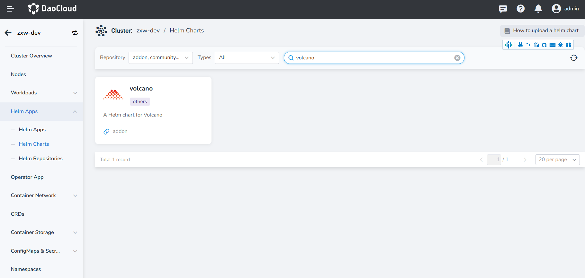
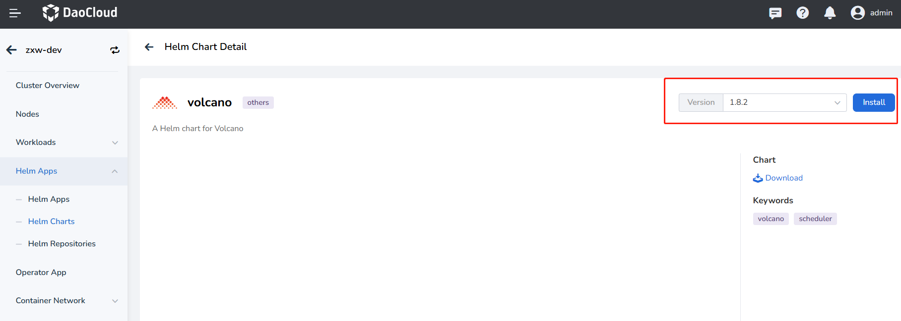
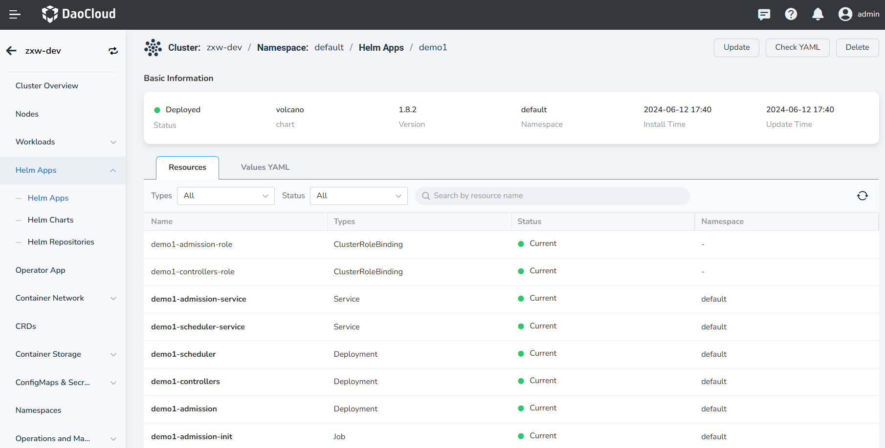

# Install Volcano

As Kubernetes (K8s) becomes the preferred platform for orchestrating and managing cloud-native applications,
an increasing number of applications are actively migrating to K8s. In the fields of artificial intelligence
and machine learning, because these tasks usually involve a large amount of computation, developers tend to
build AI platforms on Kubernetes to fully leverage its advantages in resource management, application
orchestration, and operations monitoring.

However, the default scheduler of Kubernetes is mainly designed for long-running services and has many
shortcomings for tasks such as AI and big data that require batch and elastic scheduling. For example, when
resource contention is intense, the default scheduler may cause uneven resource allocation, which in turn
affects the normal execution of tasks.

Take a TensorFlow job as an example. It contains two roles, PS (parameter server) and Worker, and both need to
work together to complete the task. If only a single role is deployed, the job cannot run. In addition, the
default scheduler schedules Pods one by one and cannot perceive the dependency between PS and Worker in a
TFJob. Under high load, this may cause multiple jobs to each be allocated part of the resources but none of
them can be completed, resulting in a waste of resources.

## Scheduling strategy advantages of Volcano

Volcano provides a variety of scheduling strategies to address the above challenges. Among them, the
Gang-scheduling strategy can ensure that multiple tasks (Pods) start at the same time during distributed
machine learning training, avoiding deadlocks; the Preemption scheduling strategy allows high-priority jobs
to preempt the resources of low-priority jobs when resources are insufficient, ensuring that critical tasks
are completed first.

In addition, Volcano seamlessly integrates with mainstream computing frameworks such as Spark, TensorFlow,
and PyTorch, and supports hybrid scheduling of heterogeneous devices such as CPUs and GPUs, providing
comprehensive optimization support for AI compute tasks.

Next, we will introduce how to install and use Volcano, so that you can make full use of its scheduling
strategy advantages to optimize AI compute tasks.

## Install Volcano

1. Find Volcano in **Cluster Details** -> **Helm Apps** -> **Helm Chart** and install it.

    
   
    

2. Check and confirm whether Volcano is installed successfully, that is, whether the components
   volcano-admission, volcano-controllers, and volcano-scheduler are running properly.

    

Typically, Volcano is used in conjunction with the [AI Lab](../../../../baize/intro/index.md) to achieve an
effective closed-loop process for the development and training of datasets, Notebooks, and task training.
