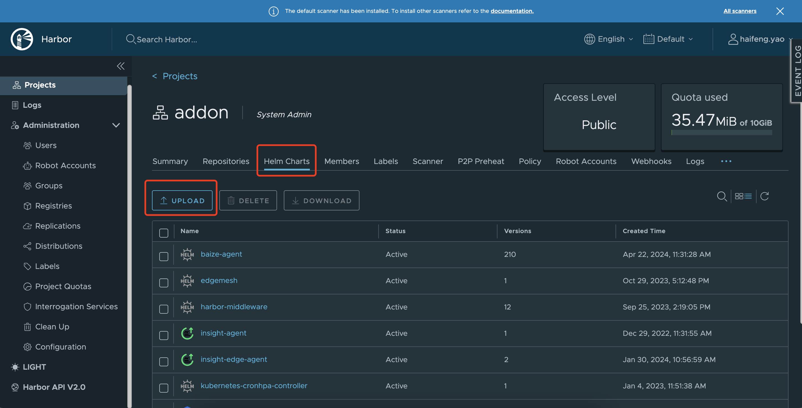
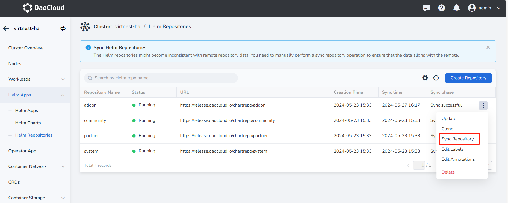

# Upload Helm Charts

This article explains how to upload Helm charts. See the steps below.

1. Add a Helm repository, refer to [Adding a Third-Party Helm Repository](./helm-repo.md) for the procedure.

2. Upload the Helm Chart to the Helm repository.

    === "Upload with Client"

        !!! note

            This method is suitable for Harbor, ChartMuseum, JFrog type repositories.

        1. Log in to a node that can access the Helm repository, upload the Helm binary to the node,
           and install the cm-push plugin (VPN is needed and [Git](https://git-scm.com/downloads) should be installed in advance).

            Refer to the [plugin installation process](https://github.com/chartmuseum/helm-push).

        2. Push the Helm Chart to the Helm repository by executing the following command:

            ```shell
            helm cm-push ${charts-dir} ${HELM_REPO_URL} --username ${username} --password ${password}
            ```

            Argument descriptions:

            - `charts-dir`: The directory of the Helm Chart, or the packaged Chart (i.e., .tgz file).
            - `HELM_REPO_URL`: The URL of the Helm repository.
            - `username`/`password`: The username and password for the Helm repository with push permissions.
            - If you want to access via HTTPS and skip the certificate verification, you can add the argument `--insecure`.

    === "Upload with Web Page"

        !!! note

            This method is only applicable to Harbor repositories.

        1. Log into the Harbor repository, ensuring the logged-in user has permissions to push;

        2. Go to the relevant project, select the __Helm Charts__ tab, click the __Upload__ button on the page to upload the Helm Chart.

            

3. Sync Remote Repository Data

    === "Manual Sync"
    
        By default, the cluster does not enable **Helm Repository Auto-Refresh**, so you need to perform a manual sync operation. The general steps are:

        Go to **Helm Applications** -> **Helm Repositories**, click the **┇** button on the right side of the repository list, and select **Sync Repository** to complete the repository data synchronization.

        

    === "Auto Sync"
    
        If you need to enable the Helm repository auto-sync feature, you can go to **Cluster Maintenance** -> **Cluster Settings** -> **Advanced Settings** and turn on the Helm repository auto-refresh switch.

        <!-- add image later -->
