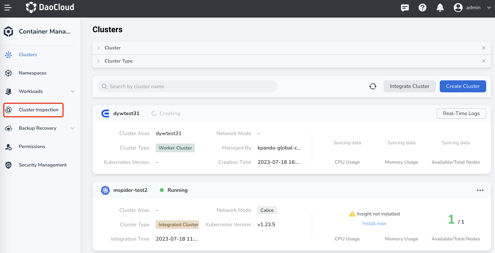
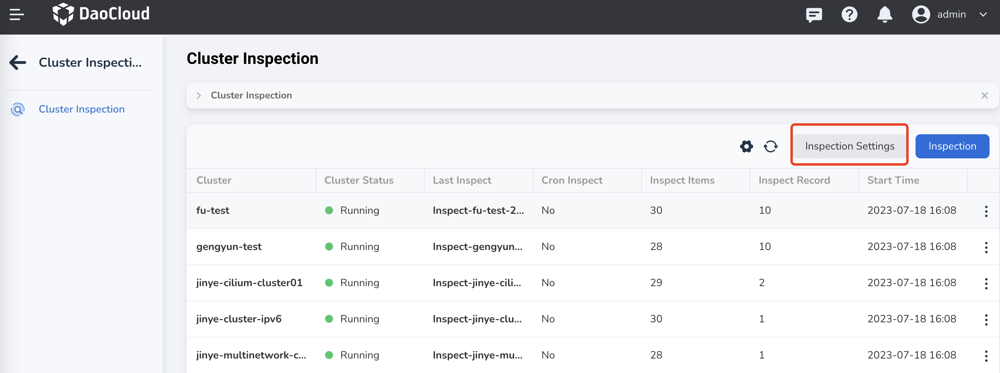
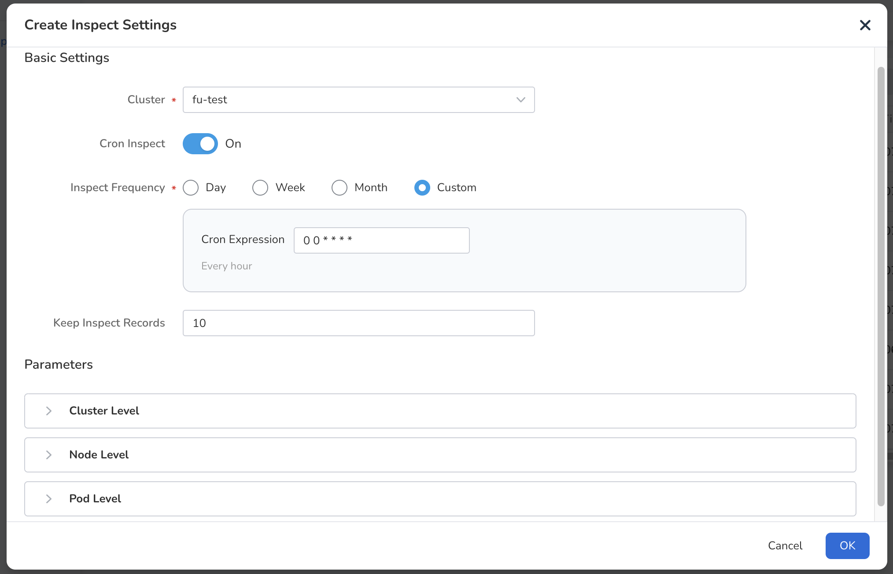

---
hide:
  - toc
---

# Creating Inspection Configuration

DCE 5.0 Container Management module provides cluster inspection functionality, which supports inspection at the cluster, node, and container group levels.

- Cluster level: Check the running status of system components in the cluster, including cluster status, resource usage, and specific inspection items for control nodes such as `kube-apiserver` and `etcd`.
- Node level: Includes common inspection items for both control nodes and worker nodes, such as node resource usage, handle count, PID status, and network status.
- Pod level: Check the CPU and memory usage, running status, PV and PVC status of Pods.

Here's how to create an inspection configuration.

1. Click `Cluster Inspection` in the left navigation bar.

    

2. On the right side of the page, click `Inspection Configuration`.

    

3. Fill in the inspection configuration based on the following instructions, then click `OK` at the bottom of the page.

    - Cluster: Select the clusters that you want to inspect from the dropdown list. **If you select multiple clusters, multiple inspection configurations will be automatically generated (only the inspected clusters are inconsistent, all other configurations are identical).**
    - Scheduled Inspection: When enabled, it allows for regular automatic execution of cluster inspections based on a pre-set inspection frequency.
    - Inspection Frequency: Set the interval for automatic inspections, e.g., every Tuesday at 10 AM. It supports custom CronExpressios, refer to [Cron Schedule Syntax](https://kubernetes.io/docs/concepts/workloads/controllers/cron-jobs/#cron-schedule-syntax) for more information.
    - Number of Inspection Records to Retain: Specifies the maximum number of inspection records to be retained, including all inspection records for each cluster.
    - Parameter Configuration: The parameter configuration is divided into three parts: cluster level, node level, and container group level. You can enable or disable specific inspection items based on your requirements.

        

After creating the inspection configuration, it will be automatically displayed in the inspection configuration list. Click the more options button on the right of the configuration to immediately perform an inspection or modify the inspection configuration.

- Click `Inspection` to perform an inspection once based on the configuration.
- Click `Inspection Configuration` to modify the inspection configuration.

    

!!! note

    - After creating the inspection configuration, if the `Scheduled Inspection` configuration is enabled, inspections will be automatically executed at the specified time.
    - If `Scheduled Inspection` configuration is not enabled, you need to manually [trigger the inspection](inspect.md).