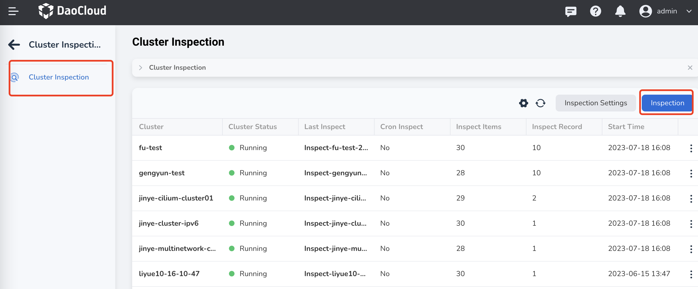
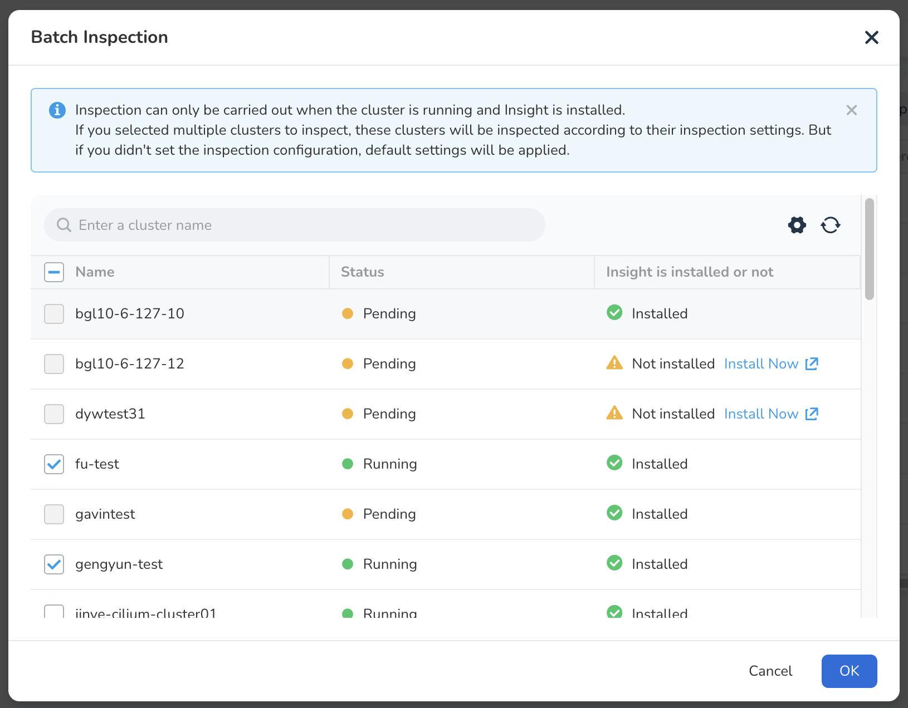
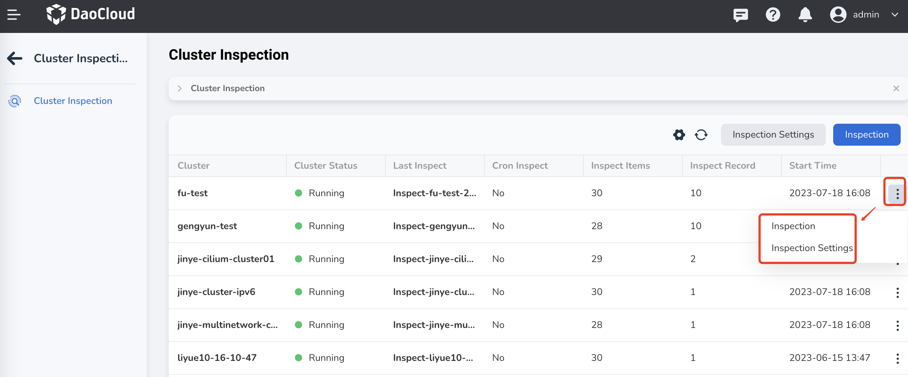

---
hide:
  - toc
---

# Start Cluster Inspection

After creating an inspection configuration, if the `Scheduled Inspection` configuration is enabled, inspections will be automatically executed at the specified time. If the `Scheduled Inspection` configuration is not enabled, you need to manually trigger the inspection.

This page explains how to manually perform a cluster inspection.

## Prerequisites

- [Integrate](../clusters/integrate-cluster.md) or [create](../clusters/create-cluster.md) a cluster in the Container Management module.
- Create an [inspection configuration](config.md).
- The selected cluster is in the `Running` state and the insight component has been [installed in the cluster](../../../insight/quickstart/install/install-agent.md).

## Steps

When performing an inspection, you can choose to inspect multiple clusters in batches or perform a separate inspection for a specific cluster.

=== "Batch Inspection"

    1. Click `Cluster Inspection` in the top-level navigation bar of the Container Management module, then click `Inspection` on the right side of the page.

        

    2. Select the clusters you want to inspect, then click `OK` at the bottom of the page.

        - If you choose to inspect multiple clusters at the same time, the system will perform inspections based on different inspection configurations for each cluster.
        - If no inspection configuration is set for a cluster, the system will use the default configuration.

        

=== "Individual Inspection"

    1. Go to the Cluster Inspection page.
    2. Click the more options button (`ⵗ`) on the right of the corresponding inspection configuration, then select `Inspection` from the popup menu.

        
