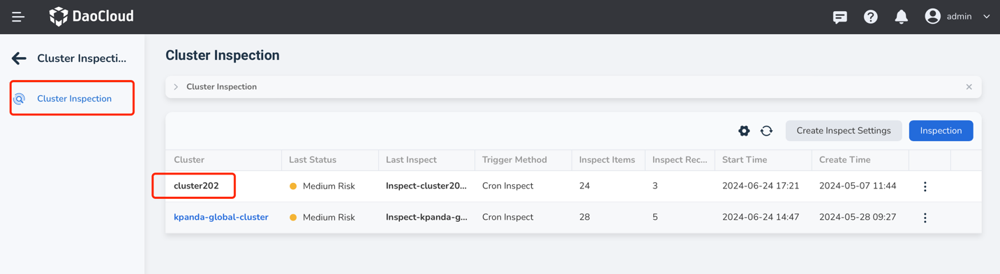
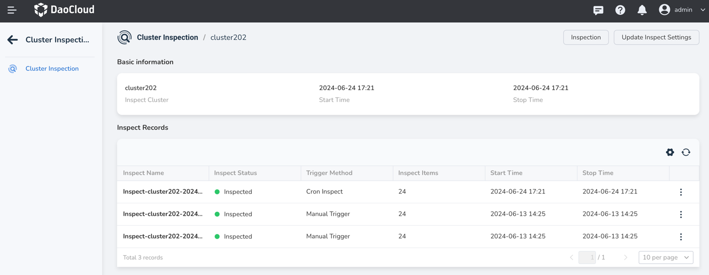
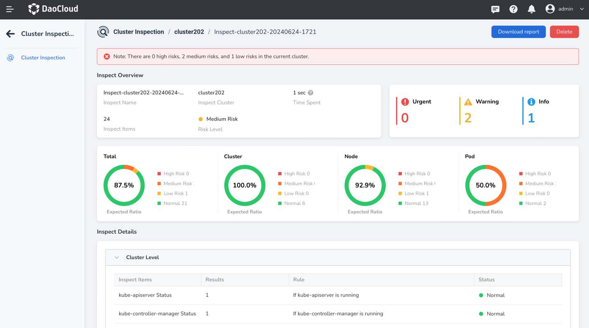

---
hide:
  - toc
---

# Check Inspection Reports

After the [inspection execution](inspect.md) is completed, you can view the inspection records and detailed inspection reports.

## Prerequisites

- [Create an inspection configuration](config.md).
- Perform at least one inspection [execution](inspect.md).

## Steps

1. Go to the Cluster Inspection page and click the name of the target inspection cluster.

   

2. Click the name of the inspection record you want to view.

    - Each inspection execution generates an inspection record.
    - When the number of inspection records exceeds the maximum retention specified in the [inspection configuration](config.md), the earliest record will be deleted starting from the execution time.

    

3. View the detailed information of the inspection, which may include an overview of cluster resources and the running status of system components.

    You can download the inspection report or delete the inspection report from the top right corner of the page.

    
