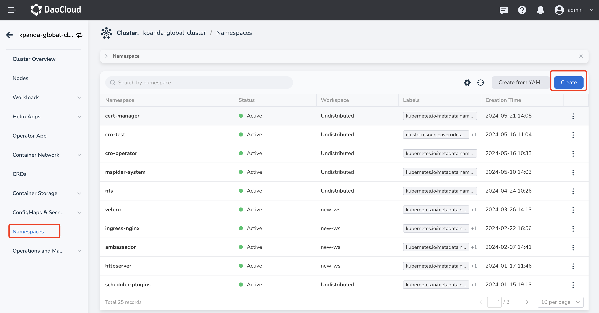
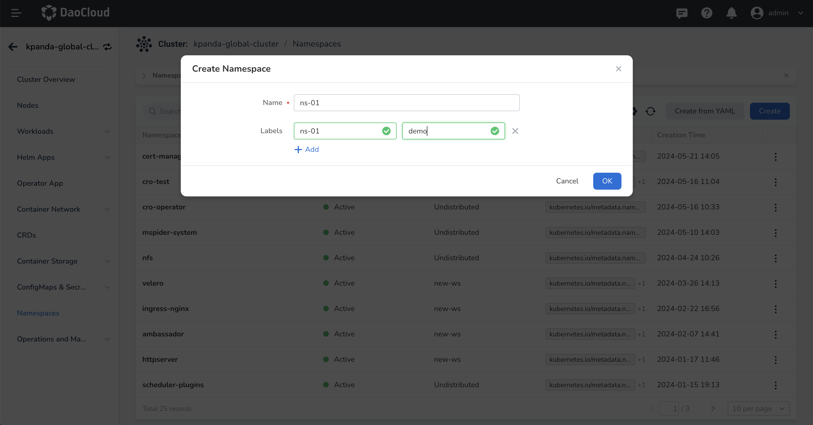
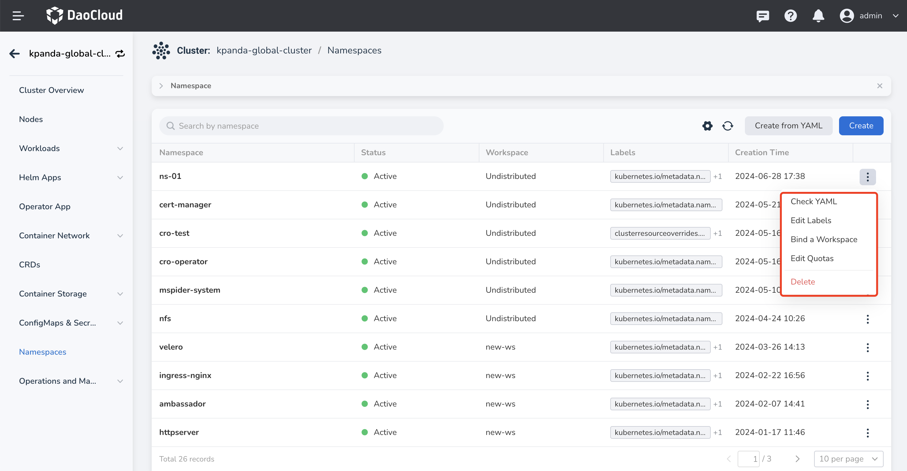

# Namespaces

Namespaces are an abstraction used in Kubernetes for resource isolation. A cluster can contain multiple namespaces with different names, and the resources in each namespace are isolated from each other. For a detailed introduction to namespaces, refer to [Namespaces](https://kubernetes.io/docs/concepts/overview/working-with-objects/namespaces/).

This page will introduce the related operations of the namespace.

## Create a namespace

Supports easy creation of namespaces through forms, and quick creation of namespaces by writing or importing YAML files.

!!! note

    - Before creating a namespace, you need to [Integrate a Kubernetes cluster](../clusters/integrate-cluster.md) or [Create a Kubernetes cluster](../clusters/create-cluster.md) in the container management module.
    - The default namespace __default__ is usually automatically generated after cluster initialization. But for production clusters, for ease of management, it is recommended to create other namespaces instead of using the __default__ namespace directly.

### Create with form

1. On the cluster list page, click the name of the target cluster.

    

2. Click __Namespace__ in the left navigation bar, then click the __Create__ button on the right side of the page.

    

3. Fill in the name of the namespace, configure the workspace and labels (optional), and then click __OK__.

    !!! info

        - After binding a namespace to a workspace, the resources of that namespace will be shared with the bound workspace. For a detailed explanation of workspaces, refer to [Workspaces and Hierarchies](../../../ghippo/user-guide/workspace/workspace.md).

        - After the namespace is created, you can still bind/unbind the workspace.

    

4. Click __OK__ to complete the creation of the namespace. On the right side of the namespace list, click __⋮__ to select update, bind/unbind workspace, quota management, delete, and more from the pop-up menu.

    
