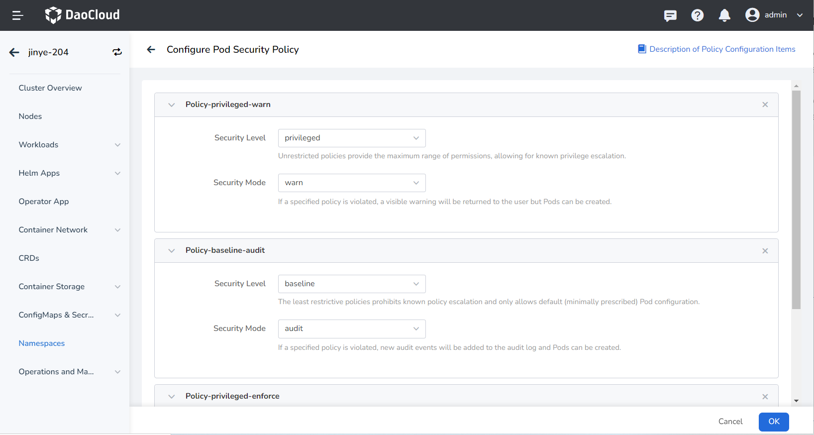
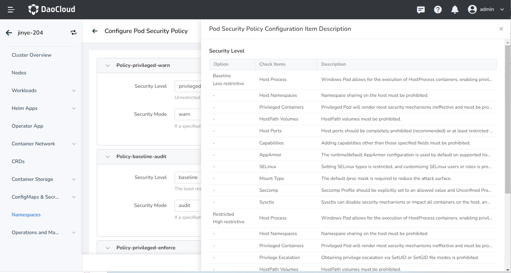
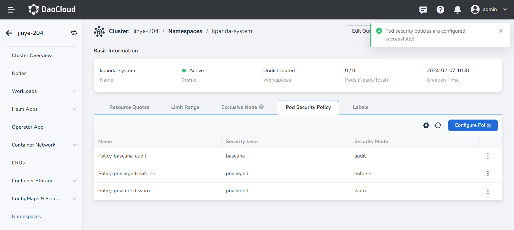
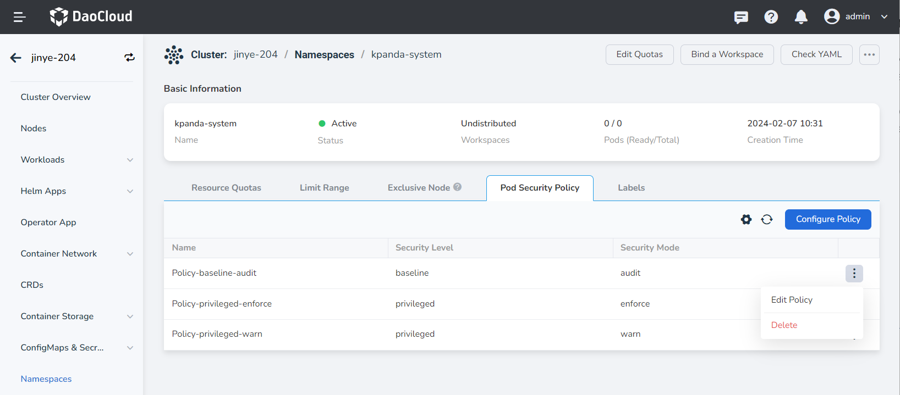

# Pod Security Policy

Pod security policies in a Kubernetes cluster allow you to control the behavior of Pods in various aspects of security by configuring different levels and modes for specific namespaces. Only Pods that meet certain conditions will be accepted by the system. It sets three levels and three modes, allowing users to choose the most suitable scheme to set restriction policies according to their needs.

!!! note

    Only one security policy can be configured for one security mode. Please be careful when configuring the enforce security mode for a namespace, as violations will prevent Pods from being created.

This section will introduce how to configure Pod security policies for namespaces through the container management interface.

## Prerequisites

- The container management module has [integrated a Kubernetes cluster](../clusters/integrate-cluster.md) or [created a Kubernetes cluster](../clusters/create-cluster.md). The cluster version needs to be v1.22 or above, and you should be able to access the cluster's UI interface.

- A [namespace has been created](../namespaces/createns.md), a [user has been created](../../../ghippo/user-guide/access-control/user.md), and the user has been granted [NS Admin](../permissions/permission-brief.md) or higher permissions. For details, please refer to [Namespace Authorization](../permissions/cluster-ns-auth.md).

## Configure Pod Security Policies for Namespace

1. Select the namespace for which you want to configure Pod security policies and go to the details page. Click __Configure Policy__ on the __Pod Security Policy__ page to go to the configuration page.

    

2. Click __Add Policy__ on the configuration page, and a policy will appear, including security level and security mode. The following is a detailed introduction to the security level and security policy.

    | Security Level | Description |
    | ---------- | ------------------------------------------------------------ |
    | Privileged | An unrestricted policy that provides the maximum possible range of permissions. This policy allows known privilege elevations. |
    | Baseline   | The least restrictive policy that prohibits known privilege elevations. Allows the use of default (minimum specified) Pod configurations. |
    | Restricted | A highly restrictive policy that follows current best practices for protecting Pods. |

    | Security Mode | Description |
    | -------- | ------------------------------------------------------------ |
    | Audit    | Violations of the specified policy will add new audit events in the audit log, and the Pod can be created. |
    | Warn     | Violations of the specified policy will return user-visible warning information, and the Pod can be created. |
    | Enforce  | Violations of the specified policy will prevent the Pod from being created. |

    

3. Different security levels correspond to different check items. If you don't know how to configure your namespace, you can __Policy Configuration Item Explanation__ at the top right corner of the page to view detailed information.

    

4. Click Confirm. If the creation is successful, the security policy you configured will appear on the page.

    

5. Click __⋮__ to edit or delete the security policy you configured.

    
