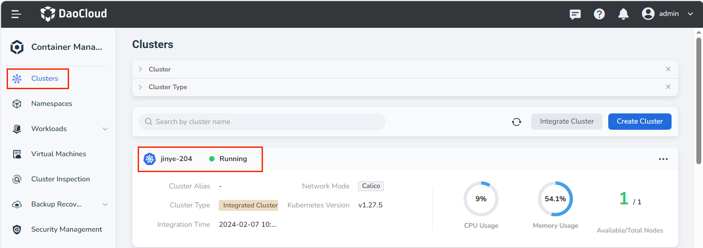
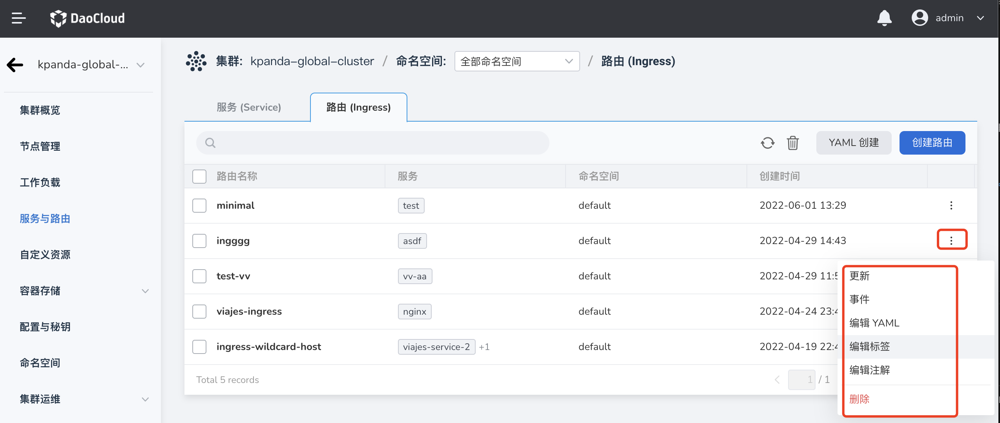

# Create an Ingress

In a Kubernetes cluster, [Ingress](https://kubernetes.io/docs/reference/generated/kubernetes-api/v1.24/#ingress-v1beta1-networking-k8s-io) exposes services from outside the cluster to inside the cluster HTTP and HTTPS ingress.
Traffic ingress is controlled by rules defined on the Ingress resource. Here's an example of a simple Ingress that sends all traffic to the same Service:

Ingress is an API object that manages external access to services in the cluster, and the typical access method is HTTP. Ingress can provide load balancing, SSL termination, and name-based virtual hosting.

## Prerequisites

- Container management module [connected to Kubernetes cluster](../clusters/integrate-cluster.md) or [created Kubernetes](../clusters/create-cluster.md), and can access the cluster UI interface.
- Completed a [namespace creation](../namespaces/createns.md), [user creation](../../../ghippo/user-guide/access-control/user.md), and authorize the user as [NS Editor](../permissions/permission-brief.md#ns-editor) role, for details, refer to [Namespace Authorization](../permissions/cluster-ns-auth.md).
- Completed [Create Ingress Instance](../../../network/modules/ingress-nginx/install.md), [Deploy Application Workload](../workloads/create-deployment.md), and have [created the corresponding Service](create-services.md)
- When there are multiple containers in a single instance, please make sure that the ports used by the containers do not conflict, otherwise the deployment will fail.

## Create ingress

1. After successfully logging in as the __NS Editor__ user, click __Clusters__ in the upper left corner to enter the __Clusters__ page. In the list of clusters, click a cluster name.

    

2. In the left navigation bar, click __Container Network__ -> __Ingress__ to enter the service list, and click the __Create Ingress__ button in the upper right corner.

    

     !!! note

         It is also possible to __Create from YAML__ .

3. Open __Create Ingress__ page to configure. There are two protocol types to choose from, refer to the following two parameter tables for configuration.

### Create HTTP protocol ingress

- | parameter | description | example value |
   | -------------- | :--------------------------------- -------------------------- | :------------------ |
   | Ingress name | [Type] Required [Meaning] Enter the name of the new ingress.  [Note] Please enter a string of 4 to 63 characters, which can contain lowercase English letters, numbers and dashes (-), and start with a lowercase English letter, lowercase English letters or numbers. | Ing-01 |
   | Namespace | [Type] Required [Meaning] Select the namespace where the new service is located. For more information about namespaces, refer to [Namespace Overview](../namespaces/createns.md).  [Note] Please enter a string of 4 to 63 characters, which can contain lowercase English letters, numbers and dashes (-), and start with a lowercase English letter and end with a lowercase English letter or number. | default |
   | Protocol | [Type] Required  [Meaning] Refers to the protocol that authorizes inbound access to the cluster service, and supports HTTP (no identity authentication required) or HTTPS (identity authentication needs to be configured) protocol. Here select the ingress of HTTP protocol. | HTTP |
   | Domain Name | [Type] Required  [Meaning] Use the domain name to provide external access services. The default is the domain name of the cluster | testing.daocloud.io |
   | LB Type | [Type] Required  [Meaning] The usage range of the Ingress instance. [Scope of use of Ingress](../../../network/modules/ingress-nginx/scope.md)  __Platform-level load balancer__ : In the same cluster, share the same Ingress instance, where all Pods can receive requests distributed by the load balancer.   __Tenant-level load balancer__ : Tenant load balancer, the Ingress instance belongs exclusively to the current namespace, or belongs to a certain workspace, and the set workspace includes the current namespace, and all Pods can receive it Requests distributed by this load balancer. | Platform Level Load Balancer |
   | Ingress Class | [Type] Optional [Meaning] Select the corresponding Ingress instance, and import traffic to the specified Ingress instance after selection. When it is None, the default DefaultClass is used. Please set the DefaultClass when creating an Ingress instance. For more information, refer to [Ingress Class](../../../network/modules/ingress-nginx/ingressclass.md)< br /> | Ngnix |
   | Session persistence| [Type] Optional [Meaning] Session persistence is divided into three types: __L4 source address hash__ , __Cookie Key__ , __L7 Header Name__ . Keep  __L4 Source Address Hash__ : : When enabled, the following tag is added to the Annotation by default: nginx.ingress.kubernetes.io/upstream-hash-by: "$binary_remote_addr"  __Cookie Key__ : When enabled, the connection from a specific client will be passed to the same Pod. After enabled, the following parameters are added to the Annotation by default:  nginx.ingress.kubernetes.io/affinity: "cookie"  nginx.ingress.kubernetes .io/affinity-mode: persistent  __L7 Header Name__ : After enabled, the following tag is added to the Annotation by default: nginx.ingress.kubernetes.io/upstream-hash-by: "$http_x_forwarded_for" | Close |
   | Path Rewriting| [Type] Optional  [Meaning] __rewrite-target__ , in some cases, the URL exposed by the backend service is different from the path specified in the Ingress rule. If no URL rewriting configuration is performed, There will be an error when accessing. | close |
   | Redirect | [Type] Optional [Meaning] __permanent-redirect__ , permanent redirection, after entering the rewriting path, the access path will be redirected to the set address. | close |
   | Traffic Distribution | [Type] Optional [Meaning] After enabled and set, traffic distribution will be performed according to the set conditions.   __Based on weight__ : After setting the weight, add the following Annotation to the created Ingress: __nginx.ingress.kubernetes.io/canary-weight: "10"__   __Based on Cookie__ : set After the cookie rules, the traffic will be distributed according to the set cookie conditions  __Based on Header__ : After setting the header rules, the traffic will be distributed according to the set header conditions | Close |
   | Labels | [Type] Optional  [Meaning] Add a label for the ingress  | - |
   | Annotations | [Type] Optional  [Meaning] Add annotation for ingress  | - |

### Create HTTPS protocol ingress

| parameter | description | example value |
| :------------- | :--------------------------------- -------------------------- | :------------------ |
| Ingress name | [Type] Required [Meaning] Enter the name of the new ingress.  [Note] Please enter a string of 4 to 63 characters, which can contain lowercase English letters, numbers and dashes (-), and start with a lowercase English letter, lowercase English letters or numbers. | Ing-01 |
| Namespace | [Type] Required [Meaning] Select the namespace where the new service is located. For more information about namespaces, refer to [Namespace Overview](../namespaces/createns.md).  [Note] Please enter a string of 4 to 63 characters, which can contain lowercase English letters, numbers and dashes (-), and start with a lowercase English letter and end with a lowercase English letter or number. | default |
| Protocol | [Type] Required  [Meaning] Refers to the protocol that authorizes inbound access to the cluster service, and supports HTTP (no identity authentication required) or HTTPS (identity authentication needs to be configured) protocol. Here select the ingress of HTTPS protocol. | HTTPS |
| Domain Name | [Type] Required  [Meaning] Use the domain name to provide external access services. The default is the domain name of the cluster | testing.daocloud.io |
| Secret | [Type] Required  [Meaning] Https TLS certificate, [Create Secret](../configmaps-secrets/create-secret.md). | |
| Forwarding strategy | [Type] Optional [Meaning] Specify the access strategy of Ingress.  **Path**: Specifies the URL path for service access, the default is the root path/ **directoryTarget service**: Service name for ingress **Target service port**: Port exposed by the service | |
| LB Type | [Type] Required  [Meaning] The usage range of the Ingress instance.   __Platform-level load balancer__ : In the same cluster, the same Ingress instance is shared, and all Pods can receive requests distributed by the load balancer.   __Tenant-level load balancer__ : Tenant load balancer, the Ingress instance belongs exclusively to the current namespace or to a certain workspace. This workspace contains the current namespace, and all Pods can receive the load from this Balanced distribution of requests. | Platform Level Load Balancer |
| Ingress Class | [Type] Optional [Meaning] Select the corresponding Ingress instance, and import traffic to the specified Ingress instance after selection. When it is None, the default DefaultClass is used. Please set the DefaultClass when creating an Ingress instance. For more information, refer to [Ingress Class](../../../network/modules/ingress-nginx/ingressclass.md)< br /> | None |
| Session persistence| [Type] Optional [Meaning] Session persistence is divided into three types: __L4 source address hash__ , __Cookie Key__ , __L7 Header Name__ . Keep  __L4 Source Address Hash__ : : When enabled, the following tag is added to the Annotation by default: nginx.ingress.kubernetes.io/upstream-hash-by: "$binary_remote_addr"  __Cookie Key__ : When enabled, the connection from a specific client will be passed to the same Pod. After enabled, the following parameters are added to the Annotation by default:  nginx.ingress.kubernetes.io/affinity: "cookie"  nginx.ingress.kubernetes .io/affinity-mode: persistent  __L7 Header Name__ : After enabled, the following tag is added to the Annotation by default: nginx.ingress.kubernetes.io/upstream-hash-by: "$http_x_forwarded_for" | Close |
| Labels | [Type] Optional  [Meaning] Add a label for the ingress | |
| Annotations | [Type] Optional [Meaning] Add annotation for ingress | |

### Create ingress successfully

After configuring all the parameters, click the __OK__ button to return to the ingress list automatically. On the right side of the list, click __┇__ to modify or delete the selected ingress.

