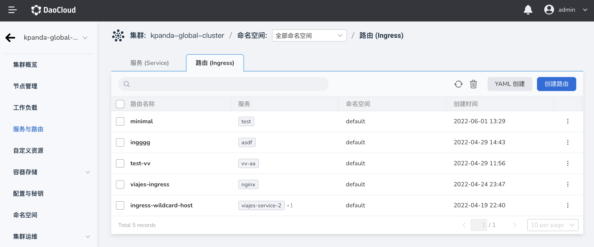
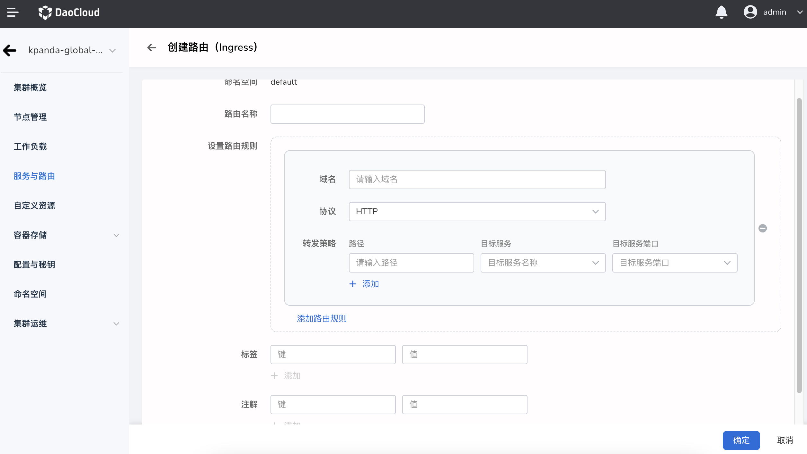
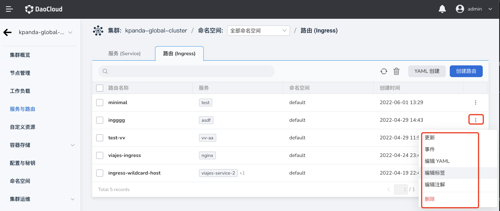

# Create an Ingress

In a Kubernetes cluster, [Ingress](https://kubernetes.io/docs/reference/generated/kubernetes-api/v1.24/#ingress-v1beta1-networking-k8s-io) exposes services from outside the cluster to inside the cluster HTTP and HTTPS ingress.
Traffic ingress is controlled by rules defined on the Ingress resource. Here's an example of a simple Ingress that sends all traffic to the same Service:

Ingress is an API object that manages external access to services in the cluster, and the typical access method is HTTP. Ingress can provide load balancing, SSL termination, and name-based virtual hosting.

## Prerequisites

- Container management module [connected to Kubernetes cluster](../clusters/integrate-cluster.md) or [created Kubernetes](../clusters/create-cluster.md), and can access the cluster UI interface.
- Completed a [namespace creation](../namespaces/createns.md), [user creation](../../../ghippo/user-guide/access-control/user.md), and authorize the user as [NS Editor](../permissions/permission-brief.md#ns-editor) role, for details, refer to [Namespace Authorization](../permissions/cluster-ns-auth.md).
- Completed [Create Ingress Instance](../../../network/modules/ingress-nginx/install.md), [Deploy Application Workload](../workloads/create-deployment.md), and have [created the corresponding Service](create-services.md)
- When there are multiple containers in a single instance, please make sure that the ports used by the containers do not conflict, otherwise the deployment will fail.

## Create ingress

1. After successfully logging in as the __NS Editor__ user, click __Clusters__ in the upper left corner to enter the __Clusters__ page. In the list of clusters, click a cluster name.

    

2. In the left navigation bar, click __Container Network__ -> __Ingress__ to enter the service list, and click the __Create Ingress__ button in the upper right corner.

    

    !!! note

        It is also possible to __Create from YAML__ .

3. Open __Create Ingress__ page to configure. There are two protocol types to choose from, refer to the following two parameter tables for configuration.

### Create HTTP protocol ingress

Enter the following parameters:

| Field | Subfield | Description | Required |
|------|------|------|------|
| Ingress Name | – | Enter the name of the new ingress | Required |
| Namespace | – | Select the namespace where the new service is located. For more information about namespaces, refer to the namespace overview. | Required |
| Set Routing Rules | Domain Name | Use the domain name to provide external access services. The default is the domain name of the cluster. | Required |
|  | Protocol | Refers to the protocol that authorizes inbound access to the cluster service, and supports HTTP (no identity authentication required) or HTTPS (identity authentication needs to be configured). | Required |
|  | Forwarding Policy | Specify the access policy of the Ingress | Optional |
|  | Path | Specify the URL path for service access. The default is the root path. | Optional |
|  | Target Service | The name of the service to be routed | Required |
|  | Target Service Port | The port exposed by the service | Required |
| Load Balancer Type | Platform-level Load Balancer | In the same cluster, share the same Ingress instance, where all Pods can receive requests distributed by the load balancer | Required |
|  | Tenant-level Load Balancer | The Ingress instance belongs exclusively to the current namespace, or exclusively to a certain workspace that includes the current namespace, and all Pods can receive distributed requests | Required |
| Ingress Class | – | Select the corresponding Ingress instance, and after selection, traffic is directed to the specified instance. When it is None, DefaultClass is used | Optional |
|  | Session Persistence | Session persistence is divided into L4 source address hash / Cookie Key / L7 Header Name. Once enabled, session persistence is performed according to the rules. | Optional |
| Session Persistence | L4 Source Address Hash | When enabled, by default the following is added to the Annotation: `nginx.ingress.kubernetes.io/upstream-hash-by: "$binary_remote_addr"` | Optional |
|  | Cookie Key | When enabled, connections from a specific client will be passed to the same Pod. Default Annotation: `nginx.ingress.kubernetes.io/affinity: "cookie"` , `nginx.ingress.kubernetes.io/affinity-mode: persistent` | Optional |
|  | L7 Header Name | When enabled, default Annotation: `nginx.ingress.kubernetes.io/upstream-hash-by: "$http_x_forwarded_for"` | Optional |
| Path Rewriting | – | rewrite-target, used for URL rewriting when the URL exposed by the backend service differs from the Ingress path | Optional |
| Redirect | – | permanent-redirect, permanent redirection. After entering the rewrite path, access will be redirected to that address | Optional |
| Traffic Distribution | Based on Weight | After setting the weight, Annotation: `nginx.ingress.kubernetes.io/canary-weight: "10"` | Optional |
|  | Based on Cookie | After the Cookie rules are set, traffic is distributed according to the Cookie conditions | Optional |
|  | Based on Header | After the Header rules are set, traffic is distributed according to the Header conditions | Optional |
| Labels | – | Add labels to the ingress | Optional |
| Annotations | – | Add annotations to the ingress | Optional |

### Create HTTPS protocol ingress

Enter the following parameters:

!!! note

    Note: Unlike the __Set Routing Rules__ of the HTTP protocol, you additionally need to select a certificate by secret; other configurations are basically the same.

- __Protocol__ : Required. Refers to the protocol that authorizes inbound access to the cluster service, and supports the HTTP (no identity authentication required) or HTTPS (identity authentication needs to be configured) protocol. Here select the ingress of the HTTPS protocol.
- __Secret__ : Required. HTTPS TLS certificate, [Create Secret](../configmaps-secrets/create-secret.md).

### Create ingress successfully

After configuring all the parameters, click the __OK__ button to return to the ingress list automatically. On the right side of the list, click __┇__ to modify or delete the selected ingress.

