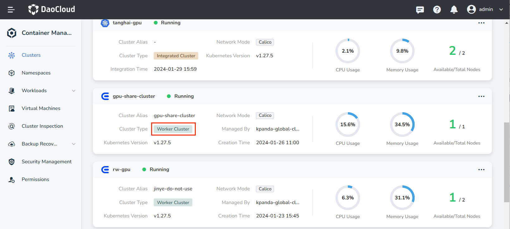
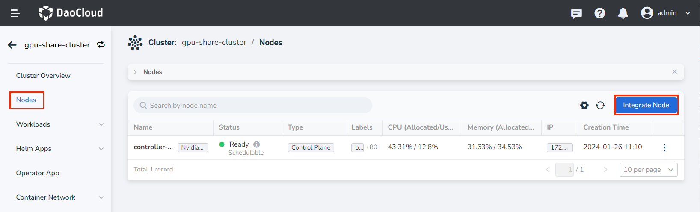
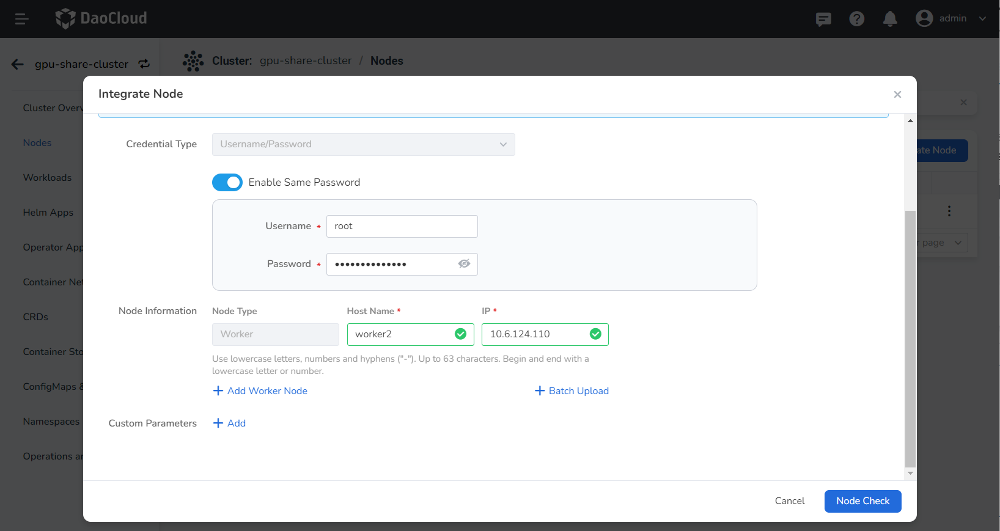

# Cluster Node Expansion

As the number of business applications continues to grow, the resources of the cluster become increasingly tight. At this point, you can expand the cluster nodes based on kubean. After the expansion, applications can run on the newly added nodes, alleviating resource pressure.

Only clusters [created through the container management module](../clusters/create-cluster.md) support node expansion and contraction. Clusters accessed from the outside do not support this operation. This article mainly introduces the expansion of **worker nodes** in the same architecture work cluster. If you need to add control nodes or heterogeneous work nodes to the cluster, please refer to: [Expanding the control node of the work cluster](../../best-practice/add-master-node.md), [Adding heterogeneous nodes to the work cluster](../../best-practice/multi-arch.md), [Expanding the worker node of the global service cluster](../../best-practice/add-worker-node-on-global.md).

1. On the __Clusters__ page, click the name of the target cluster.

    If the __Cluster Type__ contains the label __Integrated Cluster__, it means that the cluster does not support node expansion and contraction.

    

2. Click __Nodes__ in the left navigation bar, and then click __Integrate Node__ in the upper right corner of the page.

    

3. Enter the host name and node IP and click __OK__.

    Click __➕ Add Worker Node__ to continue accessing more nodes.

    

!!! note

    Accessing the node takes about 20 minutes, please be patient.
