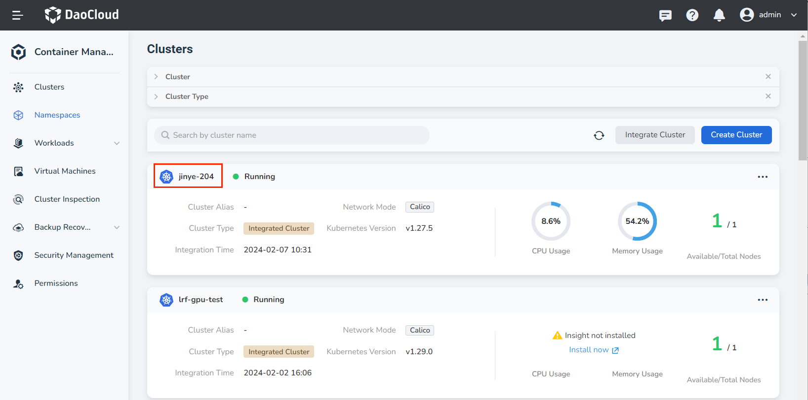
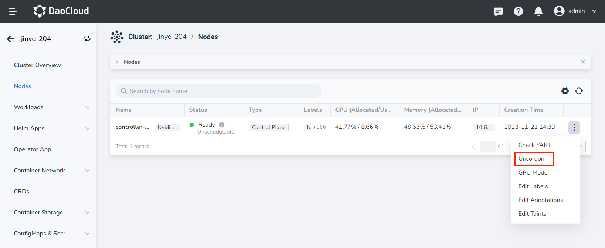
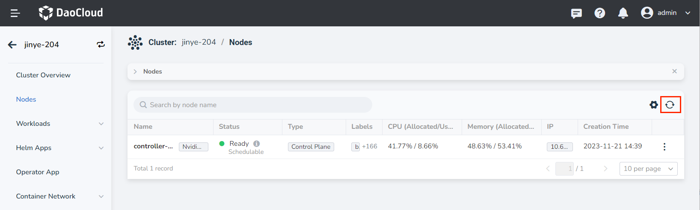

# Node Scheduling

Supports suspending or resuming scheduling of nodes. Pausing scheduling means stopping the scheduling of Pods to the node. Resuming scheduling means that Pods can be scheduled to that node.

1. On the __Clusters__ page, click the name of the target cluster.

    

2. Click __Nodes__ on the left navigation bar, click the __ⵗ__ operation icon on the right side of the node, and click the __Cordon__ button to suspend scheduling the node.

    

3. Click the __ⵗ__ operation icon on the right side of the node, and click the __Uncordon__ button to resume scheduling the node.

    

The node scheduling status may be delayed due to network conditions. Click the __refresh icon__ on the right side of the search box to refresh the node scheduling status.

