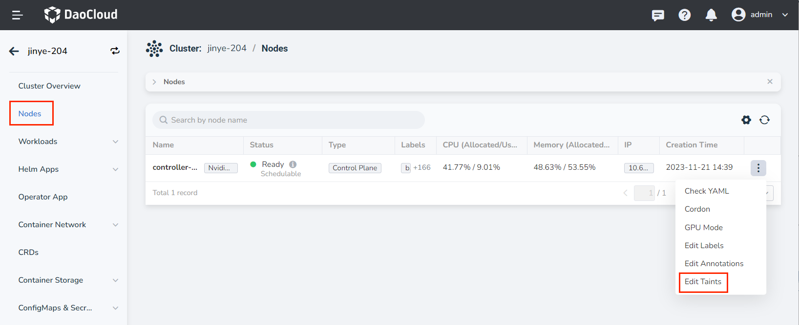
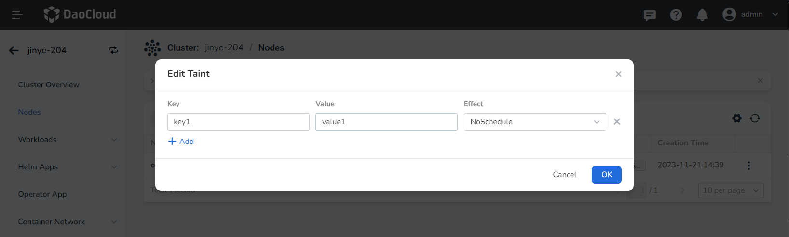

# Node Taints

Taint can make a node exclude a certain type of Pod and prevent Pod from being scheduled on the node.
One or more taints can be applied to each node, and Pods that cannot tolerate these taints will not be scheduled on that node.

## Precautions

1. The current operating user should have [NS Editor](../permissions/permission-brief.md) role authorization or other higher permissions.
2. After adding a taint to a node, only Pods that can tolerate the taint can be scheduled to the node. <!--For how to set tolerance for Pod, refer to -->

## Steps

1. Find the target cluster on the __Clusters__ page, and click the cluster name to enter the Cluster page.

    

2. In the left navigation bar, click __Nodes__ , find the node that needs to modify the taint, click the __┇__ operation icon on the right and click the __Edit Taints__ button.

    

3. Enter the key value information of the taint in the pop-up box, select the taint effect, and click __OK__ .

    Click __➕ Add__ to add multiple taints to the node, and click __X__ on the right side of the taint effect to delete the taint.

    Currently supports three taint effects:

    - `NoExecute`: This affects pods that are already running on the node as follows:

        - Pods that do not tolerate the taint are evicted immediately
        - Pods that tolerate the taint without specifying `tolerationSeconds` in
            their toleration specification remain bound forever
        - Pods that tolerate the taint with a specified `tolerationSeconds` remain
            bound for the specified amount of time. After that time elapses, the node
            lifecycle controller evicts the Pods from the node.

    - `NoSchedule`: No new Pods will be scheduled on the tainted node unless they have a matching
      toleration. Pods currently running on the node are **not** evicted.

    - `PreferNoSchedule`: This is a "preference" or "soft" version of `NoSchedule`.
      The control plane will *try* to avoid placing a Pod that does not tolerate
      the taint on the node, but it is not guaranteed, so this taint is not recommended to use in a production environment.

    

For more details about taints, refer to the Kubernetes documentation
[Taints and Tolerance](https://kubernetes.io/docs/concepts/scheduling-eviction/taint-and-toleration/).
