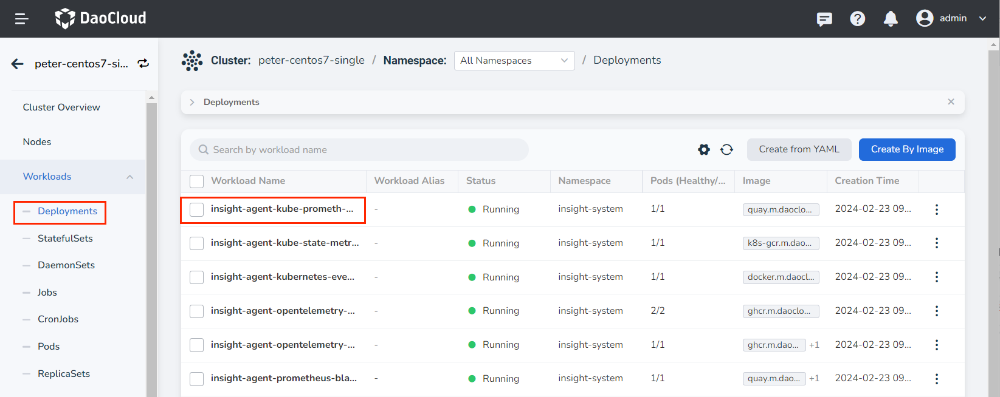
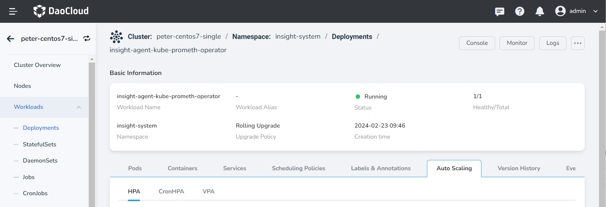
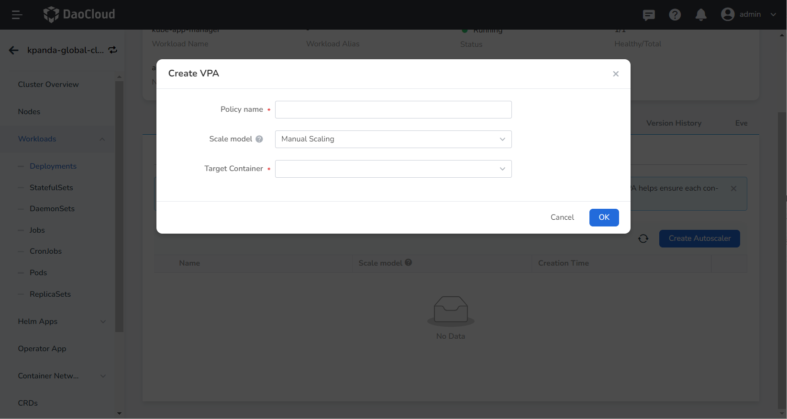
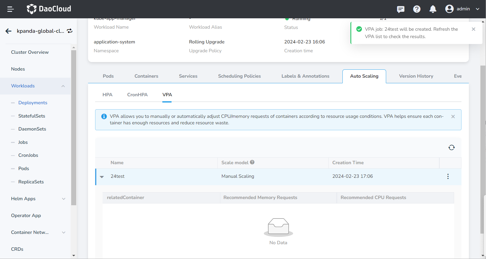

# Create VPAs

The container Vertical Pod Autoscaler (VPA) calculates the most suitable CPU and memory request values ​​for the Pod by monitoring the Pod's resource application and usage over a period of time. Using VPA can allocate resources to each Pod in the cluster more reasonably, improve the overall resource utilization of the cluster, and avoid waste of cluster resources.

DCE 5.0 supports VPA through containers. Based on this function, the Pod request value can be dynamically adjusted according to the usage of container resources. DCE 5.0 supports manual and automatic modification of resource request values, and you can configure them according to actual needs.

This page describes how to configure VPA for deployment.

!!! warning

    Using VPA to modify a Pod resource request will trigger a Pod restart. Due to the limitations of Kubernetes itself, Pods may be scheduled to other nodes after restarting.

## Prerequisites

Before configuring a vertical scaling policy for deployment, the following prerequisites must be met:

- In the [Container Management](../../intro/index.md) module [Access Kubernetes Cluster](../clusters/integrate-cluster.md) or [Create Kubernetes Cluster](../clusters/create-cluster.md), and can access the cluster UI interface.

- Create a [namespace](../namespaces/createns.md), [user](../../../ghippo/user-guide/access-control/user.md), [Deployments](../workloads/create-deployment.md) or [Statefulsets](../workloads/create-statefulset.md).

- The current operating user should have [`NS Edit`](../permissions/permission-brief.md#ns-edit) or higher permissions, for details, refer to [Namespace Authorization](../namespaces/createns.md).

- The current cluster has installed [ __metrics-server__ ](install-metrics-server.md) and [ __VPA__ ](install-vpa.md) plugins.

## Steps

Refer to the following steps to configure the built-in index auto scaling policy for the deployment.

1. Find the current cluster in __Clusters__ , and click the name of the target cluster.

    

2. Click __Deployments__ in the left navigation bar, find the deployment that needs to create a VPA, and click the name of the deployment.

    

3. Click the __Auto Scaling__ tab to view the auto scaling configuration of the current cluster, and confirm that the relevant plug-ins have been installed and are running normally.

    

4. Click the __Create Autoscaler__ button and configure the VPA vertical scaling policy parameters.

    

    - Policy name: Enter the name of the vertical scaling policy. Please note that the name can contain up to 63 characters, and can only contain lowercase letters, numbers, and separators ("-"), and must start and end with lowercase letters or numbers, such as vpa- my-dep.
    - Scaling mode: Run the method of modifying the CPU and memory request values. Currently, vertical scaling supports manual and automatic scaling modes.
        - Manual scaling: After the vertical scaling strategy calculates the recommended resource configuration value, the user needs to manually modify the resource quota of the application.
        - Auto-scaling: The vertical scaling strategy automatically calculates and modifies the resource quota of the application.
    - Target container: Select the container to be scaled vertically.

5. After completing the parameter configuration, click the __OK__ button to automatically return to the elastic scaling details page. Click __⋮__ on the right side of the list to perform edit and delete operations.

    
