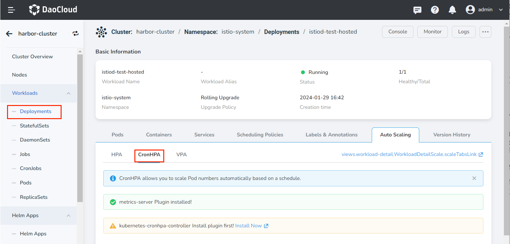
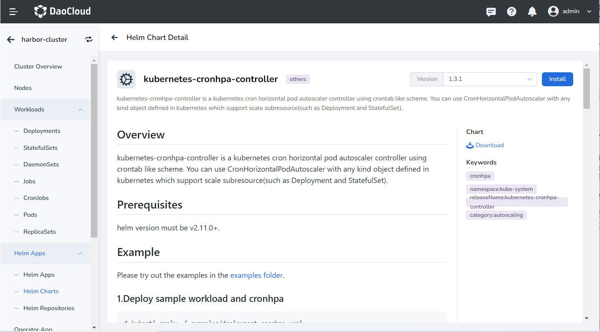

# Install kubernetes-cronhpa-controller

The container copy timing horizontal expansion and contraction policy (CronHPA) can provide stable computing resource guarantee for periodic high-concurrency applications, and __kubernetes-cronhpa-controller__ is a key component to implement CronHPA.

This section describes how to install the __kubernetes-cronhpa-controller__ plugin.

!!! note

    In order to use CornHPA, not only the __kubernetes-cronhpa-controller__ plugin needs to be installed, but also [install the __metrics-server__ plugin](install-metrics-server.md).

## Prerequisites

Before installing the __kubernetes-cronhpa-controller__ plugin, the following prerequisites need to be met:

- In the [Container Management](../../intro/index.md) module [Access Kubernetes Cluster](../clusters/integrate-cluster.md) or [Create Kubernetes Cluster](../clusters/create-cluster.md), and can access the cluster UI interface.

- Create a [namespace](../namespaces/createns.md).

- The current operating user should have [NS Editor](../permissions/permission-brief.md#ns-editor) or higher permissions, for details, refer to [Namespace Authorization](../namespaces/createns.md).

## Steps

Refer to the following steps to install the __kubernetes-cronhpa-controller__ plugin for the cluster.

1. On the __Clusters__ page, find the target cluster where the plugin needs to be installed, click the name of the cluster, then click __Workloads__ -> __Deployments__ on the left, and click the name of the target workload.

2. On the workload details page, click the __Auto Scaling__ tab, and click __Install__ on the right side of __CronHPA__ .

    

3. Read the relevant introduction of the plug-in, select the version and click the __Install__ button. It is recommended to install __1.3.0__ or later.

    

4. Refer to the following instructions to configure the parameters.

    

    - Name: Enter the plugin name, please note that the name can be up to 63 characters, can only contain lowercase letters, numbers, and separators ("-"), and must start and end with lowercase letters or numbers, such as kubernetes-cronhpa-controller.
    - Namespace: Select which namespace the plugin will be installed in, here we take __default__ as an example.
    - Version: The version of the plugin, here we take the __1.3.0__ version as an example.
    - Ready Wait: When enabled, it will wait for all associated resources under the application to be in the ready state before marking the application installation as successful.
    - Failed to delete: If the plugin installation fails, delete the associated resources that have already been installed. When enabled, __Wait__ will be enabled synchronously by default.
    - Detailed log: When enabled, a detailed log of the installation process will be recorded.

    !!! note

        After enabling __ready wait__ and/or __failed deletion__ , it takes a long time for the application to be marked as "running".

5. Click __OK__ in the lower right corner of the page, and the system will automatically jump to the __Helm Apps__ list page. Wait a few minutes and refresh the page to see the application you just installed.

    !!! warning

    If you need to delete the __kubernetes-cronhpa-controller__ plugin, you should go to the __Helm Apps__ list page to delete it completely.

    If you delete the plug-in under the __Auto Scaling__ tab of the workload, this only deletes the workload copy of the plug-in, and the plug-in itself is still not deleted, and an error will be prompted when the plug-in is reinstalled later.

6. Go back to the __Auto Scaling__ tab under the workload details page, and you can see that the interface displays __Plug-in installed__ . Now it's time to start creating CronHPA policies.
