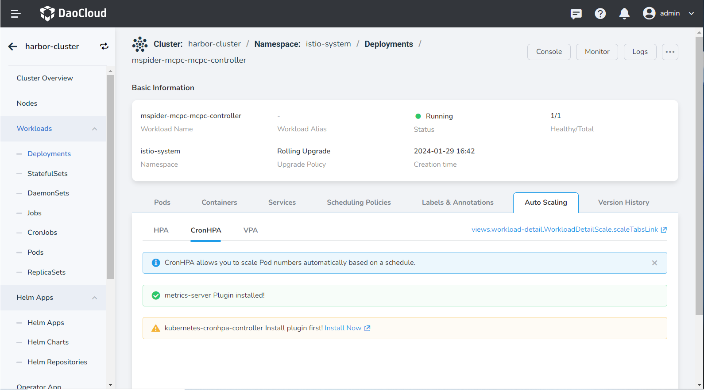
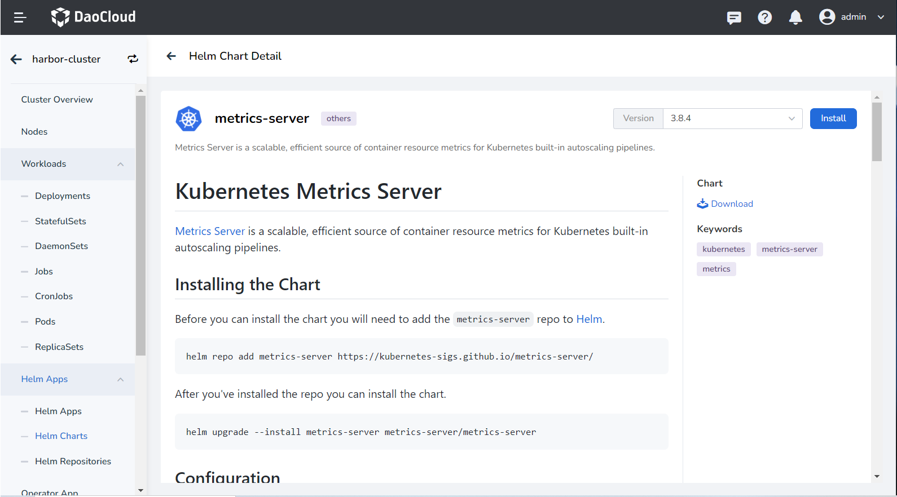
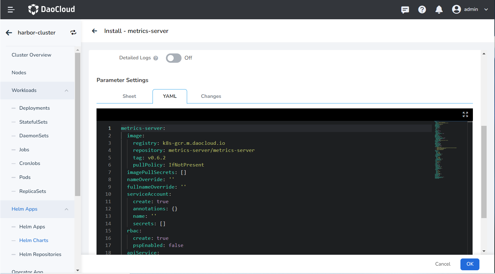

# Install metrics-server

 __metrics-server__ is the built-in resource usage metrics collection component of Kubernetes.
You can automatically scale Pod copies horizontally for workload resources by configuring HPA policies.

This section describes how to install __metrics-server__ .

## Prerequisites

Before installing the __metrics-server__ plugin, the following prerequisites need to be met:

- The container management module [connected to the Kubernetes cluster](../clusters/integrate-cluster.md) or [created the Kubernetes cluster](../clusters/create-cluster.md), and can access the UI interface of the cluster .

- Completed a [namespace creation](../namespaces/createns.md).

- The current operating user should have [NS Editor](../permissions/permission-brief.md#ns-editor) or higher permissions, for details, refer to [Namespace Authorization](../namespaces/createns.md).

## Steps

Please perform the following steps to install the __metrics-server__ plugin for the cluster.

1. On the Auto Scaling page under workload details, click the __Install__ button to enter the __metrics-server__ plug-in installation interface.

    

2. Read the introduction of the __metrics-server__ plugin, select the version and click the __Install__ button. This page will use the __3.8.2__ version as an example to install, and it is recommended that you install __3.8.2__ and later versions.

    

3. Configure basic parameters on the installation configuration interface.

    

    - Name: Enter the plugin name, please note that the name can be up to 63 characters, can only contain lowercase letters, numbers and separators ("-"), and must start and end with lowercase letters or numbers, such as metrics-server-01.
    - Namespace: Select the namespace for plugin installation, here we take __default__ as an example.
    - Version: The version of the plugin, here we take __3.8.2__ version as an example.
    - Ready Wait: When enabled, it will wait for all associated resources under the application to be ready before marking the application installation as successful.
    - Failed to delete: After it is enabled, the synchronization will be enabled by default and ready to wait. If the installation fails, the installation-related resources will be removed.
    - Verbose log: Turn on the verbose output of the installation process log.

    !!! note

        After enabling __Wait__ and/or __Deletion failed__ , it takes a long time for the app to be marked as __Running__ .

4. Advanced parameter configuration

    - If the cluster network cannot access the __k8s.gcr.io__ repository, please try to modify the __repositort__ parameter to __repository: k8s.m.daocloud.io/metrics-server/metrics-server__ .

    - An SSL certificate is also required to install the __metrics-server__ plugin. To bypass certificate verification, you need to add __- --kubelet-insecure-tls__ parameter at __defaultArgs:__ .

    ??? note "Click to view and use the YAML parameters to replace the default __YAML__ "

        ```yaml
        image:
          repository: k8s.m.daocloud.io/metrics-server/metrics-server # Change the registry source address to k8s.m.daocloud.io
          tag: ''
          pullPolicy: IfNotPresent
        imagePullSecrets: []
        nameOverride: ''
        fullnameOverride: ''
        serviceAccount:
          create: true
          annotations: {}
          name: ''
        rbac:
          create: true
          pspEnabled: false
        apiService:
          create: true
        podLabels: {}
        podAnnotations: {}
        podSecurityContext: {}
        securityContext:
          allowPrivilegeEscalation: false
          readOnlyRootFilesystem: true
          runAsNonRoot: true
          runAsUser: 1000
        priorityClassName: system-cluster-critical
        containerPort: 4443
        hostNetwork:
          enabled: false
        replicas: 1
        updateStrategy: {}
        podDisruptionBudget:
          enabled: false
          minAvailable: null
          maxUnavailable: null
        defaultArgs:
          - '--cert-dir=/tmp'
          - '--kubelet-preferred-address-types=InternalIP,ExternalIP,Hostname'
          - '--kubelet-use-node-status-port'
          - '--metric-resolution=15s'
          - --kubelet-insecure-tls # Bypass certificate verification
        args: []
        livenessProbe:
          httpGet:
            path: /livez
            port:https
            scheme: HTTPS
          initialDelaySeconds: 0
          periodSeconds: 10
          failureThreshold: 3
        readinessProbe:
          httpGet:
            path: /readyz
            port:https
            scheme: HTTPS
          initialDelaySeconds: 20
          periodSeconds: 10
          failureThreshold: 3
        service:
          type: ClusterIP
          port: 443
          annotations: {}
          labels: {}
        metrics:
          enabled: false
        serviceMonitor:
          enabled: false
          additionalLabels: {}
          interval: 1m
          scrapeTimeout: 10s
        resources: {}
        extraVolumeMounts: []
        extraVolumes: []
        nodeSelector: {}
        tolerations: []
        affinity: {}
        ```

5. Click the __OK__ button to complete the installation of the __metrics-server__ plug-in, and then the system will automatically jump to the __Helm Apps__ list page. After a few minutes, refresh the page and you will see the newly installed Applications.

!!! note

    When deleting the __metrics-server__ plugin, the plugin can only be completely deleted on the __Helm Applications__ list page. If you only delete __metrics-server__ on the workload page, this only deletes the workload copy of the application, the application itself is still not deleted, and an error will be prompted when you reinstall the plugin later.