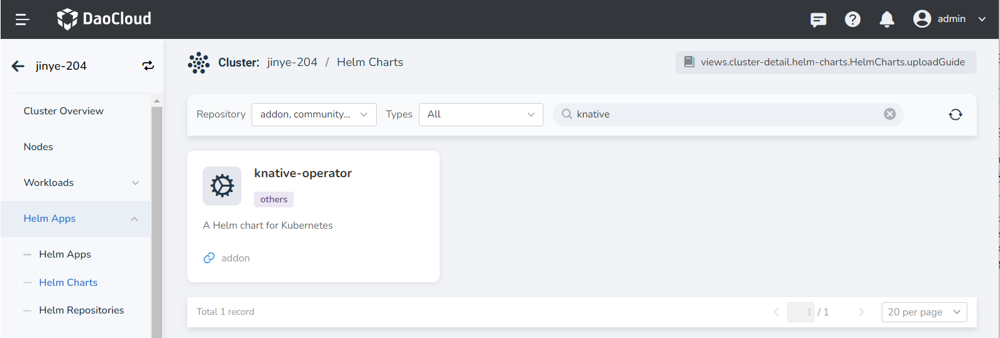
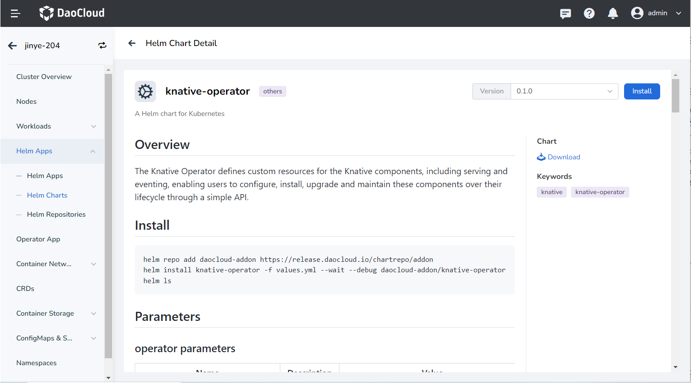
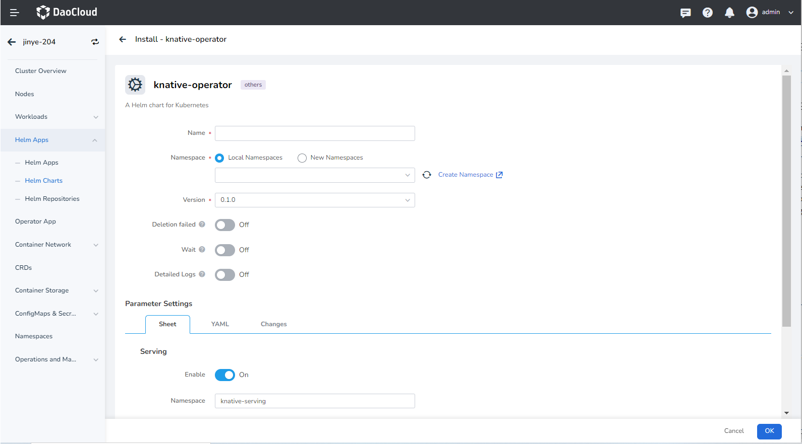

# Installation

1. Log in to the cluster, click on the sidebar __Helm Apps__ → __Helm Charts__ , enter __knative__ in the search box at the top right, and then press the enter key to search.

    

2. Click the __knative-operator__ to enter the installation configuration interface. You can view the available versions and the Parameters optional items of Helm values on this interface.

    

3. After clicking the install button, you will enter the installation configuration interface.

    

4. Enter the name, installation tenant, and it is recommended to check __Wait__ and __Detailed Logs__ .

5. In the settings below, you can tick __Serving__ and enter the installation tenant of the Knative Serving component, which will deploy the Knative Serving component after installation. This component is managed by the Knative Operator.
