# Create Deployment

This page describes how to create deployments through images and YAML files.

[Deployment](https://kubernetes.io/docs/concepts/workloads/controllers/deployment/) is a common resource in Kubernetes, mainly [Pod](https://kubernetes.io/docs/concepts/workloads/pods/) and [ReplicaSet](https://kubernetes.io/docs/concepts/workloads/controllers/replicaset/) provide declarative updates, support elastic scaling, rolling upgrades, version rollbacks, etc. Function. Declare the desired Pod state in the Deployment, and the Deployment Controller will modify the current state through the ReplicaSet to make it reach the pre-declared desired state. Deployment is stateless and does not support data persistence. It is suitable for deploying stateless applications that do not need to save data and can be restarted and rolled back at any time.

Through the container management module of [DCE 5.0](../../../dce/index.md), workloads on multicloud and multiclusters can be easily managed based on corresponding role permissions, including the creation of deployments, Full life cycle management such as update, deletion, elastic scaling, restart, and version rollback.

## Prerequisites

Before using image to create deployments, the following prerequisites need to be met:

- In the [Container Management](../../intro/index.md) module [Access Kubernetes Cluster](../clusters/integrate-cluster.md) or [Create Kubernetes Cluster](../clusters/create-cluster.md), and can access the cluster UI interface.

- Create a [namespace](../namespaces/createns.md) and a [user](../../../ghippo/user-guide/access-control/user.md).

- The current operating user should have [NS Editor](../permissions/permission-brief.md#ns-editor) or higher permissions, for details, refer to [Namespace Authorization](../namespaces/createns.md).

- When there are multiple containers in a single instance, please make sure that the ports used by the containers do not conflict, otherwise the deployment will fail.

## Create by image

Follow the steps below to create a deployment by image.

1. Click __Clusters__ on the left navigation bar, and then click the name of the target cluster to enter the Cluster Details page.

    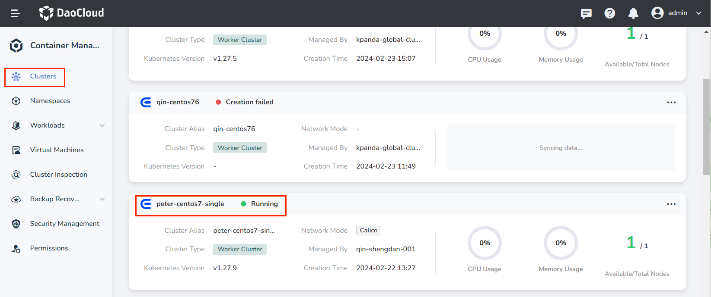

2. On the cluster details page, click __Workloads__ -> __Deployments__ in the left navigation bar, and then click the __Create by Image__ button in the upper right corner of the page.

    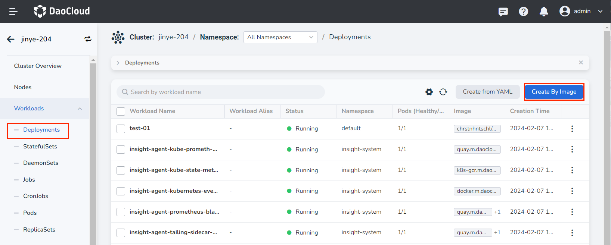

3. Fill in [Basic Information](create-deployment.md#_3), [Container Setting](create-deployment.md#_4), [Service Setting](create-deployment.md#_5), [Advanced Setting] in turn (create-deployment.md#_6), click __OK__ in the lower right corner of the page to complete the creation.

     The system will automatically return the list of __Deployments__ . Click __︙__ on the right side of the list to perform operations such as update, delete, elastic scaling, restart, and version rollback on the load. If the load status is abnormal, please check the specific abnormal information, refer to [Workload Status](../workloads/pod-config/workload-status.md).

    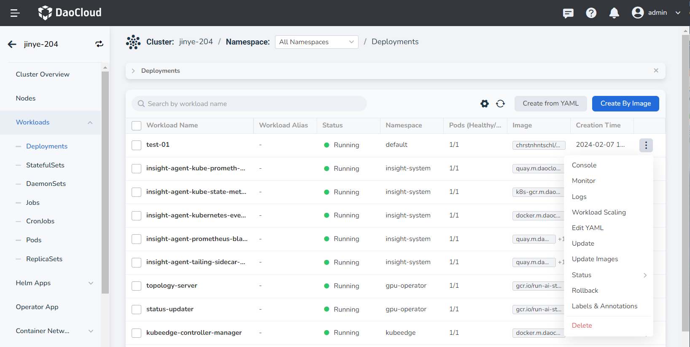

### Basic information

- Workload Name: can contain up to 63 characters, can only contain lowercase letters, numbers, and a separator ("-"), and must start and end with a lowercase letter or number, such as deployment-01. The name of the same type of workload in the same namespace cannot be repeated, and the name of the workload cannot be changed after the workload is created.
- Namespace: Select the namespace where the newly created payload will be deployed. The default namespace is used by default. If you can't find the desired namespace, you can go to [Create a new namespace](../namespaces/createns.md) according to the prompt on the page.
- Pods: Enter the number of Pod instances for the load, and one Pod instance is created by default.
- Description: Enter the description information of the payload and customize the content. The number of characters cannot exceed 512.

    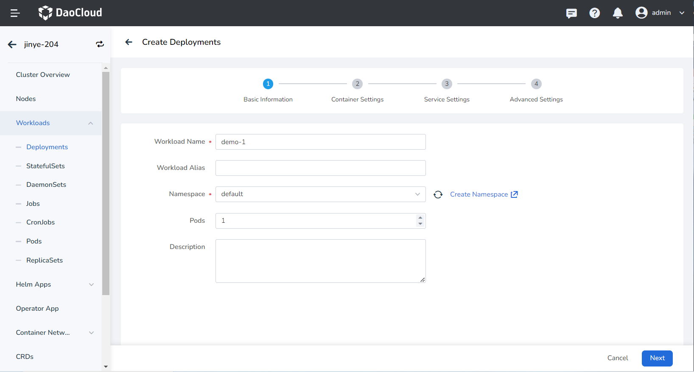

### Container settings

Container setting is divided into six parts: basic information, life cycle, health check, environment variables, data storage, and security settings. Click the corresponding tab below to view the requirements of each part.

> Container setting is only configured for a single container. To add multiple containers to a pod, click __+__ on the right to add multiple containers.

=== "Basic information (required)"

     When configuring container-related parameters, you must correctly fill in the container name and image parameters, otherwise you will not be able to proceed to the next step. After filling in the setting with reference to the following requirements, click __OK__ .
    
     - Container Name: Up to 63 characters, lowercase letters, numbers and separators ("-") are supported. Must start and end with a lowercase letter or number, eg nginx-01.
     - Image: Enter the address or name of the image. When entering the image name, the image will be pulled from the official [DockerHub](https://hub.docker.com/) by default. After accessing the [container registry](../../../kangaroo/intro/index.md) module of DCE 5.0, you can click __Select Image__ on the right to select an image.
     - Image Pull Policy: After checking __Always pull image__ , the image will be pulled from the registry every time the load restarts/upgrades. If it is not checked, only the local mirror will be pulled, and only when the mirror does not exist locally, it will be re-pulled from the container registry. For more details, refer to [Image Pull Policy](https://kubernetes.io/docs/concepts/containers/images/#image-pull-policy).
     - Privileged container: By default, the container cannot access any device on the host. After enabling the privileged container, the container can access all devices on the host and enjoy all the permissions of the running process on the host.
     - CPU/Memory Quota: Requested value (minimum resource to be used) and limit value (maximum resource allowed to be used) of CPU/Memory resource. Please configure resources for containers as needed to avoid resource waste and system failures caused by excessive container resources. The default value is shown in the figure.
     - GPU Exclusive: Configure the GPU usage for the container, only positive integers are supported. The GPU quota setting supports setting exclusive use of the entire GPU card or part of the vGPU for the container. For example, for an 8-core GPU card, enter the number __8__ to let the container exclusively use the entire length of the card, and enter the number __1__ to configure a 1-core vGPU for the container.
    
         > Before setting exclusive GPU, the administrator needs to install the GPU card and driver plug-in on the cluster nodes in advance, and enable the GPU feature in [Cluster Settings](../clusterops/cluster-settings.md).
    
        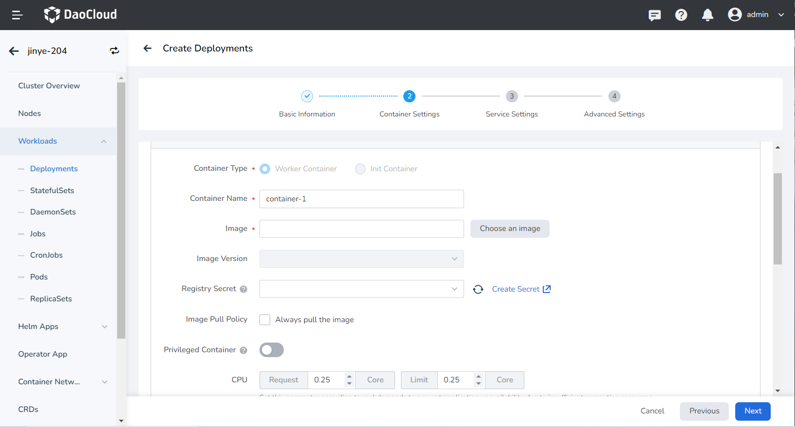

=== "Lifecycle (optional)"

     Set the commands that need to be executed when the container starts, after starting, and before stopping. For details, refer to [Container Lifecycle Setting](pod-config/lifecycle.md).

    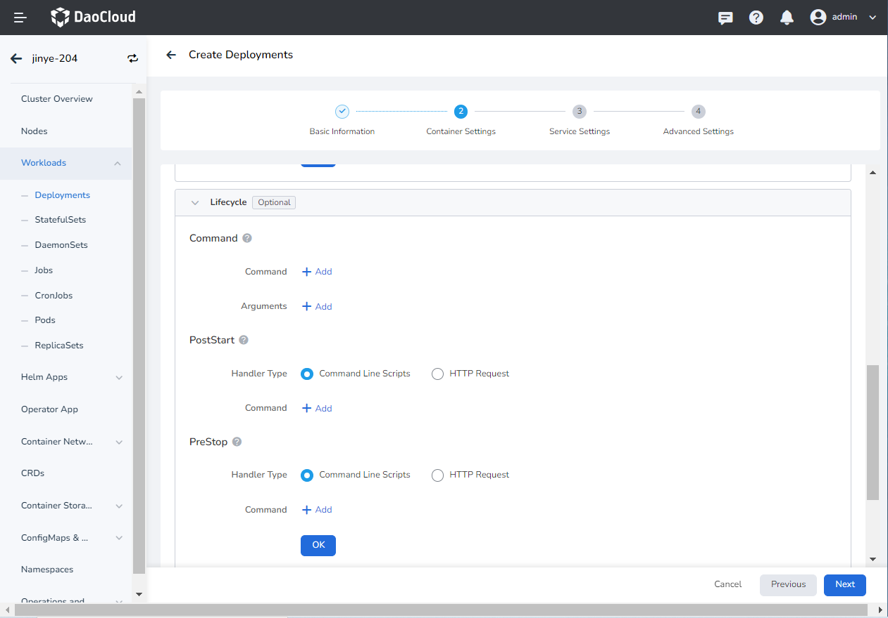

=== "Health Check (optional)"

     It is used to judge the health status of containers and applications, which helps to improve the availability of applications. For details, refer to [Container Health Check Setting](pod-config/health-check.md).
    
    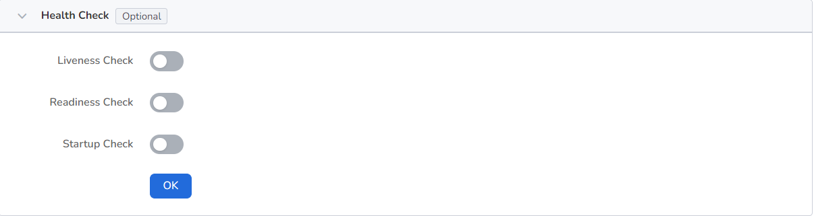    

=== "Environment variables (optional)"

     Configure container parameters within the Pod, add environment variables or pass setting to the Pod, etc. For details, refer to [Container environment variable setting](pod-config/env-variables.md).

    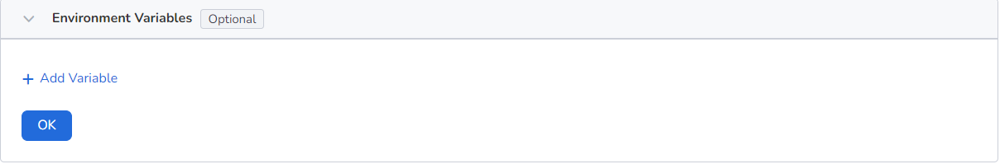

=== "Data storage (optional)"

     Configure the settings for container mounting data volumes and data persistence. For details, refer to [Container Data Storage Setting](pod-config/env-variables.md).

    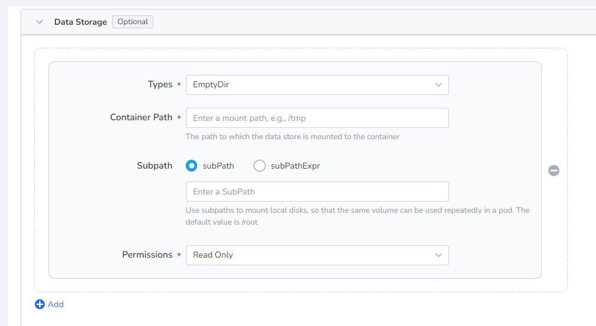

=== "Security settings (optional)"

     Containers are securely isolated through Linux's built-in account authority isolation mechanism. You can limit container permissions by using account UIDs (digital identity tokens) with different permissions. For example, enter __0__ to use the privileges of the root account.
    
    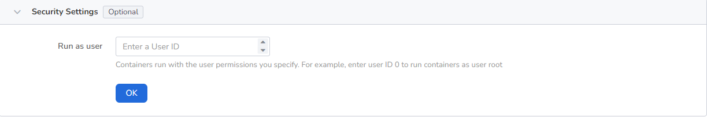

### Service settings

Configure [Service](../network/create-services.md) for the deployment, so that the deployment can be accessed externally.

1. Click the __Create Service__ button.

    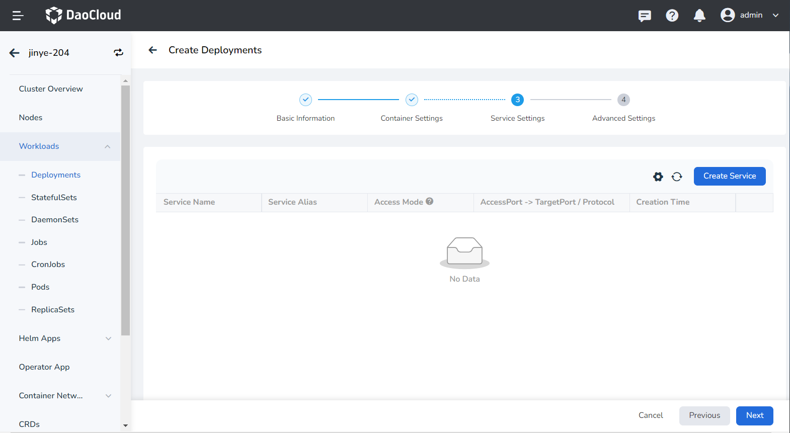

2. Refer to [Create Service](../network/create-services.md) to configure service parameters.

    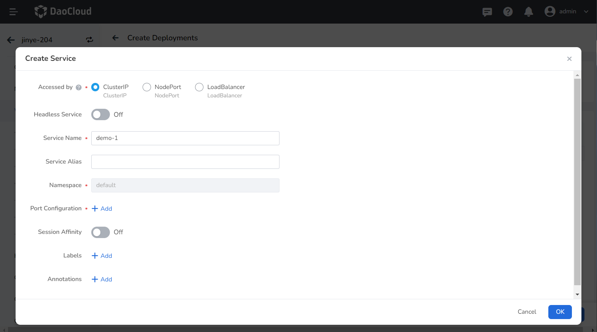

3. Click __OK__ and click __Next__ .

### Advanced settings

Advanced setting includes four parts: load network setting, upgrade strategy, scheduling strategy, label and annotation. You can click the tabs below to view the setting requirements of each part.

=== "Network Settings"

     1. For container NIC setting, refer to [Workload Usage IP Pool](../../../network/config/use-ippool/usage.md)
     2. DNS setting
     In some cases, the application will have redundant DNS queries. Kubernetes provides DNS-related setting options for applications, which can effectively reduce redundant DNS queries and increase business concurrency in certain cases.
    
     
    
     - DNS Policy
    
         - Default: Make container use kubelet's __-The domain name resolution file pointed to by the -resolv-conf__ parameter. This setting can only resolve external domain names registered on the Internet, but cannot resolve cluster internal domain names, and there is no invalid DNS query.
         - ClusterFirstWithHostNet: The domain name file of the host to which the application is connected.
         - ClusterFirst: application docking with Kube-DNS/CoreDNS.
         - None: New option value introduced in Kubernetes v1.9 (Beta in v1.10). After setting to None, dnsConfig must be set. At this time, the domain name resolution file of the container will be completely generated through the setting of dnsConfig.
    
     - Nameservers: fill in the address of the domain name server, such as __10.6.175.20__ .
     - Search domains: DNS search domain list for domain name query. When specified, the provided search domain list will be merged into the search field of the domain name resolution file generated based on dnsPolicy, and duplicate domain names will be deleted. Kubernetes allows up to 6 search domains.
     - Options: Setting options for DNS, where each object can have a name attribute (required) and a value attribute (optional). The content in this field will be merged into the options field of the domain name resolution file generated based on dnsPolicy. If some options of dnsConfig options conflict with the options of the domain name resolution file generated based on dnsPolicy, they will be overwritten by dnsConfig.
     - Host Alias: the alias set for the host.

        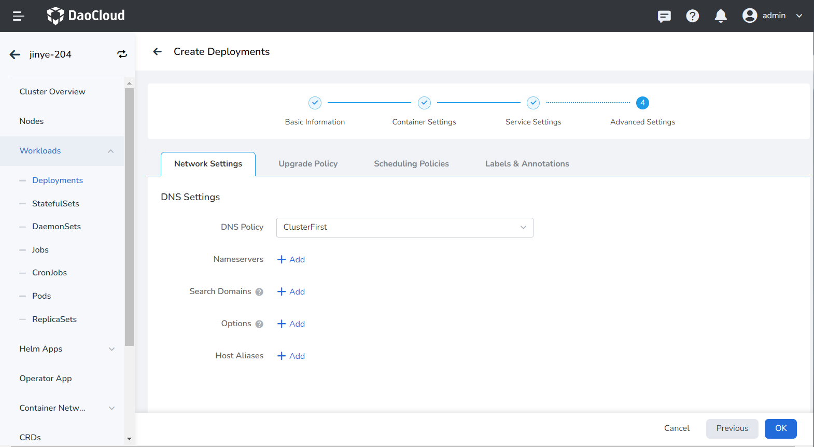

=== "Upgrade Policy"

     - Upgrade Mode: __Rolling upgrade__ refers to gradually replacing instances of the old version with instances of the new version. During the upgrade process, business traffic will be load-balanced to the old and new instances at the same time, so the business will not be interrupted. __Rebuild and upgrade__ refers to deleting the load instance of the old version first, and then installing the specified new version. During the upgrade process, the business will be interrupted.
     - Max Unavailable Pods: Specify the maximum value or ratio of unavailable pods during the load update process, the default is 25%. If it is equal to the number of instances, there is a risk of service interruption.
     - Max Surge: The maximum or ratio of the total number of Pods exceeding the desired replica count of Pods during a Pod update. Default is 25%.
     - Revision History Limit: Set the number of old versions retained when the version is rolled back. The default is 10.
     - Minimum Ready: The minimum time for a Pod to be ready. Only after this time is the Pod considered available. The default is 0 seconds.
     - Upgrade Max Duration: If the deployment is not successful after the set time, the load will be marked as failed. Default is 600 seconds.
     - Graceful Time Window: The execution time window (0-9,999 seconds) of the command before the load stops, the default is 30 seconds.

        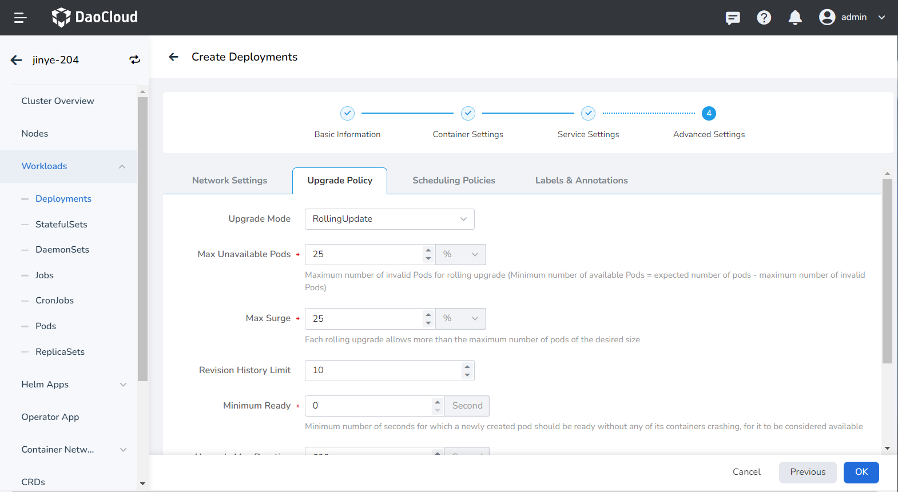

=== "Scheduling Policies"

     - Tolerance time: When the node where the load instance is located is unavailable, the time for rescheduling the load instance to other available nodes, the default is 300 seconds.
     - Node affinity: According to the label on the node, constrain which nodes the Pod can be scheduled on.
     - Workload Affinity: Constrains which nodes a Pod can be scheduled to based on the labels of the Pods already running on the node.
     - Workload anti-affinity: Constrains which nodes a Pod cannot be scheduled to based on the labels of Pods already running on the node.
     - Topology domain: namely topologyKey, used to specify a group of nodes that can be scheduled. For example, __kubernetes.io/os__ indicates that as long as the node of an operating system meets the conditions of labelSelector, it can be scheduled to the node.
    
     > For details, refer to [Scheduling Policy](pod-config/scheduling-policy.md).

        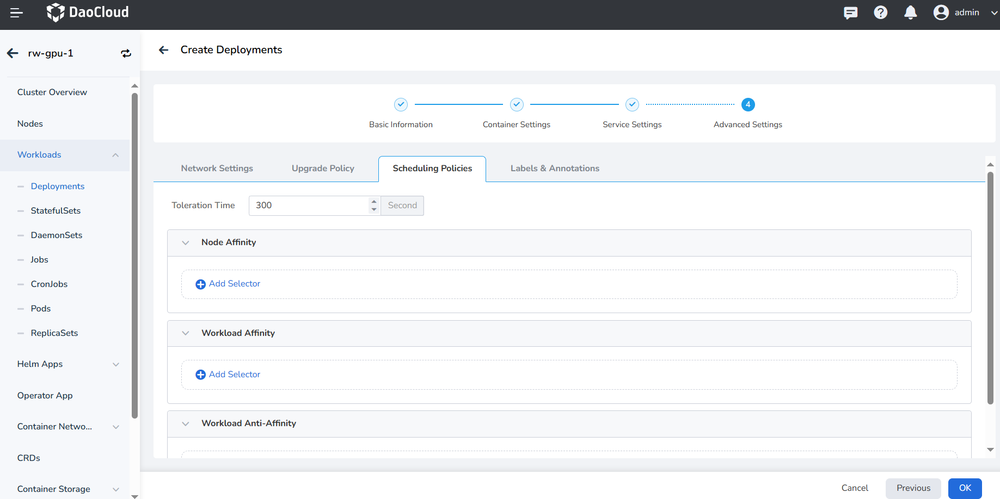

=== "Labels and Annotations"

     You can click the __Add__ button to add tags and annotations to workloads and pods.
    
    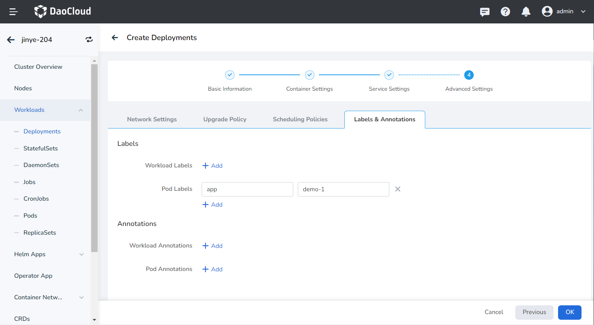

## Create from YAML

In addition to image, you can also create deployments more quickly through YAML files.

1. Click __Clusters__ on the left navigation bar, and then click the name of the target cluster to enter the Cluster Details page.

    

2. On the cluster details page, click __Workloads__ -> __Deployments__ in the left navigation bar, and then click the __Create from YAML__ button in the upper right corner of the page.

    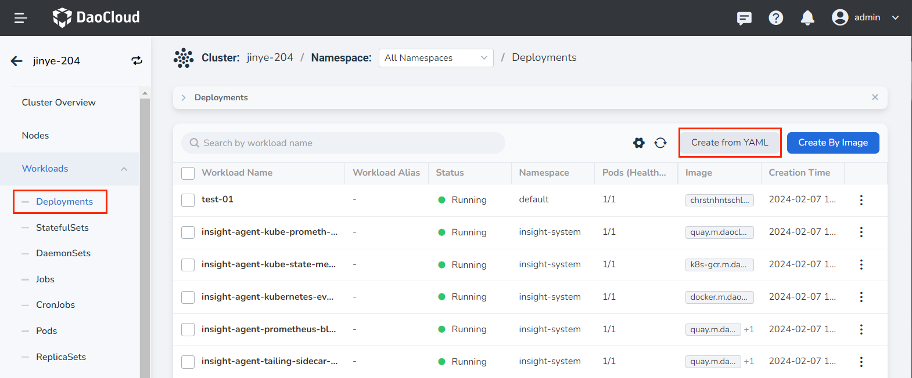

3. Enter or paste the YAML file prepared in advance, click __OK__ to complete the creation.

    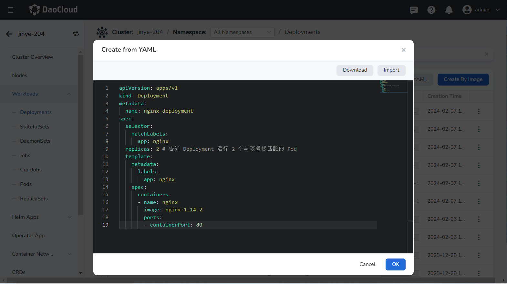

??? note "Click to see an example YAML for creating a deployment"

     ```yaml
     apiVersion: apps/v1
     kind: Deployment
     metadata:
       name: nginx-deployment
     spec:
       selector:
         matchLabels:
           app: nginx
       replicas: 2 # Tell the Deployment to run 2 Pods that match this template
       template:
         metadata:
           labels:
             app: nginx
         spec:
           containers:
           -name: nginx
             image: nginx:1.14.2
             ports:
             - containerPort: 80
     ```
