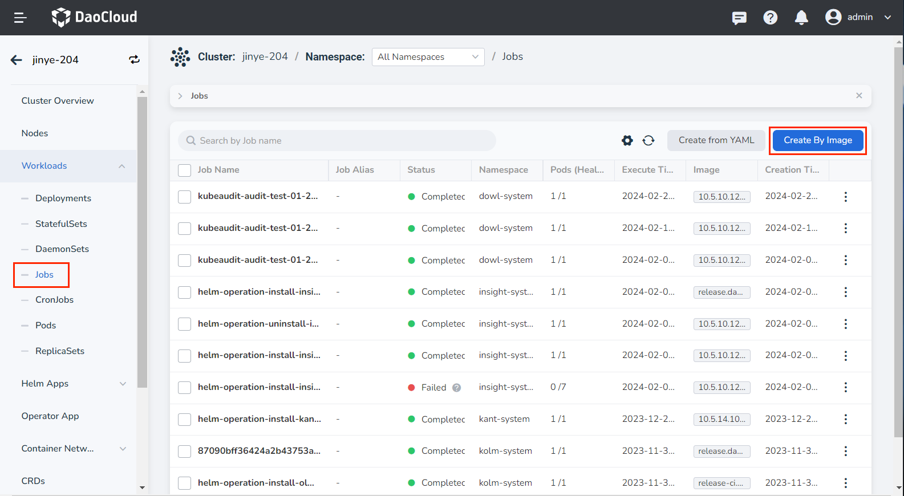
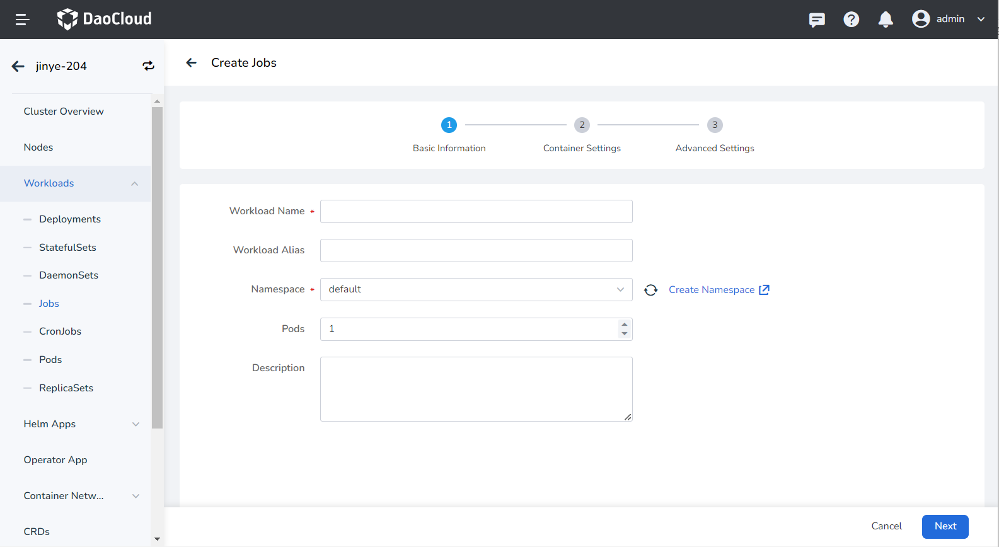
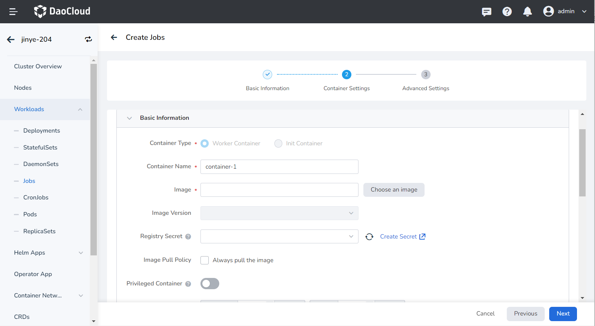
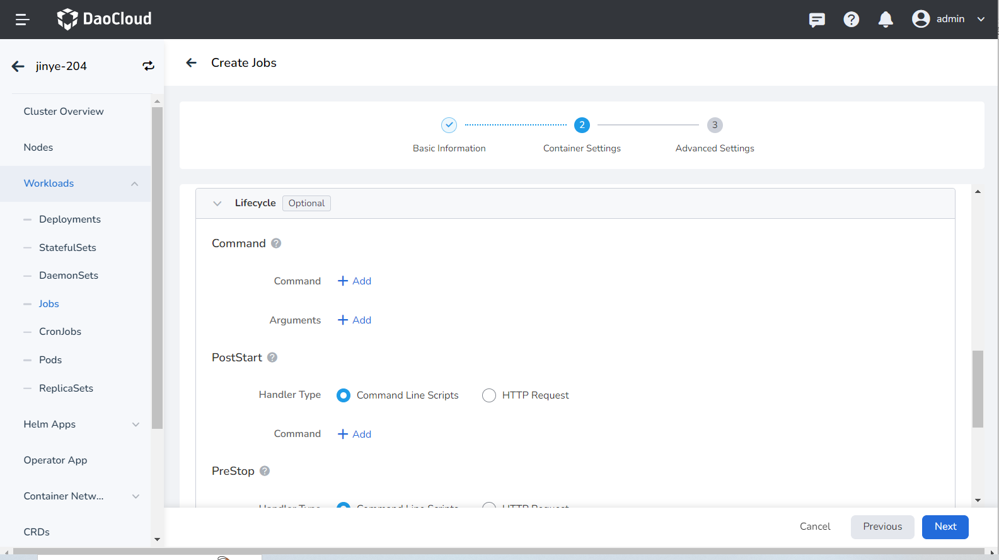
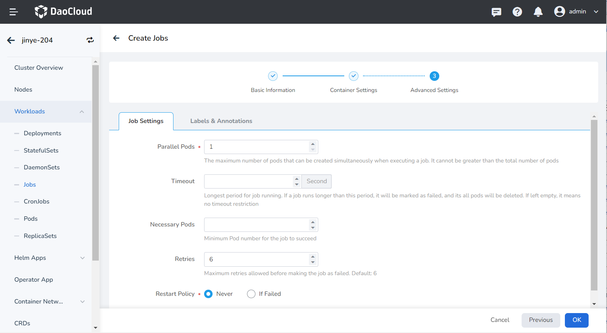
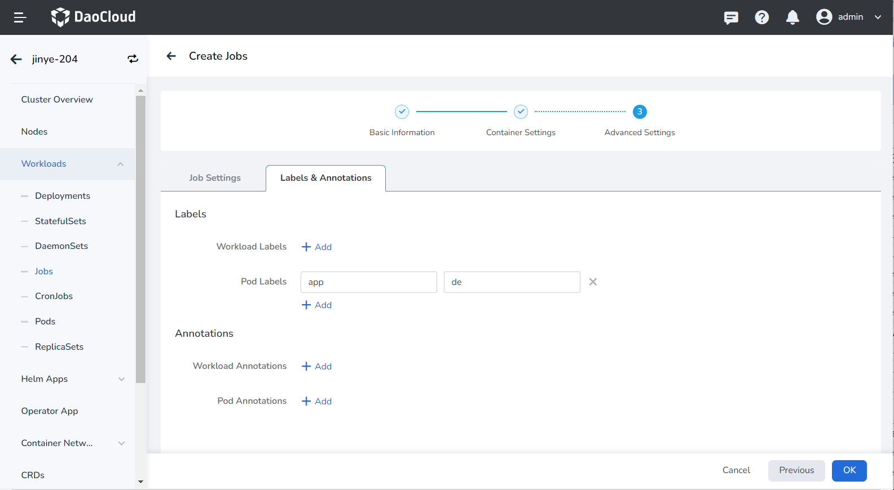
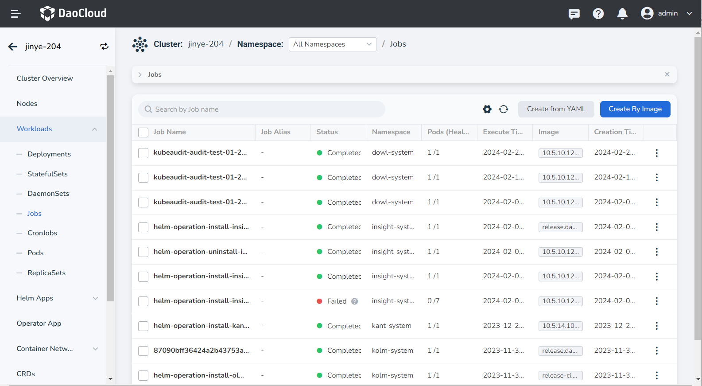
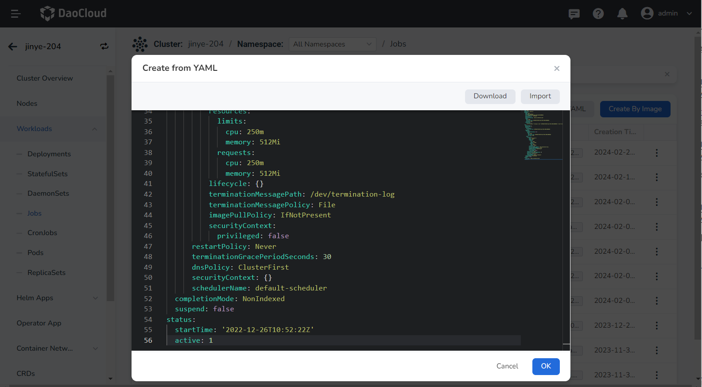

# Create Job

This page introduces how to create a job through image image and YAML file.

Job is suitable for performing one-time jobs. A Job creates one or more Pods, and the Job keeps retrying to run Pods until a certain number of Pods are successfully terminated. A Job ends when the specified number of Pods are successfully terminated. When a Job is deleted, all Pods created by the Job will be cleared. When a Job is paused, all active Pods in the Job are deleted until the Job is resumed. For more information about jobs, refer to [Job](https://kubernetes.io/docs/concepts/workloads/controllers/job/).

## Prerequisites

- In the [Container Management](../../intro/index.md) module [Access Kubernetes Cluster](../clusters/integrate-cluster.md) or [Create Kubernetes Cluster](../clusters/create-cluster.md), and can access the cluster UI interface.

- Create a [namespace](../namespaces/createns.md) and a [user](../../../ghippo/user-guide/access-control/user.md).

- The current operating user should have [NS Editor](../permissions/permission-brief.md#ns-editor) or higher permissions, for details, refer to [Namespace Authorization](../namespaces/createns.md).

- When there are multiple containers in a single instance, please make sure that the ports used by the containers do not conflict, otherwise the deployment will fail.

## Create by image

Refer to the following steps to create a job using an image.

1. Click __Clusters__ on the left navigation bar, and then click the name of the target cluster to enter the cluster details page.

    

2. On the cluster details page, click __Workloads__ -> __Jobs__ in the left navigation bar, and then click the __Create by Image__ button in the upper right corner of the page.

    

3. Fill in [Basic Information](create-job.md#_3), [Container Settings](create-job.md) and [Advanced Settings](create-job.md#_5) in turn, click __OK__ in the lower right corner of the page to complete the creation.

    The system will automatically return to the __job__ list. Click __︙__ on the right side of the list to perform operations such as updating, deleting, and restarting the job.

    ![Config]](../images/job07.png)

### Basic information

On the __Create Jobs__ page, enter the basic information according to the table below, and click __Next__ .



- Payload Name: Can contain up to 63 characters, can only contain lowercase letters, numbers, and a separator ("-"), and must start and end with a lowercase letter or number. The name of the same type of workload in the same namespace cannot be repeated, and the name of the workload cannot be changed after the workload is created.
- Namespace: Select which namespace to deploy the newly created job in, and the default namespace is used by default. If you can't find the desired namespace, you can go to [Create a new namespace](../namespaces/createns.md) according to the prompt on the page.
- Number of Instances: Enter the number of Pod instances for the workload. By default, 1 Pod instance is created.
- Description: Enter the description information of the workload and customize the content. The number of characters should not exceed 512.

### Container settings

Container setting is divided into six parts: basic information, life cycle, health check, environment variables, data storage, and security settings. Click the corresponding tab below to view the setting requirements of each part.

> Container settings is only configured for a single container. To add multiple containers to a pod, click __+__ on the right to add multiple containers.

=== "Basic information (required)"

    

     When configuring container-related parameters, you must correctly fill in the container name and image parameters, otherwise you will not be able to proceed to the next step. After filling in the settings with reference to the following requirements, click __OK__ .

     - Container Name: Up to 63 characters, lowercase letters, numbers and separators ("-") are supported. Must start and end with a lowercase letter or number, eg nginx-01.
     - Image: Enter the address or name of the image. When entering the image name, the image will be pulled from the official [DockerHub](https://hub.docker.com/) by default. After accessing the [container registry](../../../kangaroo/intro/index.md) module of DCE 5.0, you can click __Select Image__ on the right to select an image.
     - Image Pull Policy: After checking __Always pull image__ , the image will be pulled from the registry every time the load restarts/upgrades. If it is not checked, only the local image will be pulled, and only when the image does not exist locally, it will be re-pulled from the container registry. For more details, refer to [Image Pull Policy](https://kubernetes.io/docs/concepts/containers/images/#image-pull-policy).
     - Privileged container: By default, the container cannot access any device on the host. After enabling the privileged container, the container can access all devices on the host and enjoy all the permissions of the running process on the host.
     - CPU/Memory Quota: Requested value (minimum resource to be used) and limit value (maximum resource allowed to be used) of CPU/Memory resource. Please configure resources for containers as needed to avoid resource waste and system failures caused by excessive container resources. The default value is shown in the figure.
     - GPU Exclusive: Configure the GPU usage for the container, only positive integers are supported. The GPU quota setting supports setting exclusive use of the entire GPU card or part of the vGPU for the container. For example, for an 8-core GPU card, enter the number __8__ to let the container exclusively use the entire length of the card, and enter the number __1__ to configure a 1-core vGPU for the container.

    > Before setting exclusive GPU, the administrator needs to install the GPU card and driver plug-in on the cluster nodes in advance, and enable the GPU feature in [Cluster Settings](../clusterops/cluster-settings.md).

=== "Lifecycle (optional)"

     Set the commands that need to be executed when the container starts, after starting, and before stopping. For details, refer to [Container Lifecycle settings](pod-config/lifecycle.md).

     

=== "Health Check (optional)"

     It is used to judge the health status of containers and applications, which helps to improve the availability of applications. For details, refer to [Container Health Check settings](pod-config/health-check.md).

       

=== "Environment Variables (optional)"

    Configure container parameters within the Pod, add environment variables or pass settings to the Pod, etc. For details, refer to [Container environment variable settings](pod-config/env-variables.md).

    

=== "Data Storage (optional)"

    Configure the settings for container mounting data volumes and data persistence. For details, refer to [Container Data Storage settings](pod-config/env-variables.md).

    

=== "Security Settings (optional)"

    Containers are securely isolated through Linux's built-in account authority isolation mechanism. You can limit container permissions by using account UIDs (digital identity tokens) with different permissions. For example, enter __0__ to use the privileges of the root account.

    

### Advanced settings

Advanced setting includes job settings, labels and annotations.

=== "Job Settings"

    

    - Parallel Pods: the maximum number of Pods that can be created at the same time during job execution, and the parallel number should not be greater than the total number of Pods. Default is 1.
    - Timeout: When this time is exceeded, the job will be marked as failed to execute, and all Pods under the job will be deleted. When it is empty, it means that no timeout is set.
    - Restart Policy: Whether to restart the Pod when the setting fails.

=== "Labels and Annotations"

    You can click the __Add__ button to add labels and annotations to the workload instance Pod.

    

## Create from YAML

In addition to image, creation jobs can also be created more quickly through YAML files.

1. Click __Clusters__ on the left navigation bar, and then click the name of the target cluster to enter the cluster details page.

    

2. On the cluster details page, click __Workloads__ -> __Jobs__ in the left navigation bar, and then click the __Create from YAML__ button in the upper right corner of the page.

    

3. Enter or paste the YAML file prepared in advance, click __OK__ to complete the creation.

    

??? note "Click to view the complete YAML"

    ```yaml
    kind: Job
    apiVersion: batch/v1
    metadata:
      name: demo
      namespace: default
      uid: a9708239-0358-4aa1-87d3-a092c080836e
      resourceVersion: '92751876'
      generation: 1
      creationTimestamp: '2022-12-26T10:52:22Z'
      labels:
        app: demo
        controller-uid: a9708239-0358-4aa1-87d3-a092c080836e
        job-name: demo
      annotations:
        revisions: >-
          {"1":{"status":"running","uid":"a9708239-0358-4aa1-87d3-a092c080836e","start-time":"2022-12-26T10:52:22Z","completion-time":"0001-01-01T00:00:00Z"}}
    spec:
      parallelism: 1
      backoffLimit: 6
      selector:
        matchLabels:
          controller-uid: a9708239-0358-4aa1-87d3-a092c080836e
      template:
        metadata:
          creationTimestamp: null
          labels:
            app: demo
            controller-uid: a9708239-0358-4aa1-87d3-a092c080836e
            job-name: demo
        spec:
          containers:
            - name: container-4
              image: nginx
              resources:
                limits:
                  cpu: 250m
                  memory: 512Mi
                requests:
                  cpu: 250m
                  memory: 512Mi
              lifecycle: {}
              terminationMessagePath: /dev/termination-log
              terminationMessagePolicy: File
              imagePullPolicy: IfNotPresent
              securityContext:
                privileged: false
          restartPolicy: Never
          terminationGracePeriodSeconds: 30
          dnsPolicy: ClusterFirst
          securityContext: {}
          schedulerName: default-scheduler
      completionMode: NonIndexed
      suspend: false
    status:
      startTime: '2022-12-26T10:52:22Z'
      active: 1
    ```
