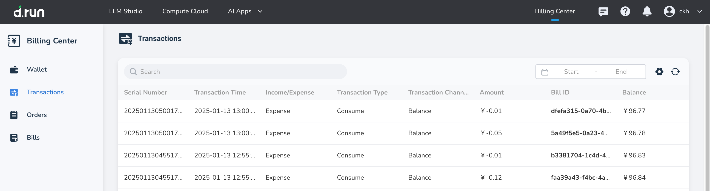
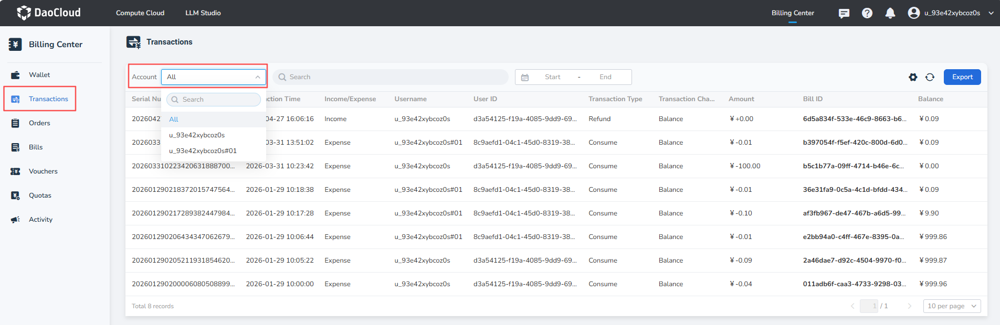
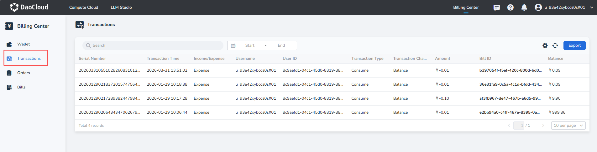

---
hide:
  - toc
---

# Transactions

**Transactions** records the spending and income situation of the cash balance in the wallet in detail.

## Steps

On the Transactions page, you can view the detailed changes in the cash balance.

- Click the search box to select filtering criteria, supporting search or filtering by transaction ID, associated bill ID, income/expense, transaction type, and transaction channel.
- Primary accounts can use the **Account** selector to filter primary-account or sub-account transactions. Sub-accounts can view transactions for the currently signed-in account only.
- The **Account** selector includes the primary account and all of its managed sub-accounts.
- Click the date picker to query detailed bills within a specific time range.

{width=900px}

Primary accounts can view transactions for the primary account and its sub-accounts and filter them with the **Account** selector.

{width=900px}

After signing in, a sub-account sees only its own transaction records. The list displays the username and User ID.

{width=900px}

## Detailed Fields in Transactions

| **Fields** | **Description** |
| --- | --- |
| Serial Number | A unique identifier for a single transaction in the Transactions. |
| Transaction Time | The specific time of the transaction. |
| Income/Expense | Types include: income, expenditure. |
| Transaction Type | The type of transaction, categorized as: recharge, consumption. |
| Transaction Channel | The channel of the transaction, categorized as: Alipay, balance. |
| Bill ID | The bill number associated with the transaction; if none, it displays -. |
| Username / User ID | The account name and unique identifier that initiated the transaction. |
| Balance | The remaining cash balance after this transaction occurs. |
