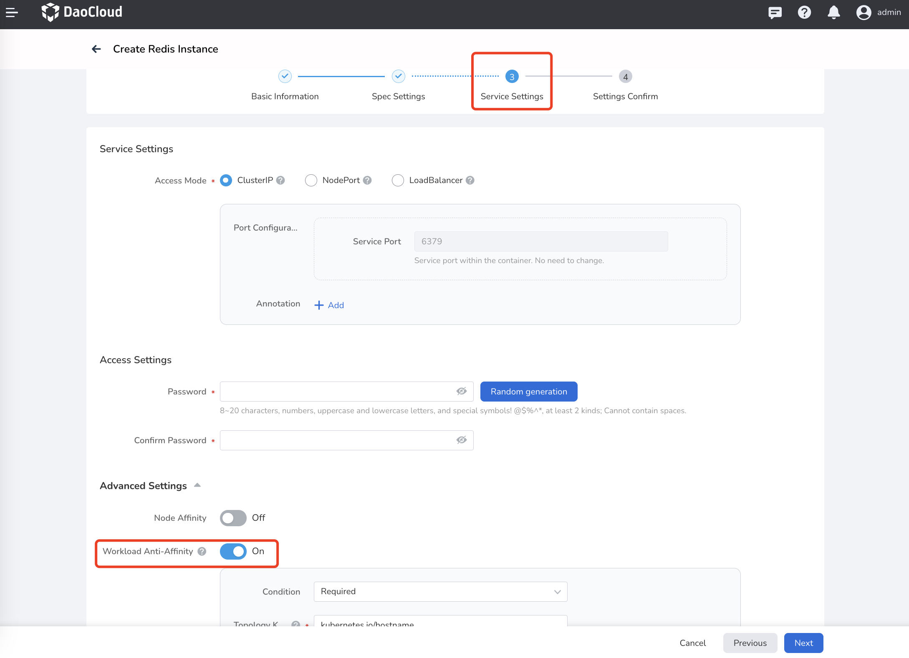
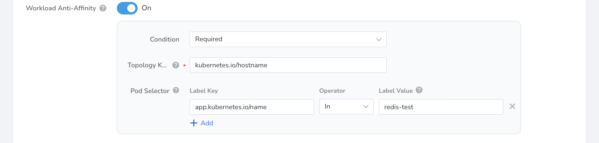
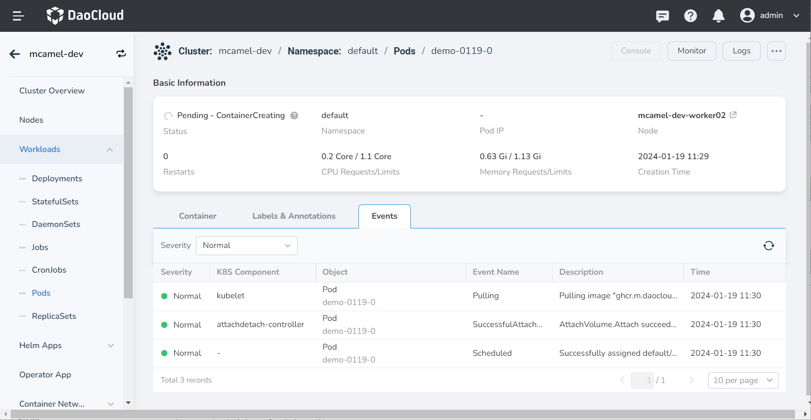

# Workload Anti-Affinity

When creating instances of [Elasticsearch search service](../elasticsearch/intro/index.md), [Kafka message queue](../kafka/intro/index.md), [MinIO object storage](../minio/intro/index.md), [MySQL data](../mysql/intro/index.md), [RabbitMQ message](../rabbitmq/intro/index.md), [PostgreSQL database](../postgresql/intro/index.md), [Redis database](../redis/intro/index.md), [MongoDB database](../mongodb/intro/index.md), [RocketMQ message queue](../rocketmq/intro/index.md), you can configure workload anti-affinity on the service settings page.

The principle of workload anti-affinity is that within a certain topology domain (scope), if it is detected that a workload already has a certain label added in the anti-affinity configuration, the newly created workload will not be deployed in that topology domain. The benefits of doing this are:

- Performance Optimization

    By using workload anti-affinity, multiple replicas of an instance can be deployed on different nodes/availability zones/regions to avoid resource contention between replicas and ensure that each replica has sufficient available resources, thereby improving the performance and reliability of the application.

- Fault Isolation

    By distributing replica instances across different nodes/availability zones/regions, single point of failure issues can be effectively avoided. When a replica in one environment fails, replicas in other environments are not affected, thereby ensuring the overall availability of the service.

## Steps

Taking __Redis__ as an example, the following steps explain how to configure __workload anti-affinity__ .

!!! note

    This article focuses on how to configure __workload anti-affinity__ . For detailed instructions on how to create a __Redis__ instance, please refer to [Create Instance](../redis/user-guide/create.md).

1. During the process of creating a __Redis__ instance, enable __workload anti-affinity__ in __Service Settings__ -> __Advanced Settings__ .

    

2. Fill in the configuration for workload anti-affinity according to the following instructions.

    - Condition: There are two types, __Preferred__ and __Required__.
        - Preferred: Try to meet the anti-affinity requirements, but the final deployment result may not meet the anti-affinity requirements.
        - Required: Must meet the anti-affinity requirements. If no schedulable node/availability zone/region is found, the Pod will remain in the Pending state.
    - Weight: When the condition is set to __Required__, there is no need to set the weight. When the condition is set to __Preferred__ , set the weight value for the anti-affinity rule, and higher-weighted rules will be given priority.
    - Topology Domain: The topology domain defines the scope of the anti-affinity, which can be node labels, zone labels, region labels, or user-defined.
    - Pod Selector: Set the Pod label. **Within the same topology domain, there can only be one Pod with this label**.
    - For detailed explanations of anti-affinity and various operators, please refer to [Operators](../../kpanda/user-guide/workloads/pod-config/scheduling-policy.md#_4).

    
    
    !!! note

        The configuration in the above image means that there can only be one Pod on the same node with the __app.kubernetes.io/name__ label and the value of __redis-test__. If there is no node that meets the condition, the Pod will remain in the Pending state.

3. Refer to [Create Instance](../redis/user-guide/create.md) to complete the subsequent operations.

## Verification

After configuring workload anti-affinity and successfully creating the instance, go to the [Container Management](../../kpanda/intro/index.md) module to view the __Pod__ scheduling information.

It can be seen that there are a total of 2 Pods, and two of them are already running and distributed on different nodes.

Click the Pod name to view the details and find that it is because of the taint and the anti-affinity rule that there is no deployable node.

!!! success

    This indicates that the previously configured workload anti-affinity has taken effect, meaning that there can only be one Pod with the __app.kubernetes.io/name__ label and the value of __redis-test__ on one node. If there is no node that meets the condition, the Pod will remain in the Pending state.
