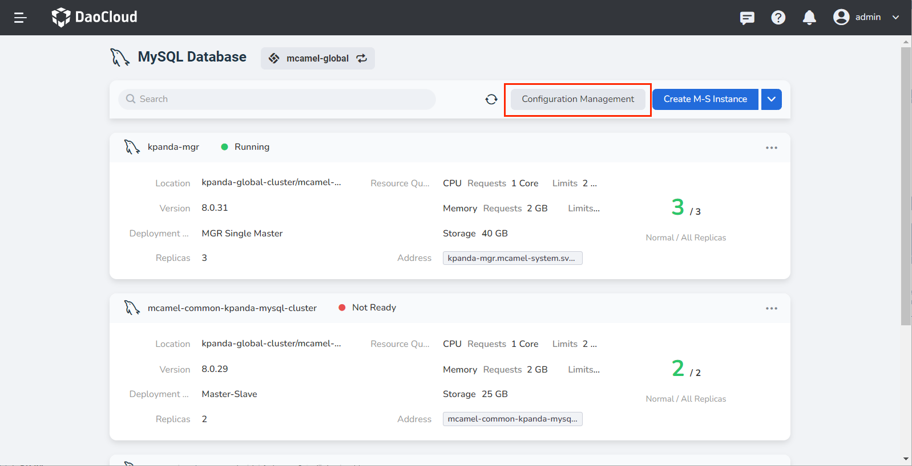
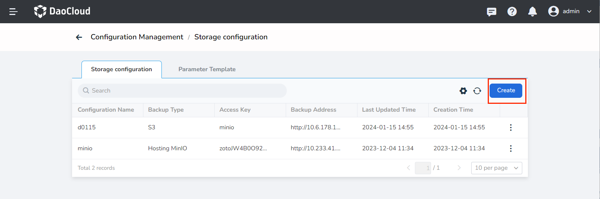
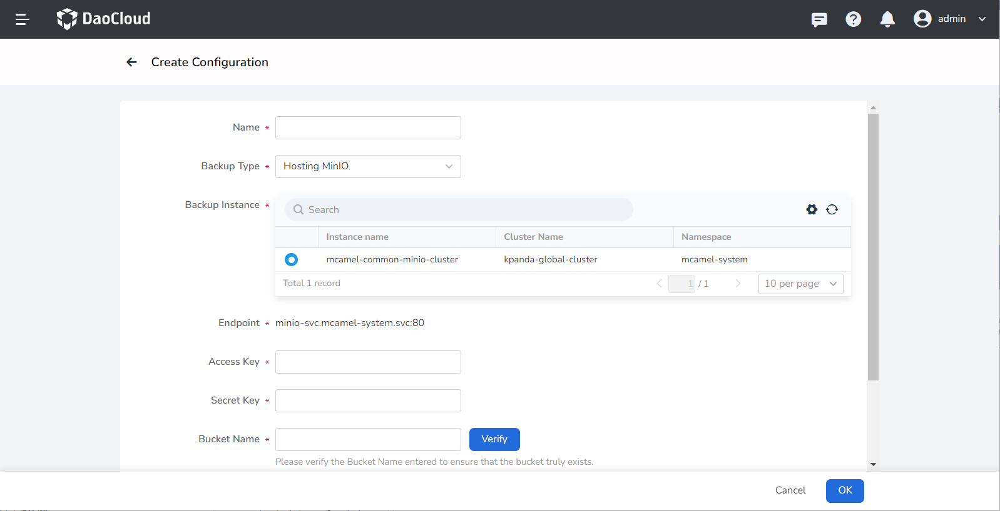
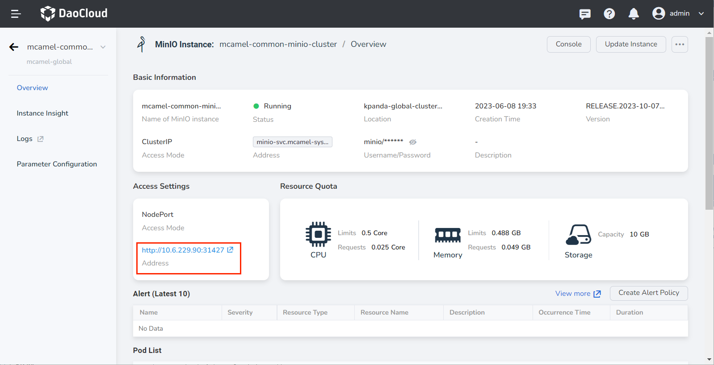
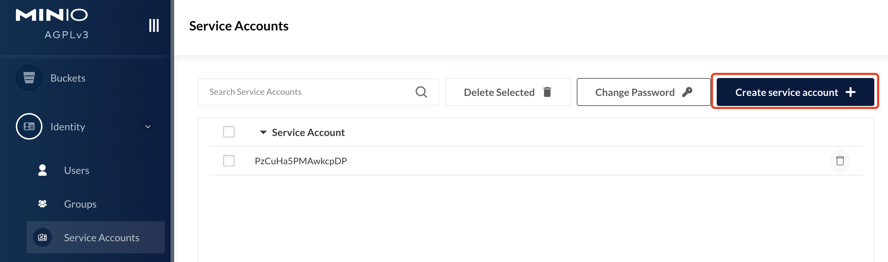
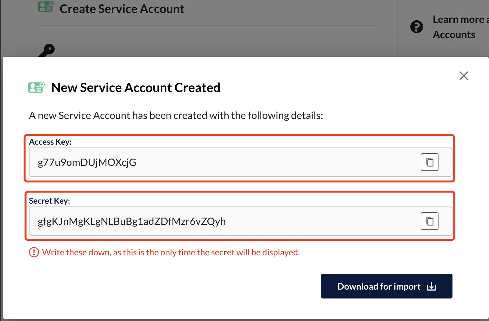
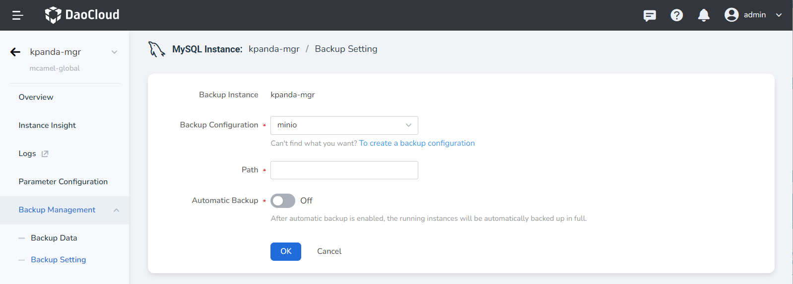

# Configuration Management

The configuration management function provides a common configuration scheme for object storage, used for data backup and recovery of various middleware instances. The specific configuration method is as follows:

1. Click __Configuration Management__ to enter the __Configuration Management__ list.

    

2. Click __Create__ to create a new configuration item in the configuration management page.

    

3. In the creation page, configure the following content:

    

    - **Name**: User-defined, used to identify the configuration item;

    - **Backup Type**: This configuration has two options, default is __Managed MinIO__ , which will display all instances in the MinIO list of middleware; select __S3__ to use external storage, and the user needs to enter the address of the external storage on their own, the address structure is similar to: http://172.30.120.201:30456;

    - **Access Key, Secret Key**: This item needs to be obtained on the MinIO management page, the steps are as follows:

        1. Click __Access Address__ in the MinIO instance to enter the management interface.

            

        2. Click __Identity__ -> __Service Account__ -> __Create service account +__ to create a new one.

            

        3. Copy the Access Key and Secret Key created here to the creation configuration page.

            

    - **Bucket Name**: This name is used to define the object storage bucket required for backup, which can be obtained from the MinIO management platform, as shown in the following figure:

        

4. Click __OK__ to complete the creation, and this configuration will be available for __Backup/Recovery__ of the middleware.

    
