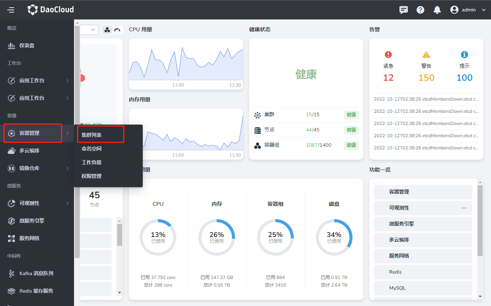

# Install Elasticsearch

Because Elasticsearch belongs to the application layer of DCE 5.0, a DCE environment needs to be prepared first.

Follow the steps below to install Elasticsearch.

## install elasticsearch-operator

1. On the left navigation bar, click `Container Management` -> `Cluster List`.

    

2. Select the cluster where Elasticsearch is to be installed, and click the cluster name.

    

3. In the left navigation bar, click `Helm Application` -> `Helm Template`, enter `elasticsearch` in the search box, press the Enter key, and click the elasticsearch tile card.

    

4. After selecting the appropriate version, click the `Install` button. You can also follow the text prompts in the black area to install from the command line.

    

5. Enter an appropriate name, select the namespace and version, and click `OK`. You can also configure YAML at the bottom to install.

    

    

6. The system returns to the `Helm application` list, and the screen prompts that the creation is successful. After refreshing the page, the newly created application is at the first place.

    

## Install mcamel-elasticsearch

1. Configure the repository.

    ```shell
    helm repo add mcamel-release https://release.daocloud.io/chartrepo/mcamel
    helm repo update
    ```

2. Check the version.

    ```shell
    helm search repo mcamel-release/mcamel-elasticsearch --versions
    NAME CHART VERSION APP VERSION DESCRIPTION
    mcamel-release/mcamel-elasticsearch 0.2.3 0.2.3 A Helm chart for Kubernetes
    ```

3. Install and upgrade.

    ```shell
    helm upgrade --install mcamel-elasticsearch --create-namespace -n mcamel-system --cleanup-on-fail \
    --set global.mcamel.imageTag=v0.2.3 \
    --set global.imageRegistry=release.daocloud.io\
    mcamel-release/mcamel-elasticsearch\
    --version 0.2.3
    ```

    Parameter Description:

    ```shell
    --set ui.image.tag: Specify the front-end image version
    --set ghippo.createCrd: Register ghippo routing, enabled by default
    --set insight.serviceMonitor.enabled: Enable monitoring, enabled by default
    --set insight.grafanaDashboard.enabled: Enable the monitoring panel, which is enabled by default

    # global parameters
    --set global.mcamel.imageTag: image version
    --set global.imageRegistry: mirror warehouse address
    ```

## uninstall

When uninstalling, first uninstall mcamel-elasticsearch, and then delete elasticsearch-operator to release related resources.

### Uninstall mcamel-elasticsearch

```shell
helm uninstall mcamel-elasticsearch -n mcamel-system
```

### Remove elasticsearch-operator

1. In the Helm application list, click `⋮` on the far right, and select `Delete` from the pop-up menu.

    

2. Enter the name to be deleted in the pop-up window, and click `Delete` after confirming that it is correct.

    

## Installation parameter description

| key | type | default | description |
|-----|------|---------|-------------|
| apiServer.affinity | object | `{}` | |
| apiServer.image.pullPolicy | string | `"IfNotPresent"` | |
| apiServer.image.registry | string | `"release.daocloud.io"` | |
| apiServer.image.repository | string | `"mcamel/mcamel-elasticsearch-apiserver"` | |
| apiServer.image.tag | string | `"v0.0.1"` | |
| apiServer.imagePullSecrets | list | `[]` | |
| apiServer.livenessProbe.enabled | bool | `true` | |
| apiServer.livenessProbe.failureThreshold | int | `3` | |
| apiServer.livenessProbe.initialDelaySeconds | int | `30` | |
| apiServer.livenessProbe.periodSeconds | int | `30` | |
| apiServer.livenessProbe.scheme | string | `"HTTP"` | |
| apiServer.livenessProbe.successThreshold | int | `1` | |
| apiServer.livenessProbe.timeoutSeconds | int | `5` | |
| apiServer.nodeSelector | object | `{}` | |
| apiServer.podAnnotations | object | `{}` | |
| apiServer. podSecurityContext | object | `{}` | |
| apiServer.readinessProbe.enabled | bool | `true` | |
| apiServer.readinessProbe.failureThreshold | int | `3` | |
| apiServer.readinessProbe.initialDelaySeconds | int | `30` | |
| apiServer.readinessProbe.periodSeconds | int | `30` | |
| apiServer.readinessProbe.scheme | string | `"HTTP"` | |
| apiServer.readinessProbe.successThreshold | int | `1` | |
| apiServer.readinessProbe.timeoutSeconds | int | `5` | |
| apiServer.replicaCount | int | `1` | |
| apiServer.resources | object | `{}` | |
| apiServer.securityContext | object | `{}` | |
| apiServer.service.grpcPort | int | `8090` | |
| apiServer.service.grpcProtocol | string | `"TCP"` | |
| apiServer.service.grpcTargetPort | int | `8090` | |
| apiServer.service.httpPort | int | `8080` | |
| apiServer.service.httpProtocol | string | `"TCP"` | |
| apiServer.service.httpTargetPort | int | `8080` | |
| apiServer.service.type | string | `"ClusterIP"` | |
| apiServer. tolerations | list | `[]` | |
| ghippo.createCrd | bool | `false` | |
| ghippo.version | string | `"v0.1.0"` | |
| global.imagePullSecrets | list | `[]` | |
| global.imageRegistry | string | `""` | |
| global.mcamel.imageTag | string | `""` | |
| insight.grafanaDashboard.enabled | bool | `false` | |
| insight.grafanaDashboard.metadataLabels | string | `"insight"` | |
| insight.serviceMonitor.enabled | bool | `false` | |
| insight.serviceMonitor.metadataLabels | string | `"insight"` | |
| insight.serviceMonitor.name | string | `"mcamel-elasticsearch"` | |
| insight.serviceMonitor.selectorMatchLabels | string | `"elasticsearch"` | |
| ui.affinity | object | `{}` | |
| ui.enabled | bool | `true` | |
| ui.image.pullPolicy | string | `"IfNotPresent"` | |
| ui.image.registry | string | `"release.daocloud.io"` | |
| ui.image.repository | string | `"mcamel/mcamel-elasticsearch-ui"` | |
| ui.image.tag | string | `"v0.2.0"` | |
| ui.imagePullSecrets | list | `[]` | |
| ui.nodeSelector | object | `{}` | |
| ui.podAnnotations | object | `{}` | |
| ui.podLabels | object | `{}` | |
| ui.replicaCount | int | `1` | |
| ui.resources | object | `{}` | |
| ui.service.port | int | `80` | |
| ui.service.type | string | `"ClusterIP"` | |
| ui.tolerations | list | `[]` | |