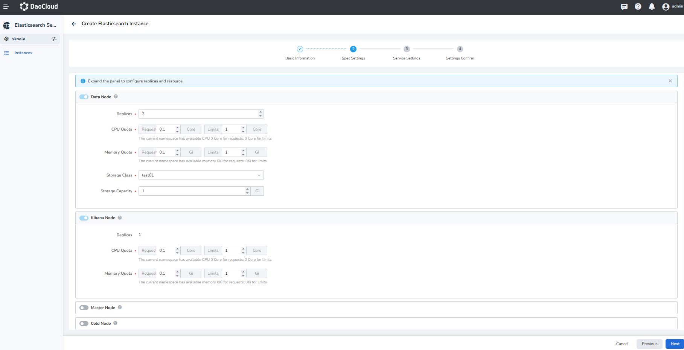

# Cluster specification and capacity planning

## Preface

When you are ready to create an Elasticsearch instance, it is recommended to estimate the resources required 
for your cluster in advance. In general, you need to evaluate the required disk capacity, cluster specifications, 
and the type, size, and quantity of stored files. 
Based on these resource estimates, pre-planning the appropriate Elasticsearch cluster configuration can 
reduce problems and risks in the following use.

> Important knowledge: The physical disk capacity of the ES cluster != The available data space size of the ES cluster

This article provides a relatively general evaluation method based on test results and user experience. 
But business is changing rapidly, so the purpose of this article is to give a relatively suitable suggestion 
when you create Elasticsearch. In fact, DCE 5 also provides the ability to optimize cluster specifications 
and capacity planning, in order to facilitate subsequent resource upgrades.

## Prior evaluation items

To do capacity planning for Elasticsearch, the following factors need to be considered:

- Usage cases: the main business cases used, the amount of data generated in different cases is different
- Number of documents: determine the number of documents to store, and the size of each document
- Storage requirements: determine the storage space required to store all documents and any related data
- Indexing requirements: choose the appropriate indexing strategy and settings to ensure performance and scalability
- Query requirements: determine the complexity and size of the query load so that sufficient resources can be allocated to it
- Cluster sizes: determine the size and number of clusters to support the expected load and provide high availability 
  and fault tolerance

## Storage capacity planning

### Basic requirements planning

At the beginning of storage capacity planning, __scenarios__ and __data requirements__ plans need to be confirmed in advance:

- scenarios to be used

     - Log scenario
     - Search scenario
     - Data analysis scenario
     - Database acceleration scenario
     - Universal scenario

- data requirements

     - Source data size or estimated number of documents and size of a single document
     - Daily data increment
     - Data retention period
     - Number of copies required

### Other business expenses of ES

In addition to data, there are other overheads in __Elasticsearch__ , which are also the main reasons for 
affecting the storage capacity of __Elasticsearch__ service, such as:

- Index overhead: the exact overhead calculation can be calculated using the ___cat/indices?v__ API and 
  the __pri.store.size__ value, usually 10% larger than the source data ( ___all__ parameters etc. are not calculated).
- Operating system reserved space: The default operating system will reserve 5% of the file system for you 
  to handle key processes, system recovery, and prevent disk fragmentation issues, etc.
- __Elasticsearch__ internal overhead: 20% is generally reserved for internal operations such as segment merging and logging.
- Number of replicas: Replicas are beneficial to increase data reliability, but at the same time increase storage costs.
- Safety threshold: In order to prevent sudden data growth, please roughly reserve 15% of the capacity space as 
  the safety threshold.

Therefore, for data security and stability, we recommend that your disk usage should not exceed 85%; 
or if it is about to reach 85%, you should expand and upgrade as soon as possible.

### Quick calculation of working hours

Full Formula | Simplified Version |
| --- | --- |
| source data * (1 + number of replicas) * ( 1 + index overhead) / (1 - Linux reserved space) / (1 - internal overhead) = minimum storage requirement | source data * (1 + number of replicas) * 1.45 = Minimum Storage Requirements |

If you have __500G__ of data storage and need a replica, the minimum storage requirement is closer to __500 * 2 * 1.1 / 0.95 / 0.8 = 1.5T__ .

### About node disk configuration

The maximum amount of data carried by a single node is different in different cases, as follows:

- Cases such as data acceleration and query aggregation: Maximum capacity of a single-node disk = single-node memory size (GB) * 10
- Cases such as log writing and offline analysis: maximum capacity of a single-node disk = single-node memory size (GB) * 50
- General scenario: maximum capacity of a single-node disk = single-node memory size (GB) * 30

## ES cluster instance configuration recommendation

Deploy the recommended configuration in a production environment: try to have one node take on only one role. 
Different nodes require different computing resources. After different roles are separated, they can be expanded 
on demand without affecting each other.

- The maximum number of nodes in the cluster = single node CPU * 5
- The maximum capacity of a single-node disk

     - Search use cases: Maximum disk capacity of a single node = memory size of a single node (GB) * 10.
     - Cases such as logs: Maximum capacity of a single-node disk = single-node memory size (GB) * 50.

Configuration | Maximum number of nodes | Maximum single-node disk capacity (query) | Maximum single-node disk capacity (log)
---|---|--|--
4 cores 16G | 20 | 160 GB | 800 GB
8 cores 32G | 40 | 320 GB | 1.5 TB
16 cores 64G | 80 | 640 GB | 2 TB

## Planning the number of shards

Applicable scene:

- Log type, frequent writing, less query, about 30G for a single shard
- Search class, less writing, frequent query, no more than 20G for a single shard

Each __Elasticsearch__ index is divided into multiple shards, and the data is scattered into different shards 
according to the hash algorithm. Since the number of index shards affects read and write performance and 
fault recovery speed, it is recommended to plan ahead.

### Shard usage summary

- __Elasticsearch__ in version 7.x defaults to __1 primary shard__ and __1 replica shard__ per index
- On a single node, the maximum number of shards in version 7.x is 1000
- Try to keep the size of a single fragment between __10-50G__ for the best experience, and it is generally recommended to be around __30G__ 

     - Large shards can slow down recovery from failures in __Elasticsearch__ 
     - A shard that is too small may lead to a lot of shards, because each shard will take up some CPU and memory, resulting in read and write performance and insufficient memory.
  
- When the number of shards exceeds the number of data nodes, it is recommended that the number of shards be close to
  an integer multiple of the data nodes, so that the shards can be evenly distributed to the data nodes.
- For log cases, it is recommended to enable the ILM function. When the fragment size is found to be unreasonable, 
  use this feature to adjust the number of fragments in time.

### Index shard resource occupation

Each index and each shard requires some memory and CPU resources. In most cases, a small set of large shards uses 
fewer resources than many small shards.

Segments play an important role in the resource usage of shards. Most shards contain several segments, which store their index data.
 __Elasticsearch__ keeps segment metadata in JVM heap memory so that it can be quickly retrieved for searching.
As a shard grows, its segments are merged into fewer, larger segments. This reduces the number of segments, which means 
less metadata is kept in heap memory.

In order to reduce the number of indexes and avoid excessively large and unordered mappings, consider storing similarly 
structured data in the same index instead of dividing data into different indexes based on the data source.
It is important to strike a good balance between the number of indexes/shards and the map size for each individual index.
Since the cluster state will be loaded into the heap memory on each node (including the master node), and the size of 
the heap memory is proportional to the number of indexes and the number of fields in a single index and fragment, 
it is also necessary to monitor the heap memory on the master node at the same time. It is important to monitor 
the heap memory usage and make sure it is sized appropriately.

Shards that are too small result in too small segments, which in turn increases overhead. You want to try to 
keep the average size of your shards from at least a few gigabytes to a few tens of gigabytes.
For time-series data use cases, shard sizes are typically between 20GB and 40GB.

Since the overhead of a single shard depends on the number of segments and the size of the segments, forcing smaller segments 
to be merged into larger segments via the forcemerge operation can reduce overhead and improve query performance.
Ideally, this should be done when no more data is being written in the index. Please note: This is an extremely
resource-intensive operation, so it should be done during off-peak hours.

The number of shards that can be stored on each node is proportional to the available heap size, but Elasticsearch 
does not enforce a fixed limit.
Here's a good rule of thumb: Make sure to keep the number of shards below 20 for each configured GB on your node.
A node with 30GB of heap memory can have up to 600 shards, but within this limit, the fewer shards you have, the better.
In general, this helps the cluster stay healthy.

For more information, please refer to:

- [Reduce the number of cluster shards](https://www.elastic.co/guide/en/elasticsearch/reference/7.17/size-your-shards.html#reduce-cluster-shard-count)

- [How many shards should I have in my Elasticsearch cluster? ](https://www.elastic.co/cn/blog/how-many-shards-should-i-have-in-my-elasticsearch-cluster)

### Shard calculation formula

(metadata + growth space) * (1 + index overhead) / required shard size = approximate number of primary shards

Assume there is __80GiB__ of data. Expect to keep each shard around __30GiB__ . So your number of shards should be approximately 80 * 1.1 / 30 = 3

### How to manage shards

Enter Kibana's index management interface and find __Stack Managment__ 

Use index lifecycle management (ILM) to automatically manage indexes, and the management strategy is as follows:

- According to the index size, automatic rollover
- Automatic rollover based on index creation time
- Automatic rollover according to the number of documents

The index life cycle execution policy is executed every 10 minutes by default, and the inspection frequency 
can be controlled by modifying the `indices.lifecycle.poll_interval` parameter.

## Create Elasticsearch in the data service

> Pages created by the middleware elasticsearch

Node introduction:
     - Data node: __Data Node__ is the node used by __Elasticsearch__ to store data, responsible for storing data, 
       and is used to store large amounts of data, so the pressure on storage is very high
     - Kibana node: Enable the corresponding Kibana console, providing an interface management window for Elasticsearch
     - Dedicated Master Node: Dedicated Node (Dedicated Node) is a configuration option that specifies that the node 
       is only used to perform specific tasks. Unlike Data Nodes, dedicated nodes do not store any data, 
       but are dedicated to performing cluster management or search operations

As shown in the figure above, for the storage capacity configuration, please plan the corresponding storage capacity 
according to the capacity calculation formula above. Whether to enable a dedicated master node mainly considers 
whether a dedicated master node is needed to support and enhance the stability of the cluster.

## Conclusion

If you have a need for how Elasticsearch does capacity planning, there is a discussion at the bottom of the page.