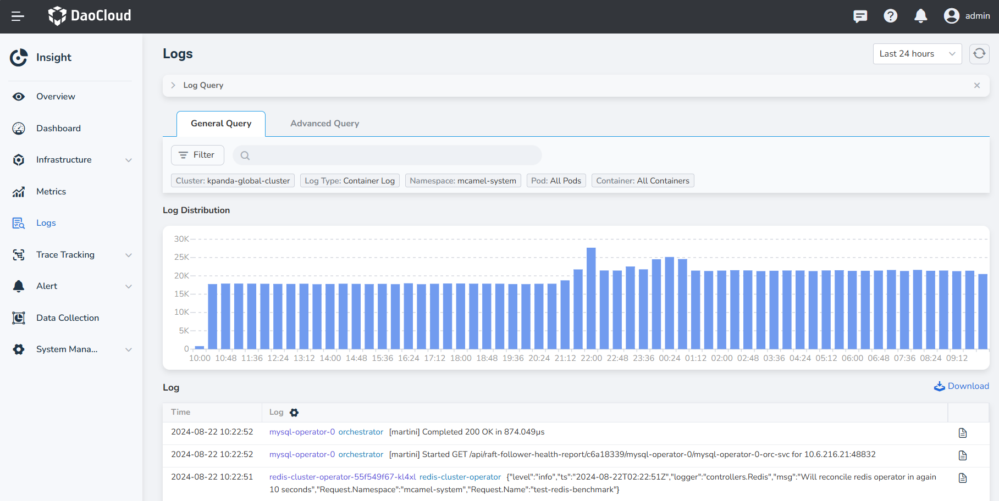

---
hide:
  - toc
MTPE: ModetaNiu
DATE: 2024-08-22
---

# View Elasticsearch logs

## Steps

By visiting the instance details page of each Elasticsearch; it is possible to support viewing Elasticsearch logs.

1. In the Elasticsearch instance list, select the log you want to view, and click Instance Name to enter 
   the instance details page.

    

2. In the left menu bar of the instance, you will find an option for log viewing.

    

3. Click __Logs__ to enter the log view page.

## Log View Instructions

On the log viewing page, we can easily view logs. Common operations are described as follows:

* Support custom log time period: in the upper right corner of the log page, you can easily switch the time period 
  to view the log (the viewable log period is subject to the log duration saved in the Insight settings)
* Support keyword searching: Metrics supports viewing more log information
* Support viewing log distribution: the histogram in the upper middle area, you can view the log distribution 
  within the time period
* Support to view the context of the log, click the __View context__ icon on the right
* Support export log

    