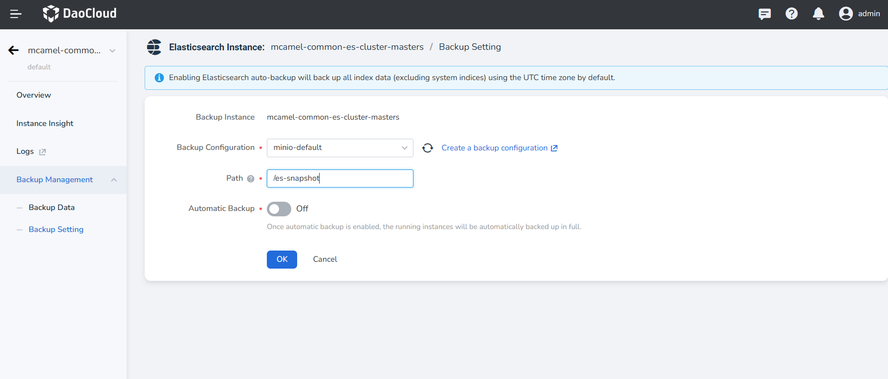
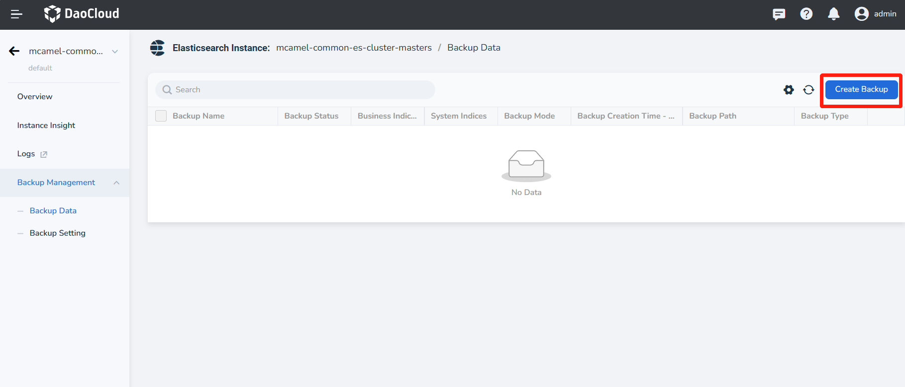
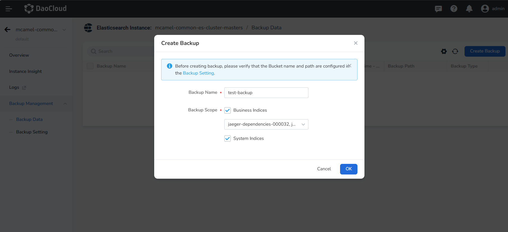
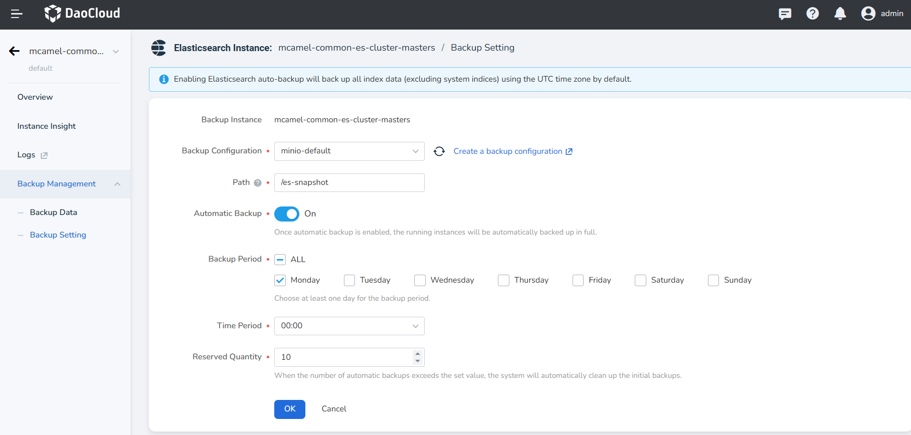

# Elasticsearch Backup and Recovery

Elasticsearch's backup and recovery feature helps you backup data from an entire cluster or a single index, 
in case you need to recover them. You can set up an automatic snapshot policy to regularly backup data or 
manually backup selected indices.

The first backup snapshot of an instance is a complete copy of the data in that instance, while all subsequent 
backup snapshots retain the incremental data. Therefore, the initial backup takes a longer time (the specific 
duration depends on the amount of data), while subsequent snapshot backups will be faster.

## Backup Setting and Methods

### Configure Backup Path

1. On the left navigation bar, click __Backup Management__ -> __Backup Setting__ .

2. Select `S3 Backup` from the added workspace and fill in the backup path.

    !!! info

        Both manual and automatic backups rely on the backup settings here.

    

### Manually Create a Backup

1. On the left navigation bar, click __Backup Management__ -> __Backup Data__ , and you can view the backup data.

    

2. Click the __Create Backup__ button in the upper right corner of the list, fill in the Backup Name, and select the Indices to backup.

    - Business Indices support selecting all or multiple backups. If System Indices are checked, all system indices will be backed up by default.

    

## Enable Automatic Backup

1. On the left navigation bar, click __Backup Management__ -> __Backup Setting__ .

2. Eable __Automatic Backup__ , select the Backup Period, Time Period, and Reserved Quantity.

    !!! info

        The default setting for automatic backup is to backup all business indices only.

    

## Recover Backup Data

1. On the left navigation bar, click __Backup Management__ -> __Backup Data__ , select the backup data 
   you want to recover, click __┇__ , and then click __Recover__ .

2. Fill in the name for the recovered instance and choose to recover it to the current instance's location 
   or select to recover it to another cluster or namespace.
