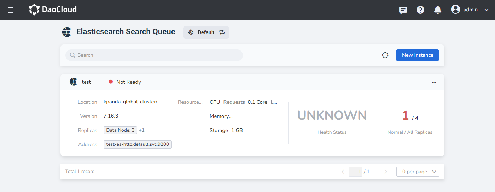
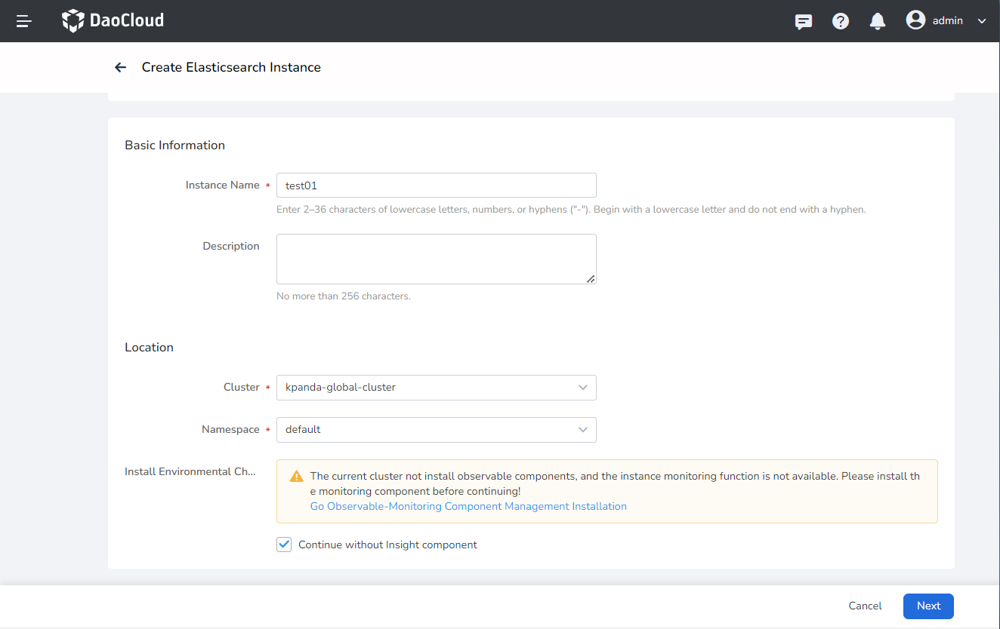
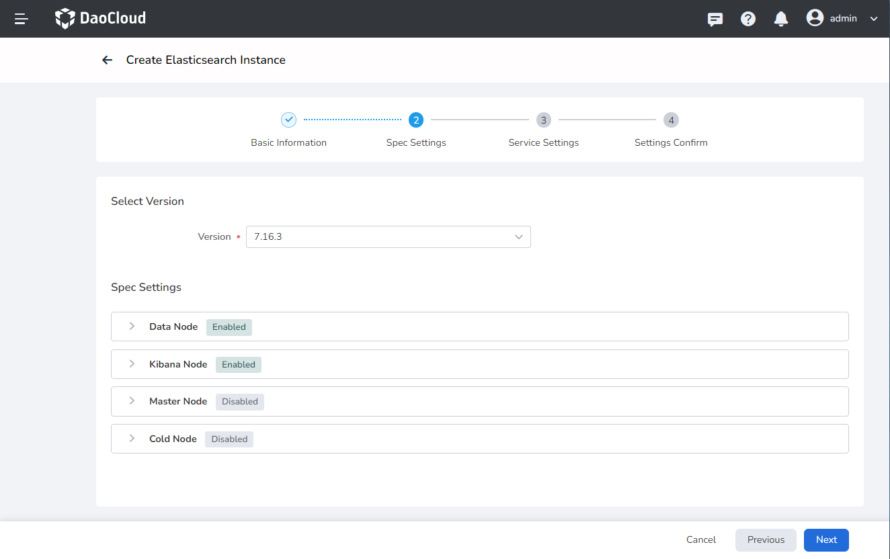
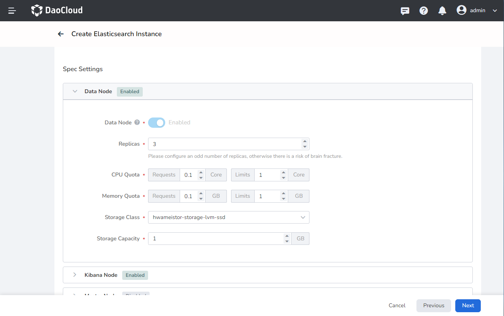
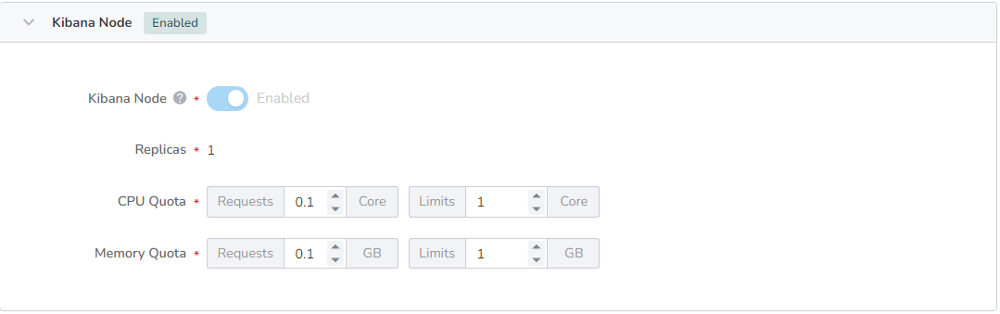
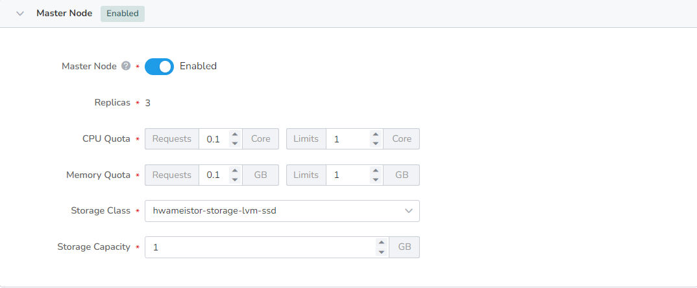
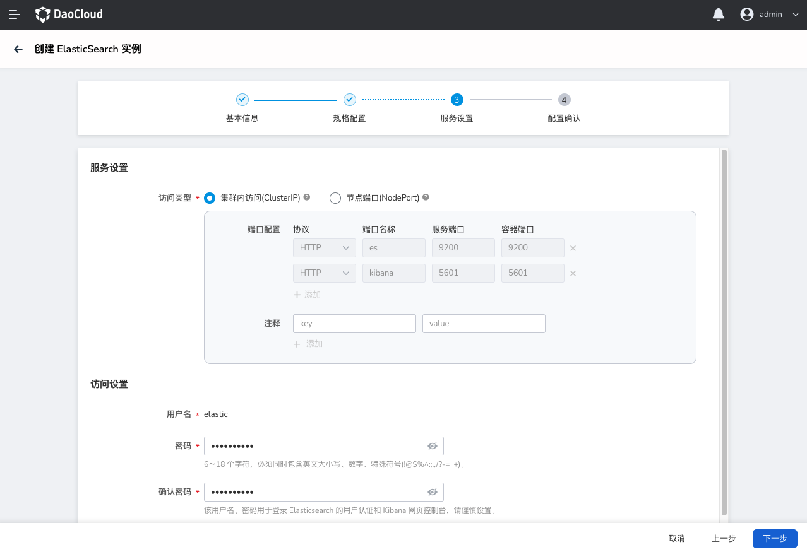
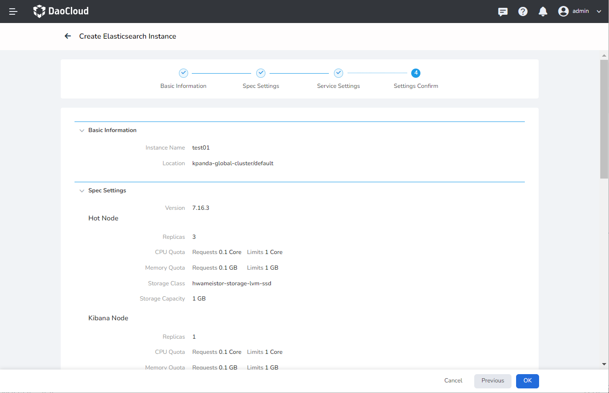
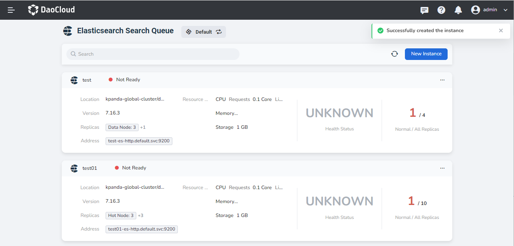

---
hide:
  - toc
---

# Create an Elasticsearch instance

In the list of Elasticsearch instances, do the following to create a new instance.

1. Click `New Instance` in the upper right corner.

    

2. On the page of creating an Elasticsearch instance, enter the basic information of the instance, and click `Next`.

    

3. Select a version, configure the following specifications of the instance, and click `Next`. Data nodes, Kibana nodes, dedicated master nodes, and cold data nodes can be optionally enabled/disabled.

    
  
    - The hot data node is enabled by default to store the daily active data of the Elasticsearch search service. There are 3 copies by default, with a minimum of 1 and a maximum of 50.

        

    - By default, the Kibana node is enabled, which is used to store the Elasticsearch visualization data node. The default is 1 Kibana node, which cannot be increased or decreased.

        

    - Optional dedicated masternode. This is a node set for some special purposes. There are 3 dedicated master nodes by default, which cannot be increased or decreased.

        

    - Optional cold data nodes. This is the node that stores some Elasticsearch historical data. There are 3 cold data nodes by default, with a minimum of 2 and a maximum of 50.

        

4. After setting the access type (ClusterIP or NodePort), username and password, click `Next`.

    

5. After confirming that the above basic information, specification configuration and service settings are correct, click `Confirm`.

    

6. The screen prompts `Instance created successfully`.

    