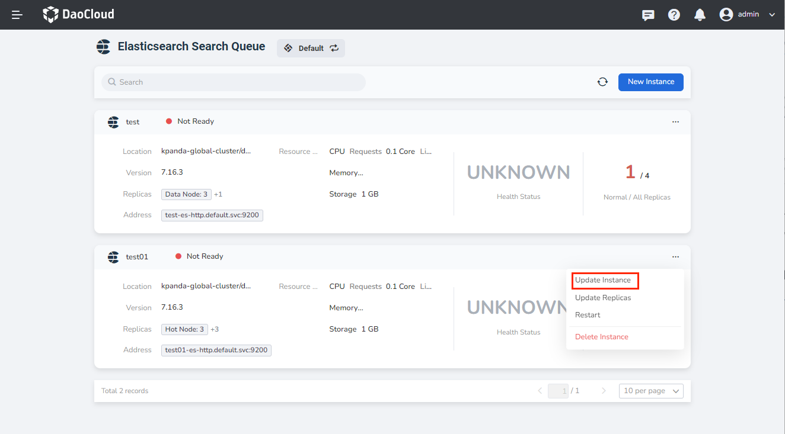
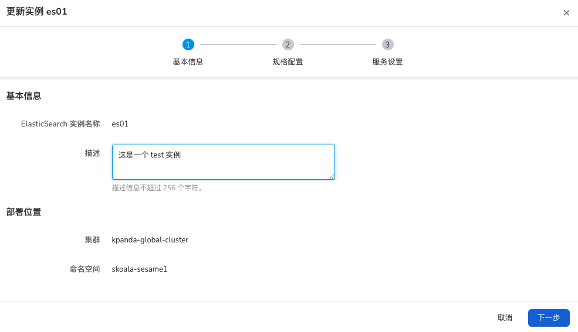
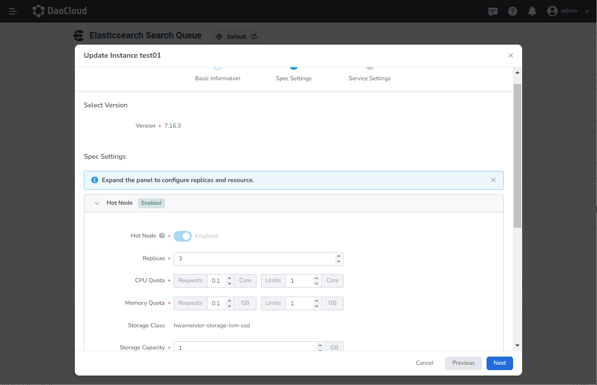
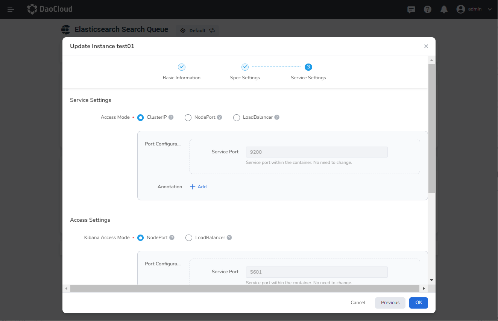
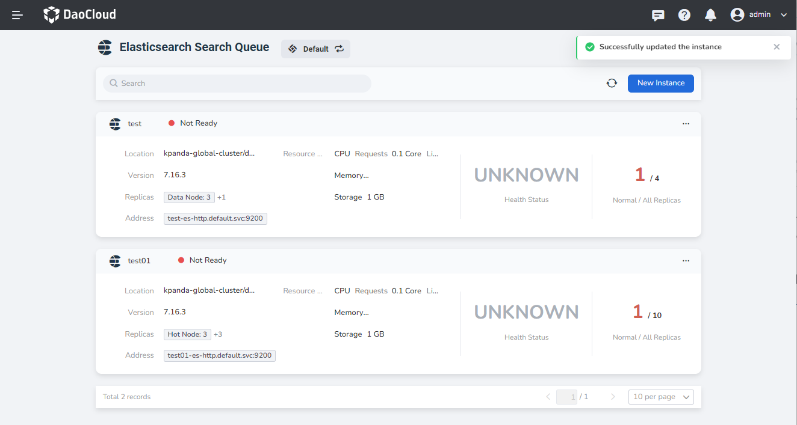

---
hide:
  - toc
---

# Update the Elasticsearch instance

If you want to update or modify the resource configuration of your Elasticsearch instance, you can follow the instructions on this page.

1. In the Elasticsearch instance list, click the `...` button on the right, and select `Update Instance` from the pop-up menu.

    

2. After modifying the basic information, click `Next`. For the time being, only the description information is supported.

    

3. After modifying the specification configuration (including hot data nodes, Kibana nodes, dedicated master nodes, and cold data nodes), click `Next`.

    

4. After modifying the service settings, click `Confirm`.

    

5. Return to the message queue, and a message will be displayed in the upper right corner of the screen: `Update instance successful`.

    