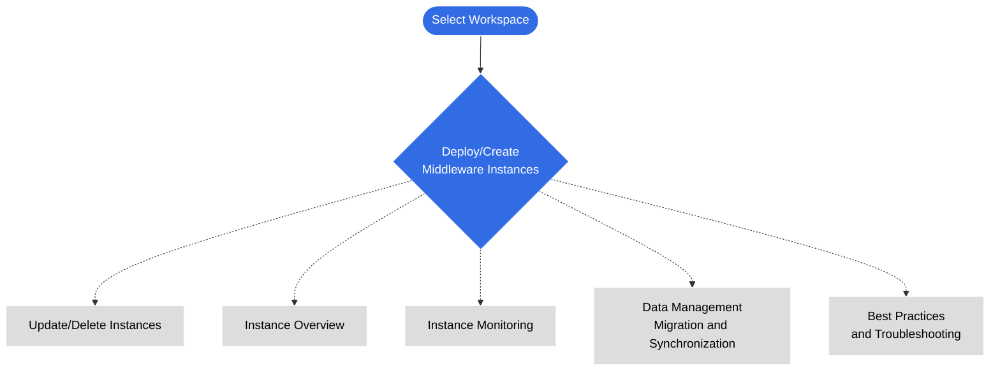

---
hide:
  - toc
---

# Middleware Data Services

DCE 5.0 offers a comprehensive set of middleware solutions tailored for various application scenarios.
These middleware services address data handling requirements and provide development and maintenance support.
Install and enable these middleware components as needed to achieve optimal performance.

!!! tip

    Empower your applications with DCE 5.0 containerized middleware,
    enhancing database performance, enabling high availability, and providing robust scalability.

- :simple-elasticsearch:{ .lg .middle } __Elasticsearch Service__

    ---

    This is currently the preferred full-text search engine, capable of fast storage, search, and analysis of massive amounts of data.

    - [What is Elasticsearch](./elasticsearch/intro/index.md)
    - [ES Cluster Capacity Planning](./elasticsearch/user-guide/cluster-capacity-plan.md)
    - [Create/Update/Delete ES Instances](./elasticsearch/user-guide/create.md)
    - [Migrate ES Data Across Nodes](./elasticsearch/user-guide/migrate-es.md)
    - [ES Troubleshooting](./elasticsearch/faq/common-question-es.md)

- :simple-minio:{ .lg .middle } __MinIO Object Storage__

    ---

    A popular, lightweight, and open-source object storage solution that is fully compatible with the AWS S3 protocol and provides excellent support for K8s.

    - [What is MinIO](./minio/intro/index.md)
    - [Create/Update/Delete MinIO Instances](./minio/user-guide/create.md)
    - [View MinIO Logs](./minio/user-guide/logs.md)
    - [MinIO Instance Monitoring](./minio/user-guide/insight.md)
    - [MinIO Identity Management](./minio/user-guide/user-management.md)

- :simple-mysql:{ .lg .middle } __MySQL Database__

    ---

    This is the most widely used relational database with features such as high throughput, low latency, and scalability.

    - [MySQL Feature Overview](./mysql/intro/features.md)
    - [Create/Update/Delete MySQL Instances](./mysql/user-guide/create.md)
    - [View MySQL Logs](./mysql/user-guide/logs.md)
    - [MySQL Troubleshooting](./mysql/faq/quick-check.md)

- :simple-mongodb:{ .lg .middle } __MongoDB Database__

    ---

    MongoDB is a document-oriented NoSQL database management system known for its flexible data model and scalability.

    - [What is MongoDB](./mongodb/intro/index.md)
    - [Create/Update/Delete MongoDB Instances](./mongodb/user-guide/create.md)
    - [View MongoDB Logs](./mongodb/user-guide/logs.md)

- :simple-postgresql:{ .lg .middle } __PostgreSQL Database__

    ---

    DCE 5.0 uses containerization technology to run PostgreSQL instances in an isolated environment.

    - [What is PostgreSQL](./postgresql/intro/index.md)
    - [Create/Update/Delete PostgreSQL Instances](./postgresql/user-guide/create.md)
    - [View PostgreSQL Logs](./postgresql/user-guide/logs.md)
    - [PostgreSQL Anti-Affinity](./postgresql/user-guide/antiaffinity.md)

- :simple-redis:{ .lg .middle } __Redis Cache Service__

    ---

    This is an in-memory database cache service that combines the advantages of Redis and Memcached memory database engines.

    - [What is Redis](./redis/intro/index.md)
    - [Create/Update/Delete Redis Instances](./redis/user-guide/create.md)
    - [View Redis Logs](./redis/user-guide/logs.md)
    - [Cross-Cluster Data Synchronization](./redis/best-practice/index.md)

- :simple-rabbitmq:{ .lg .middle } __RabbitMQ Message Queue__

    ---

    RabbitMQ is a message broker software built on the Advanced Message Queuing Protocol (AMQP) and commonly used as a messaging middleware for transmitting transactional data.

    - [What is RabbitMQ](./rabbitmq/intro/index.md)
    - [Create/Update/Delete RabbitMQ Instances](./rabbitmq/user-guide/create.md)
    - [View RabbitMQ Logs](./rabbitmq/user-guide/logs.md)
    - [RabbitMQ Data Migration](./rabbitmq/user-guide/migrate.md)
    - [Customize RabbitMQ Plugins](./rabbitmq/faq/add-plugin.md)

- :simple-apachekafka:{ .lg .middle } __Kafka Message Queue__

    ---

    Kafka is a distributed streaming platform with features such as stream processing, making it a popular choice for building data pipelines.

    - [What is Kafka](./kafka/intro/index.md)
    - [Create/Update/DeleteKafka Instances](./kafka/user-guide/create.md)
    - [View Kafka Logs](./kafka/user-guide/logs.md)
    - [Kafka Instance Monitoring](./kafka/user-guide/insight.md)
    - [Kafka Configuration Parameters](./kafka/user-guide/config.md)

## Middleware Learning Journey

!!! info

    The documentation structure for the above middleware solutions is similar.
    You can follow the learning path below.

