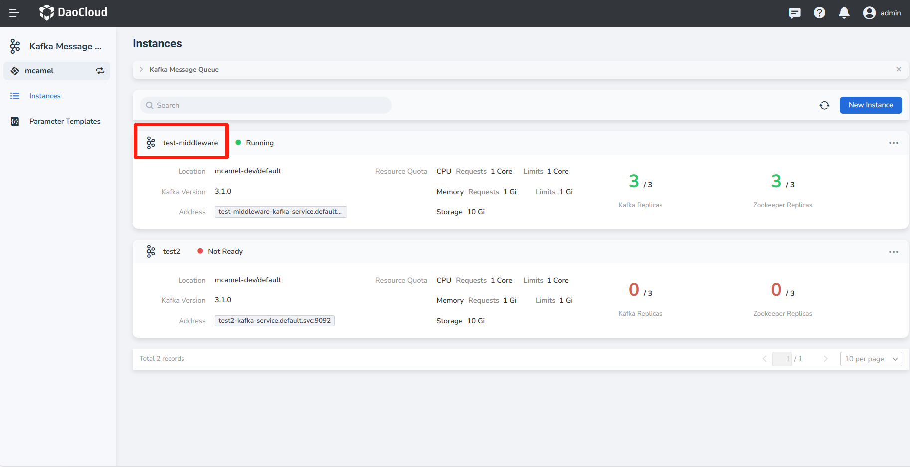
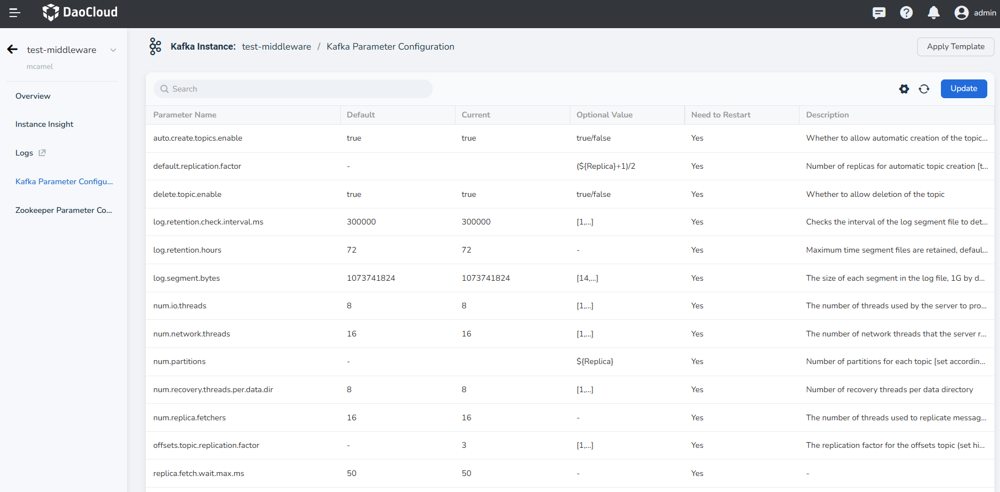
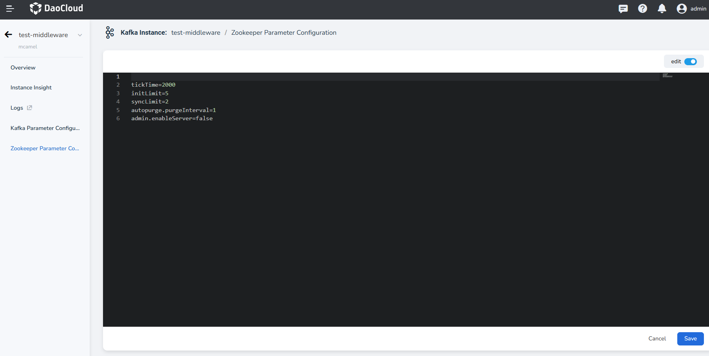

---
hide:
  - toc
---

---
MTPE: ModetaNiu
Date: 2024-07-02
---

# configuration parameters

Kafka has a built-in parameter configuration UI interface.

1. On the Message Queue page, click a name.

    

2. In the left navigation bar, click __Kafka Parameter Configuration__ .

    

3. Click the __Edit__ slider switch to easily configure parameters of Zookeeper.

    

4. Click __Save__ , the parameters will take effect immediately.