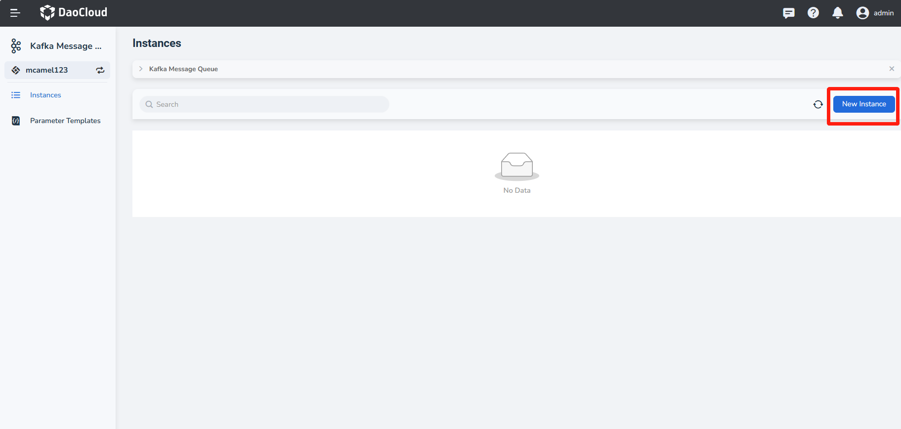
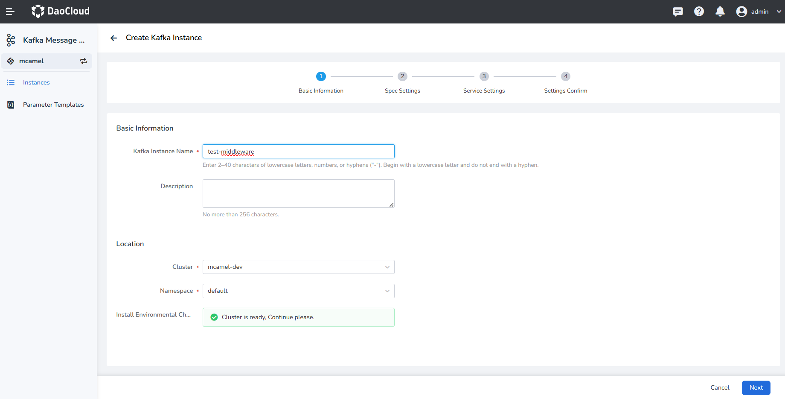
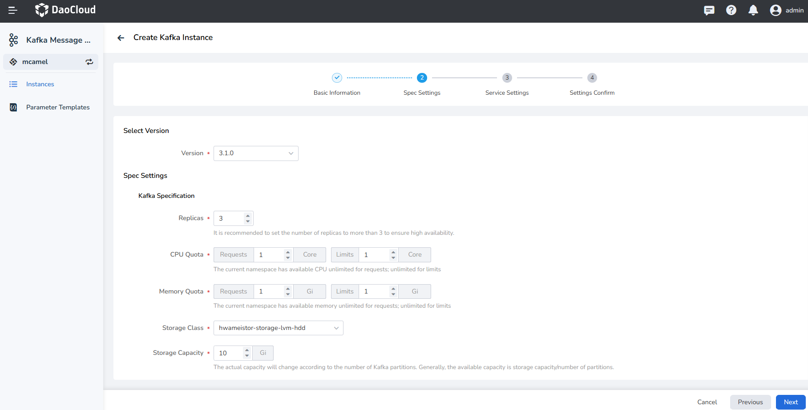
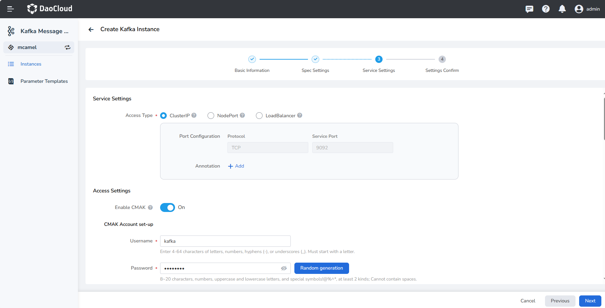
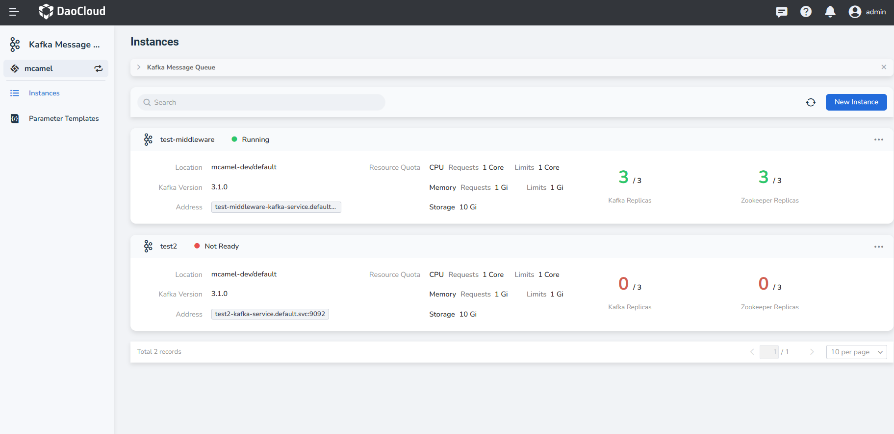

---
hide:
  - toc
---

---
MTPE: ModetaNiu
Date: 2024-07-02
---

# Create Kafka Instance

In the Kafka message queue, follow these steps to create a Kafka instance.

1. On the Kafka message queue page, click the __Create Kafka Instance__ button in the top right corner.

    

    !!! tip

        When deploying for the first time, you can click **Deploy Now**.

        <!--add screenshot later-->

2. On the __Create Kafka Instance__ page, after setting the basic information, click __Next__.

    

3. After configuring the specifications, click __Next__.

    - Version: The version of Kafka, currently only supports Kafka 3.1.0.
    - Replicas: Supports 1, 3, 5, 7 replicas.
    - Resource Quota: Choose rules according to the actual situation.
    - Storage Capacity: Select the storage volume and total storage space for the Kafka instance.

    

4. After service settings, click __Next__.

    - Service Settings:
        - ClusterIP
        - Nodeport
        - LoadBalancer
    - Access Settings:
        - CMAK Account set-up: Username and password to connect to the Kafka instance.
        - CMAK Resources: Replicas, CPU quota, and memory quotas.
        - CMAK Service Configuration: Nodeport, LoadBalancer
    - Advanced Settings: Configure as needed.

    

5. Confirm that the instance configuration information is correct, click __OK__ to complete the creation.

    

6. Check the instance list page to see if the instance has been created successfully. The status of the 
   newly created instance will be __Not Ready__, and after a few minutes, this status will change to __Running__.

    

!!! note

    In addition, DCE 5.0's Kafka provides parameter templates to simplify instance creation.
    You can use these predefined [parameter templates](./template.md) to create instances.
