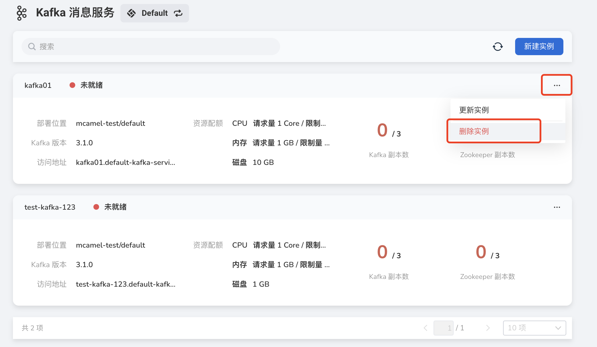
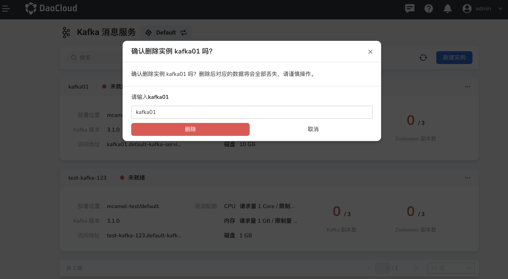

---
hide:
  - toc
---

---
MTPE: ModetaNiu
Date: 2024-07-03
---

# Delete Kafka

If you want to delete a message queue, please conduct the following steps:

1. Select the message queue and click the __...__ button on the right, and click __Delete Instance__ from the pop-up menu.

    

2. Enter the name of the message queue in the pop-up window, and click the __Delete__ button to confirm deletion.

    

    !!! warning

        After an instance is deleted, all messages related to the instance will also be deleted, so please proceed with caution.