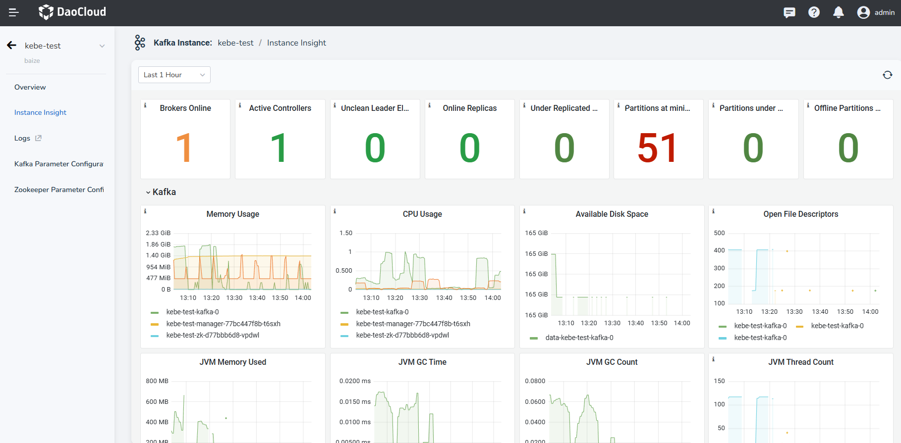

# Instance Insight and Logs

This page illustrates how the view Instance Insight and Logs of Kafka.

## Instance Insight

Kafka has built-in Prometheus and Grafana modules to enhance observability.

1. On the Message Queue page, click an instance name.

    

2. In the navigation bar on the left, click __Instance Insight__ to access the insight module.

    

<!-- The specific meaning of each monitoring metric will be added later (@justedennnnn). -->

## View Kakfa logs

By visiting the instance details page of each Kakfa; you can view Kakfa logs.

1. In the Kakfa instance list, select the log you want to view, and click the instance name to enter the instance details page.

2. In the left navigation bar, click __Logs__ to get detailed information of logs([Insight](../../../insight/intro/index.md)).

### Log View Instructions

On the log viewing page, you can easily view logs. Common operations are described as follows:

* Support customizing log time range: in the upper right corner of the log page, you can easily switch the time range to view the log (the viewable log range is subject to the log duration saved in the observable system settings).
* Support searching logs by keywords: the search area on the left supports viewing more log information.
* Support viewing log volume distribution: through the histogram in the upper middle area, you can view the log volume distribution within the time range.
* Support viewing the context of the log: Click the __context__ icon on the right.
* Support exporting log