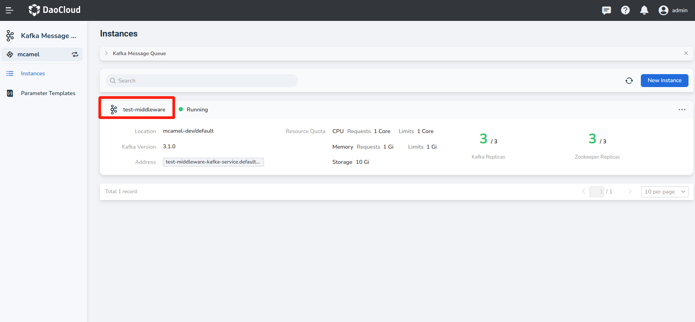
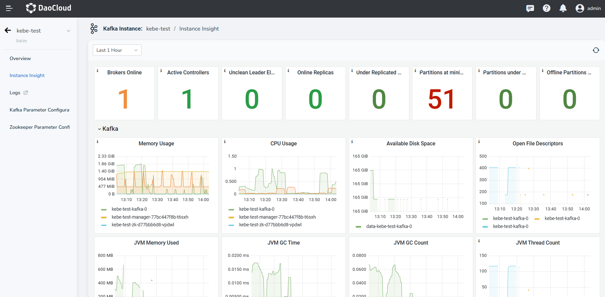

---
hide:
  - toc
---

---
MTPE: ModetaNiu
Date: 2024-07-03
---

# Instance Insight

Kafka has built-in Prometheus and Grafana modules to enhance observability.

1. On the Message Queue page, click an instance name.

    

2. In the navigation bar on the left, click __Instance Insight__ to access the insight module.

    

<!-- The specific meaning of each monitoring metric will be added later (@justedennnnn). -->