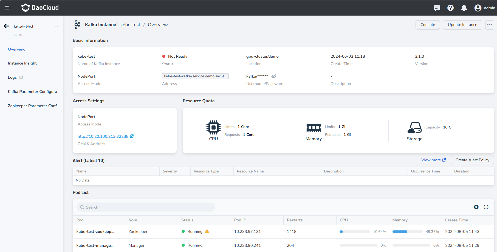
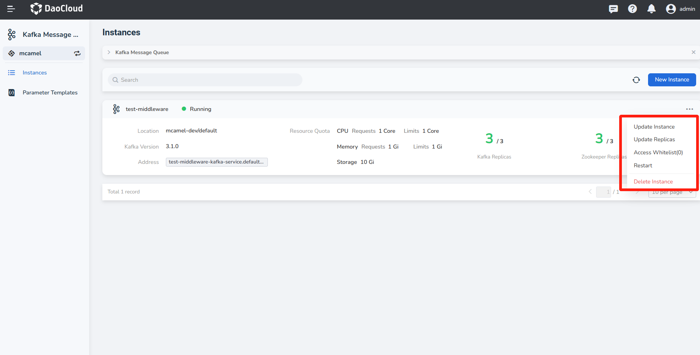
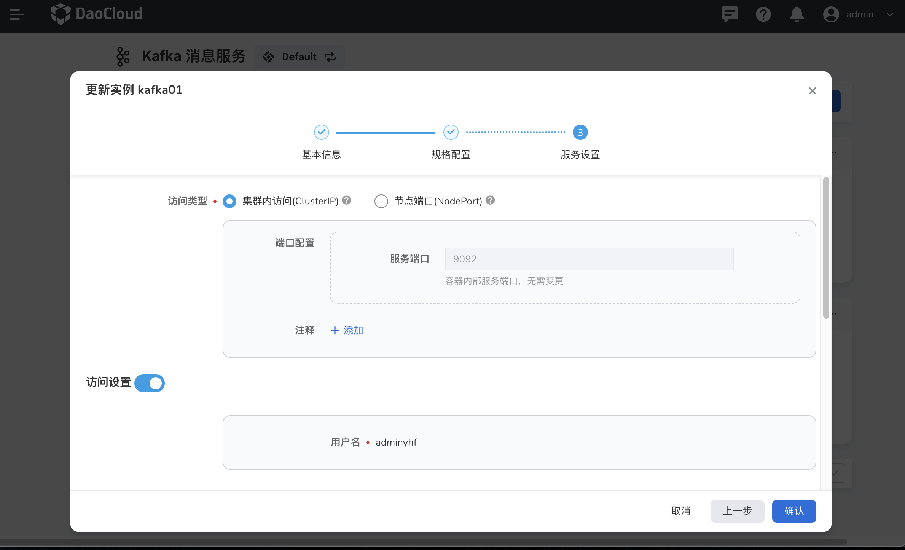

# View, Update and Delete Kafka

This page illustrates how to view, update and delete the Kafka message queue.

## View Kafka

1. On the Message Queue page, click an instance name.

    

2. Enter the message queue overview to view basic information, access settings, resource quotas, and Pod lists.

    

## Update Kafka

1. In the message queue, click the __...__ button on the right, and select __Update Instance__ from the pop-up menu.

    

2. After modifying Basic Information, Spec Settings and Service Settings, click __OK__ .

    

3. Return to the message queue list, and a message will be displayed in the upper right corner of the screen: __Successfully updated the instance__ .

## Delete Kafka

1. Select the message queue and click the __...__ button on the right, and click __Delete Instance__ from the pop-up menu.

    

2. Enter the name of the message queue in the pop-up window, and click the __Delete__ button to confirm deletion.

    

    !!! warning

        After an instance is deleted, all messages related to the instance will also be deleted, so please proceed with caution.

