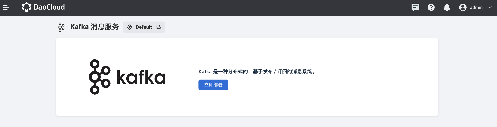

---
hide:
  - toc
---

# Enter Kafka for the first time

Please contact the administrator in advance. After `Container Management` -> `Helm Application` [installed kafka-operator](../quickstart/install.md), perform the following operations.

1. Select `Middleware` -> `Kafka Message Queue` in the left navigation bar.

    

2. After selecting a workspace in the pop-up window, click `OK`.

    

    !!! note
    
        If the pop-up window does not appear, you can manually click the icon in the upper left corner to select a workspace.

3. When you use it for the first time, you can click `Deploy Now` to create a Kafka instance.

    