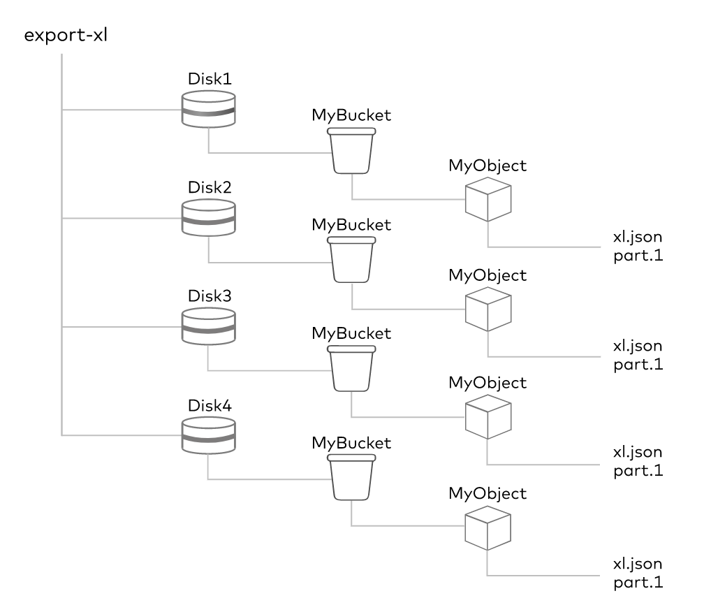
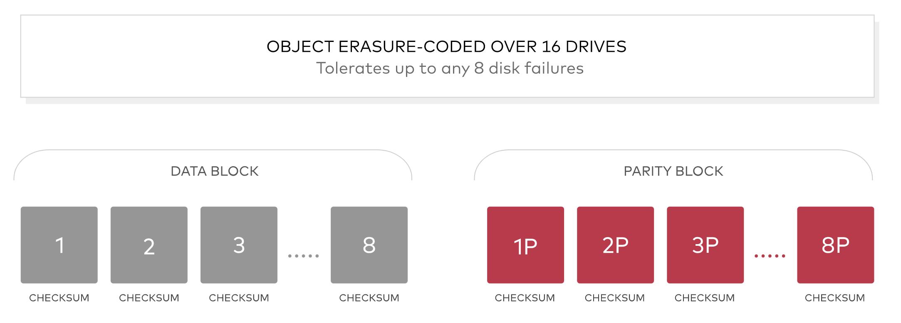
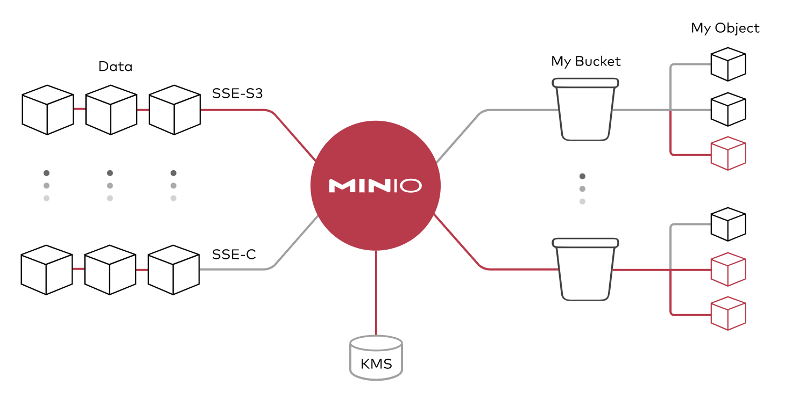
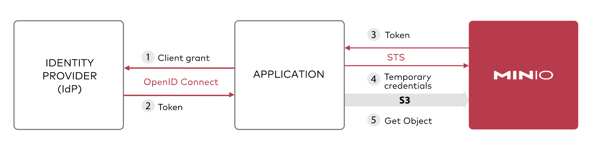
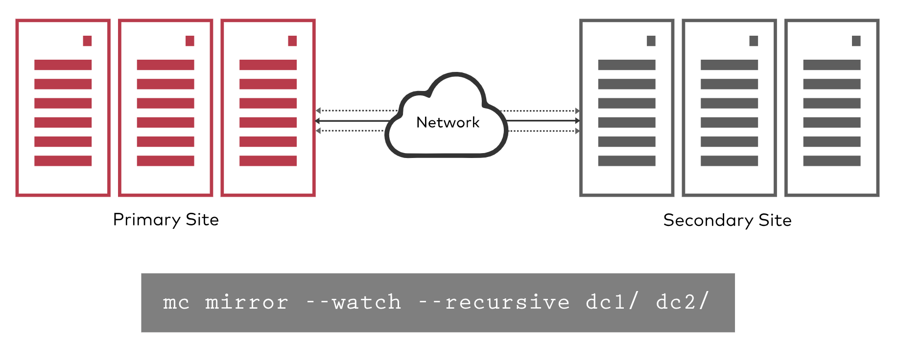

# MinIO common terms

This page explains MinIO related concepts.

| Concept | Meaning |
| -------------- | ---------------------------------- ----------------------------------- |
| Object object | Basic objects stored, such as files, pictures, etc. |
| Bucket | The logical space used to store Objects, isolated from each other, similar to the top-level folder in the system |
| Drive drive disk | the disk that stores data, all object data is stored in Drive |
| Set disk set | is a set of Drives, and distributed deployment automatically divides one or more sets according to the cluster size |

- an Object stored in a Set
- A cluster is divided into multiple Sets
- Drives in a Set are distributed on different nodes as much as possible
- The number of Drives contained in a Set is fixed, which is automatically calculated by the system according to the cluster size by default

More concepts are explained below.

## Erasure Code

MinIO protects data with per-object embedded erasure coding, written in assembly code to provide the highest performance.
MinIO uses Reed-Solomon codes to partition objects into n/2 data and n/2 parity blocks, and objects can also be configured to any desired level of redundancy.
This means that in a 12 drive setup, an object is sliced into 6 data and 6 parity blocks.
Even if up to 5 ((n/2)–1) drives are lost (either parity or data), data can still be reliably rebuilt from the remaining drives.
The implementation of MinIO ensures that even if multiple devices are lost or unavailable, objects can be read or new ones written.
Finally, MinIO's erasure code is at the object level and can repair objects one at a time.

## Bitrot Protection

Silent Data Corruption or Bitrot is a serious problem faced with disk drives that leads to data corruption without user's knowledge.
The reasons are varied: drive aging, current spikes, bad disk firmware, spurious writes, wrong read/write direction, bad drivers, accidental overwrites, etc.
But the result is the same: data leakage.

MinIO's optimized implementation of a high-speed hash algorithm ensures that it never reads corrupted data, and corrupted objects can be caught and repaired in real time.
End-to-end integrity is ensured by hashing on READ and hashing from applications, across the network, and memory/drives on WRITE.
The implementation is designed for speed and can achieve hash speeds in excess of 10 GB per second on a single core of an Intel CPU.

## encryption

Encrypting data in motion is not the same as protecting data at rest.
MinIO supports multiple sophisticated server-side encryption schemes to protect stored data in all locations.
MinIO's approach ensures confidentiality, integrity, and authenticity with negligible performance overhead.
Server-side and client-side encryption is supported using AES-256-GCM, ChaCha20-Poly1305, and AES-CBC.
Encrypted objects are tamper-resistant using AEAD server-side encryption.
Additionally, MinIO is compatible and tested with all commonly used key management solutions such as HashiCorp Vault.

MinIO supports SSE-S3 using a Key Management System (KMS).
If the client requests SSE-S3 or has automatic encryption enabled, the MinIO server encrypts each object with a unique object key, which is protected by a KMS-managed master key.
With minimal overhead, automatic encryption can be turned on per application and instance.

When WORM is enabled, MinIO disables all APIs that might mutate object data and metadata.
This means that once the data is written it is protected from tampering. This has practical application for many different regulatory requirements.

## Authentication and management

MinIO supports the most advanced standards in identity management and integrates with OpenID connect compliant providers as well as major external IDP vendors.
This means access is centralized and passwords are temporary and rotated rather than stored in configuration files and databases.
Additionally, access policies are fine-grained and highly configurable, which means supporting multi-tenant and multi-instance deployments is simple.

## Continuous copy

The challenge with traditional replication methods is that they don't scale efficiently to hundreds of terabytes.
Having said that, everyone needs a replication strategy to support disaster recovery, and that strategy needs to span geographies, data centers, and clouds.
MinIO's continuous replication is designed for large-scale cross-datacenter deployments. It computes deltas efficiently and quickly by leveraging Lambda compute notifications and object metadata.

Lambda notifications ensure that changes propagate immediately, contrary to traditional batch mode.
Continuous replication means that even with highly dynamic data sets, data loss is kept to a minimum in the event of a failure.
Finally, like MinIO does, continuous replication is multi-vendor, which means your backup location can be anywhere from NAS to public cloud.

## Global Consistency

Modern businesses have data everywhere. MinIO allows these various instances to be combined to form a unified global namespace.
Specifically, up to 32 MinIO servers can be combined into a distributed schema set, and multiple distributed schema sets can be combined into a MinIO server federation.
Each MinIO Server Federation provides a unified administrator and namespace.

MinIO Federation Server supports an unlimited number of distributed schema sets.

The impact of this approach is that object storage can scale massively for large, geographically dispersed enterprises,
While retaining the ability to accommodate various applications (S3 Select, MinSQL, Spark, Hive, Presto, TensorFlow, H20) from. Has a single console.

## Multi-Cloud Gateway

All enterprises are adopting a multi-cloud strategy, and this includes private clouds as well.
Therefore, your bare-metal virtualized containers and public cloud services (including non-S3 providers like Google, Microsoft, and Alibaba) must look identical.
While modern applications are highly portable, the data that powers them is not.

The main challenge MinIO addresses is making data available no matter where it resides.
MinIO runs on bare metal, network attached storage, and every public cloud.
What's more, MinIO ensures that you see exactly the same view of your data from an application and management perspective through the Amazon S3 API.

MinIO can go a step further and make your existing storage infrastructure compatible with Amazon S3.
Its impact is far-reaching. Organizations can now truly unify their data infrastructure from files to blocks, all appearing as objects accessible through the Amazon S3 API without migration.

