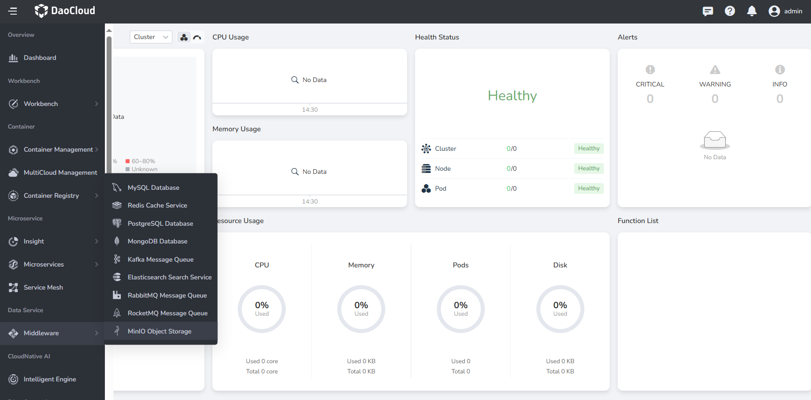
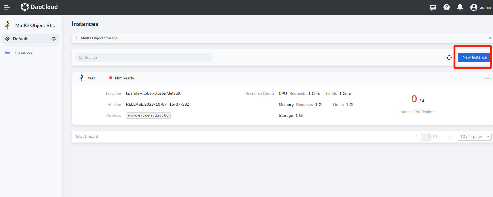
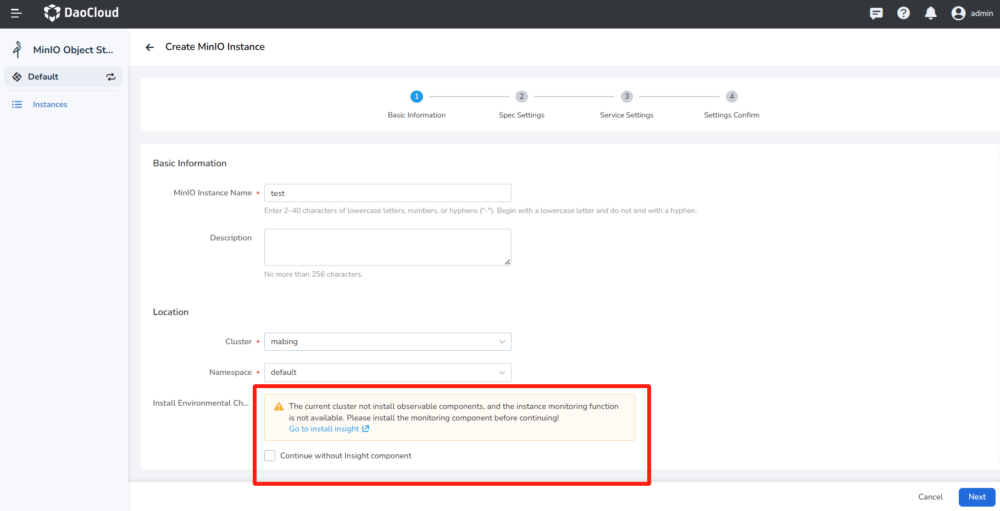
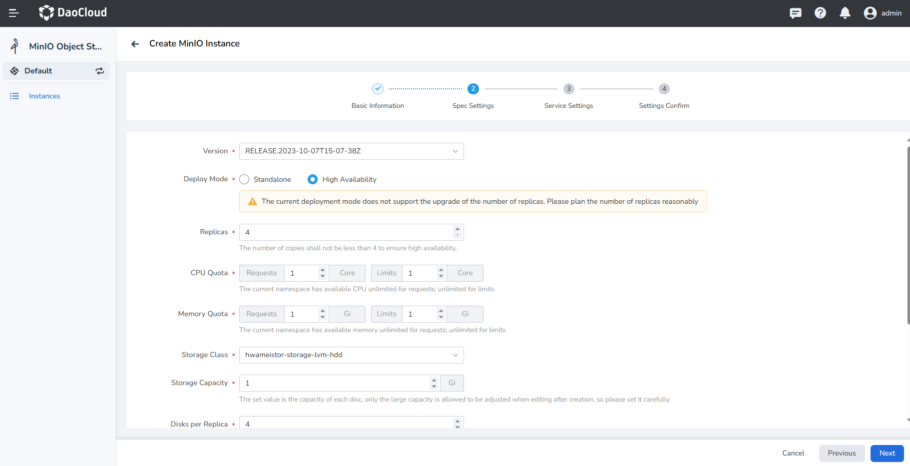
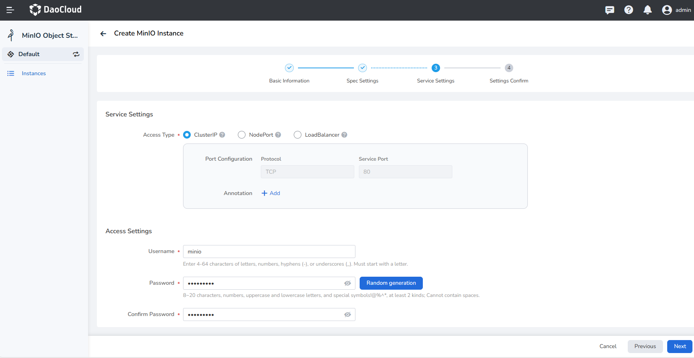
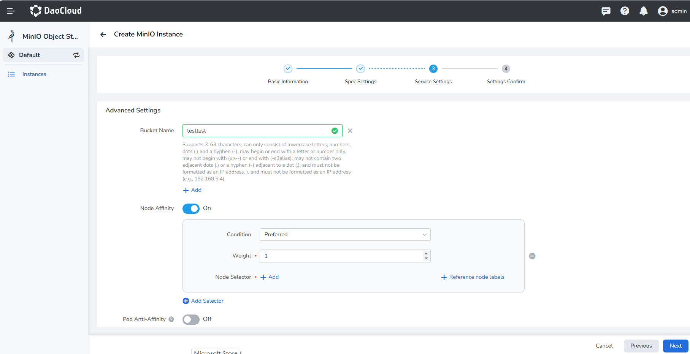
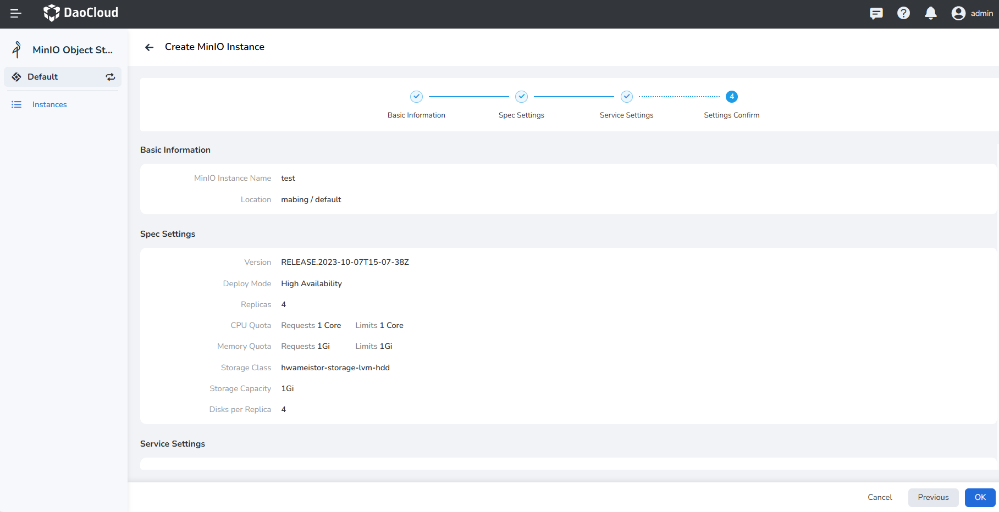
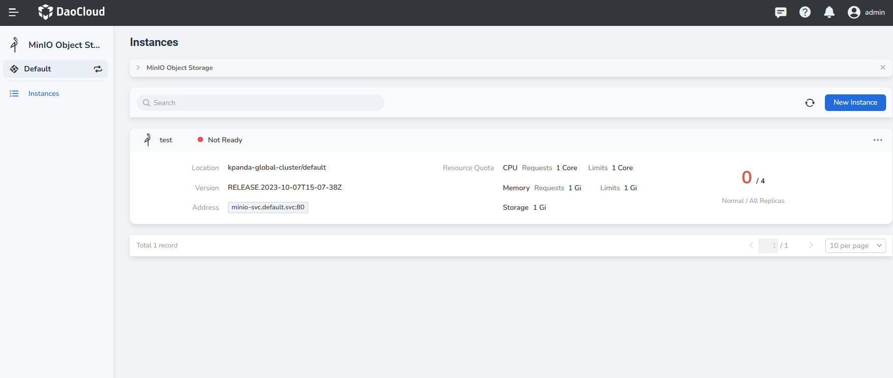

# Create a MinIO instance

1. Select __MinIO Object Storage__ from the navigation bar on the left.

    

2. You can click the __New Instance__ button in the upper right corner of the list.

    > If you are using it for the first time, you need to [select a workspace](../../common/index.md) and click __Deploy Now__ to create a MinIO instance.

    

3. Fill in the basic information of the instance by referring to the information below, and then click __Next__ .

    !!! note

        - The instance name and cluster/namespace cannot be modified after the instance is created.
        - Pay attention to check the filling requirements below the input box, and enter the content that meets the requirements.
        - If the installation environment test fails, you can follow the prompts to install the relevant plug-ins and re-create the instance, or you can check __Continue without Insight component__ and proceed directly to follow-up operations.

    

4. Fill in the configuration specifications with reference to the information below, and then click __Next__ .

    - Deploy Mode cannot be changed after the instance is created.
    - High Availability is recommended in production mode.
    - At least 4 Replicas are required in high availability mode.
    - Storage Class indicates that the selected storage class should have enough available resources, otherwise the instance creation will fail due to insufficient resources.
    - Storage capacity shows how much capacity each disk has. It **cannot be lowered after instance creation**.
    - Disks per Replica shows how many secondary disks to provide for each copy. It **cannot be lowered after instance creation**.

    !!! warning

       __After a MinIO instance is successfully created, scaling replicas and modifying disk usage are not supported. Please configure resources carefully.__    

    

5. Fill in the service settings with reference to the information below, and click __Next__ .

    - ClusterIP: services can only be accessed within the same cluster.
    - NodePort: services can be accessed through node IP and static ports, and support access to services from outside the cluster.
    - LoadBalancer indicates using the cloud service provider's load balancer to make the service publicly accessible
    - Load Balancer/External Traffic Policy: Specifies whether the service routes external traffic to node-local or cluster-wide breakpoints

        - Cluster: Traffic can be forwarded to Pods on other nodes in the cluster
        - Local: Traffic can only be forwarded to Pods on this node

    - Console account: the username and password needed to access this newly created instance
        
    

    ??? note "Click to view advanced configuration instructions"

        - Bucket Name: create a new bucket under this instance, and set the name of the new bucket.
        - Scheduling policy/condition: set the node affinity of Pod scheduling, refer to the official Kubernetes document [node affinity](https://kubernetes.io/docs/concepts/scheduling-eviction/assign-pod -node/#affinity-and-anti-affinity).

            - Preferred: try to schedule to the nodes that meet the rules first. Pod scheduling is also performed if no matching node is found
            - Required: Pod scheduling is only performed when a node satisfying the rules is found

        - Scheduling strategy/weight: Set weights for nodes that meet each scheduling strategy, preferably using a strategy with a high weight. Value range 1 to 100
        - Scheduling strategy/selector

            - In: The node must contain the selected label, and the value of the label must **belong** to a set of values. Multiple values ​​are separated by __;__ 
            - NotIn: The node must contain the selected label, and the value of the label must **not belong to a value set. Multiple values ​​are separated by __;__ 
            - Exists: It is enough for the node to contain a certain label, and do not pay attention to the specific value of the label
            - DoesNotExists: The node does not contain a certain label, and does not pay attention to the specific value of the label
            - Gt: The node must contain a certain label, and the value of the label must be greater than a certain integer
            - Lt: The node must contain a certain label, and the value of the label must be less than a certain integer

    

6. Confirm that the instance configuration information is correct, and click __OK__ to complete the creation.

    

7. Return to the instance list page to check whether the instance is successfully created.

    > The status of the newly created instance is __Not Ready__ , and the status becomes __Running__ after all related containers are successfully started.

    
