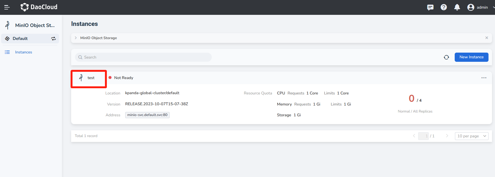
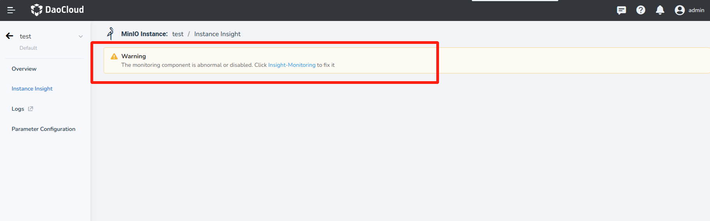
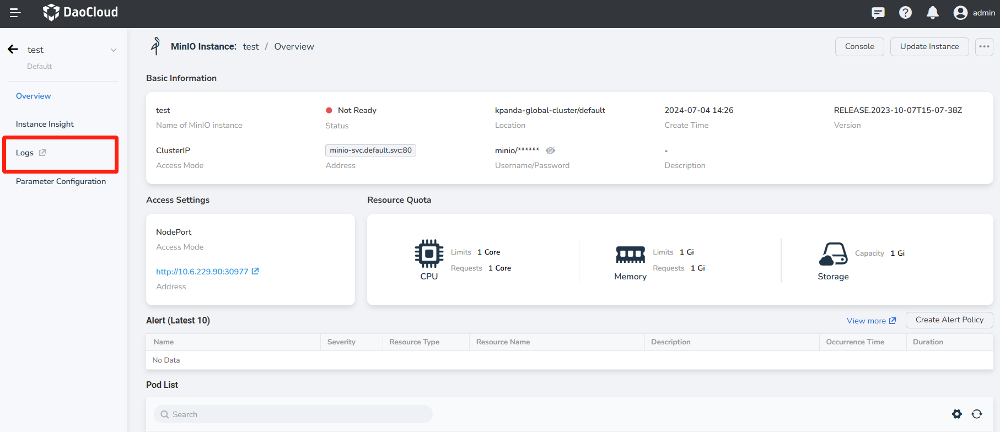
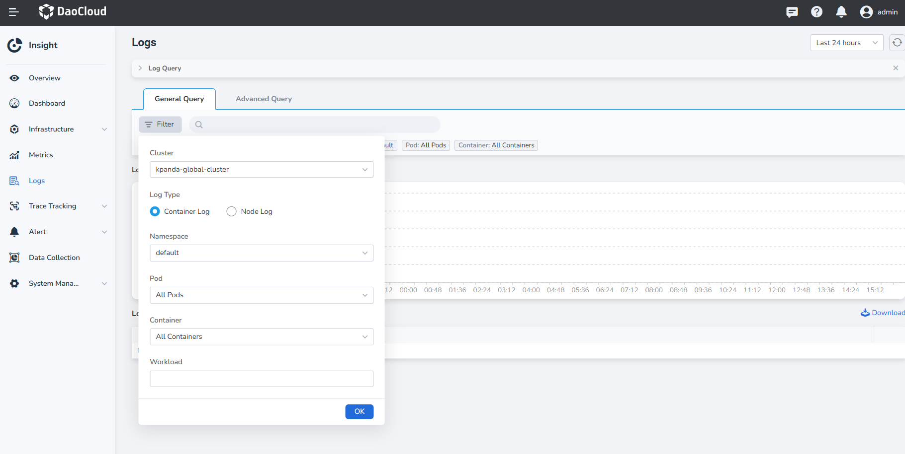
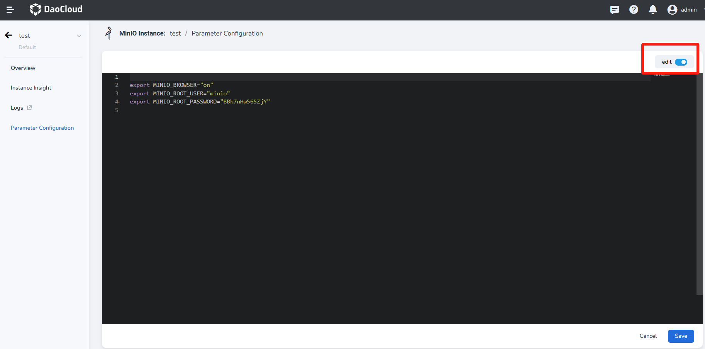

# Instance Insight, Logs and Parameter Configuration

This page illustrates how to conduct instance monitoring, view logs and configure parameters.

## Instance Insight

MinIO has built-in Prometheus and Grafana monitoring modules.

1. On the instance list page, find the instance whose monitoring information you want to view, and click the name of the instance.

    

2. Click __Instance Insight__ in navigation bar on the left.

    

    !!! note

        If it prompts that the monitoring component is abnormal, please follow the prompt [Install the insight-agent plug-in](../../../insight/quickstart/install/install-agent.md).

3. View the monitoring information of the instance. Click the information symbol in the red box to view 
   the description of the meaning of each metric.

## MinIO Logs

By visiting each MinIO's instance overview page; it is possible to view MinIO's logs.

1. On the instance list page, find the instance whose logs you want to view, and click the name of the instance.

2. Click __Logs__ in the navigation bar on the left.

    

3. Adjust the time range and refresh cycle of the log query as needed. For details, please refer to [Log Query](../../../insight/user-guide/data-query/log.md).

    

!!! note "Common Operations"

    * Custom log query time range: You can switch the log query time range in the upper right corner of the log page
    * Retrieve logs by keywords: Enter keywords in the left __search box__ to query logs with specific content
    * View the time distribution of logs: view the number of logs in a certain time range through the histogram
    * View the context of the log: click __View Context__ on the far right side of the log
    * Export log: Click __Download__ below the histogram

## Parameter Configuration

MinIO has a built-in parameter configuration UI interface.

1. On the instance list page, find the instance whose parameters you want to configure, and click the name of the instance.

2. Click __Parameter Configuration__ in the navigation bar on the left.

    

3. Open __Edit Configuration__ to add, delete, and modify various parameters of MinIO.

    

4. Click __Save__ , and the modified content will take effect immediately.