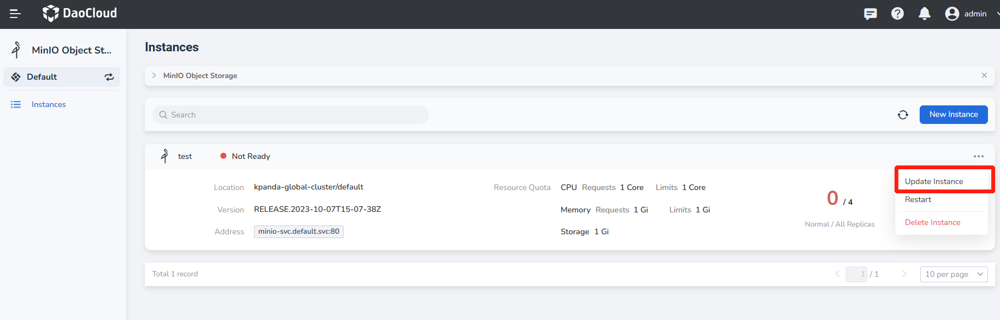
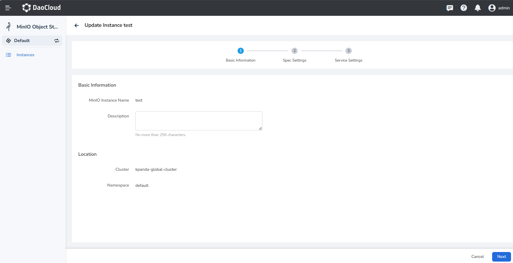
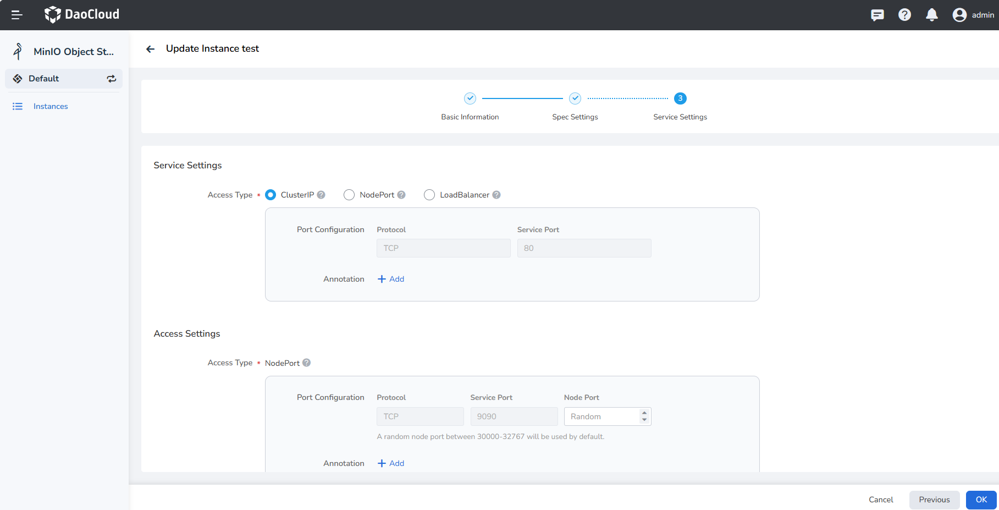
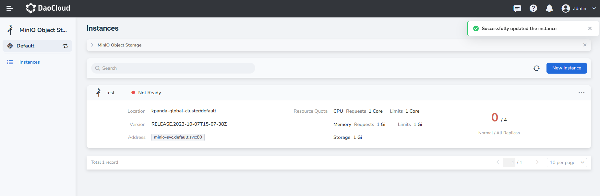
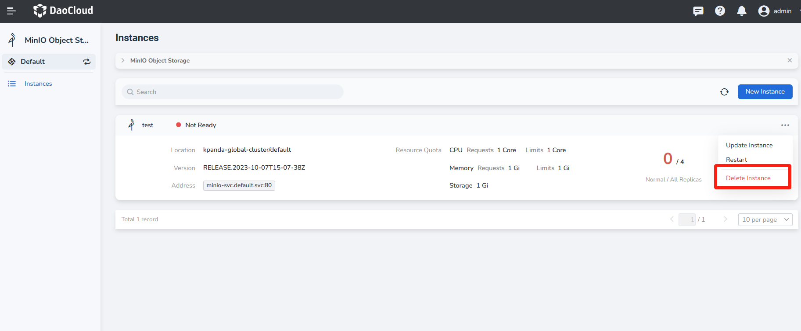
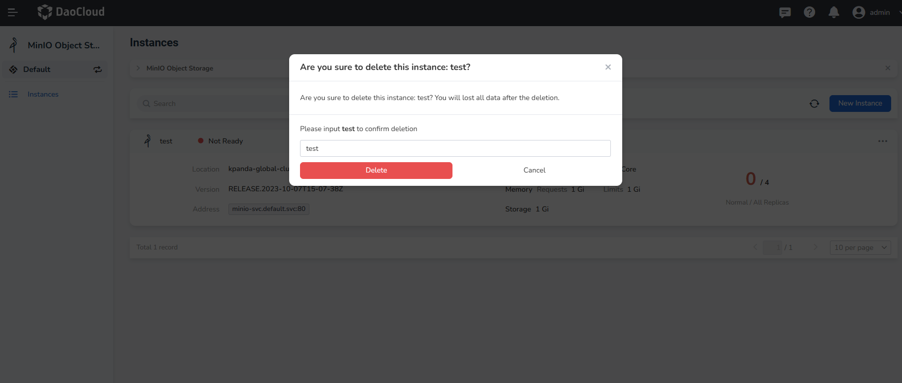

# Update and Delete MinIO Instance

## Update MinIO Instance

If you want to update or modify MinIO's resource configuration, you can follow the instructions on this page.

1. In the instance list, click the __...__ button on the right, and select __Update Instance__ from the pop-up menu.

    

2. Modify the Basic Information and click __Next__ .

    - Can be modified: Description
    - Can not be modified: Instance name, Location

    

3. Modify the Spec Settings, and click __Next__ .

    - Can be modified: CPU Quota and Memory Quota
    - Can not be modified: Version, Deployment Mode, Storage Class, Storage Capacity

    

4. Modify the service settings and click __OK__ .

    

5. Back to the instance list, a message will be displayed in the upper right corner of the screen: __Update instance successful__ .

    

## Remove MinIO Instance

If you want to delete a list of instances, you can follow the instructions on this page.

1. In the instance list, click the __...__ button on the right, and select __Delete Instance__ from the pop-up menu.

    

2. Enter the name of the instance list in the pop-up window, and click the __Delete__ button after confirming 
   that it is correct.

    !!! warning

        After an instance is deleted, all messages related to the instance will also be deleted, so please proceed with caution.

    