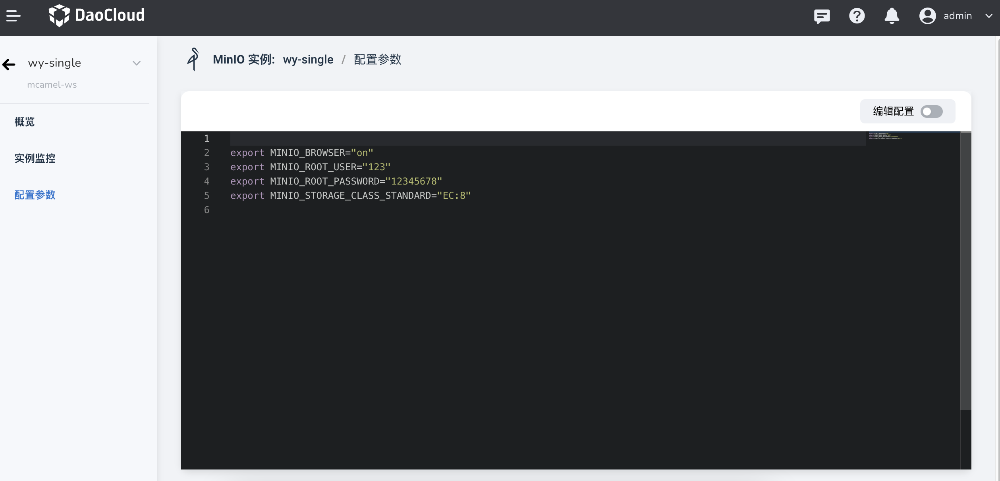
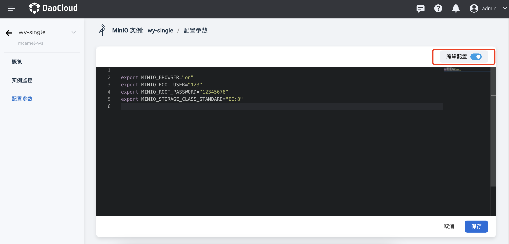

---
hide:
  - toc
---

# configuration parameters

MinIO has a built-in parameter configuration UI interface.

1. In the list of MinIO instances, click a name.

    

2. In the left navigation bar, click `Configuration parameters`.

    

3. Click the `Edit Configuration` slider switch to easily configure various parameters of MinIO.

    

4. Click `Save`, the parameters will take effect immediately.