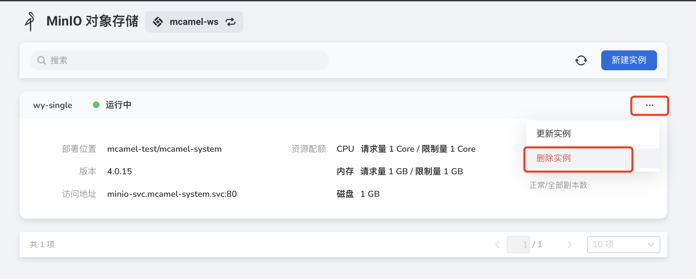
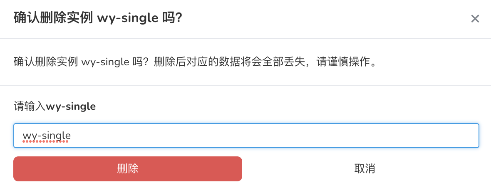

---
hide:
  - toc
---

# remove MinIO

If you want to delete a list of instances, you can do the following:

1. In the instance list, click the `...` button on the right, and select `Delete Instance` from the pop-up menu.

    

2. Enter the name of the instance list in the pop-up window, and click the `Delete` button after confirming that it is correct.

    

    !!! warning

        After an instance is deleted, all messages related to the instance will also be deleted, so please proceed with caution.