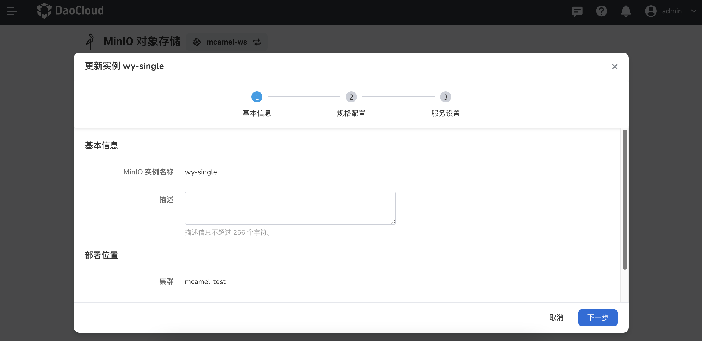
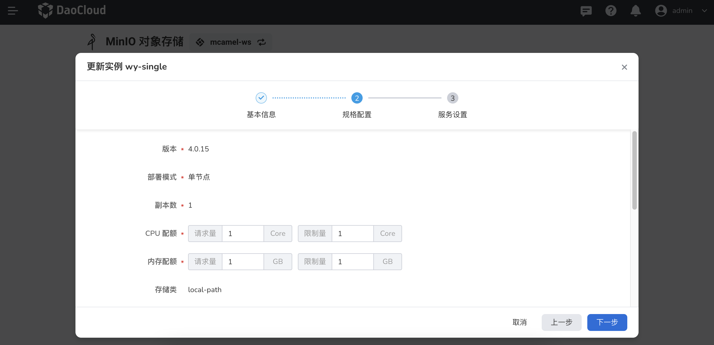

---
hide:
  - toc
---

# update MinIO

If you want to update or modify MinIO's resource configuration, you can follow the instructions on this page.

1. In the instance list, click the `...` button on the right, and select `Update Instance` from the pop-up menu.

    

2. After modifying the basic information, click `Next`.

    

3. After modifying the specification configuration, click `Next`.

    

4. After modifying the service settings, click `Confirm`.

    

5. Back to the instance list, a message will be displayed in the upper right corner of the screen: `Update instance successful`.

    