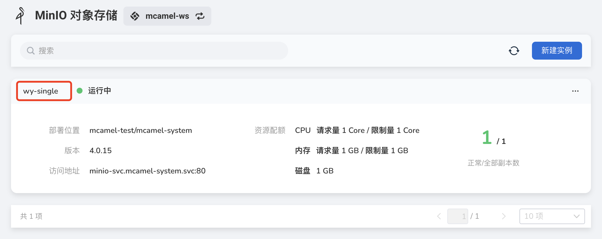
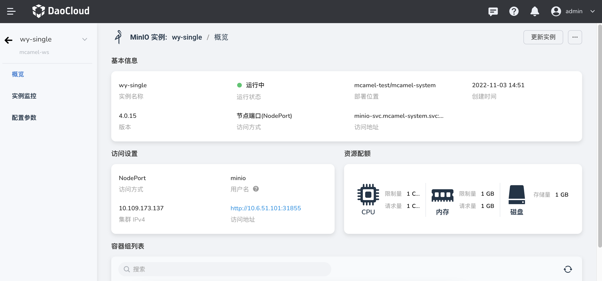

---
hide:
  - toc
---

# View the list of instances

This section explains how to view a list of MinIO instances.

1. On the instance list page, click a name.

    

2. Enter the instance list overview to view information such as basic information, access settings, resource quotas, and Pod lists.

    