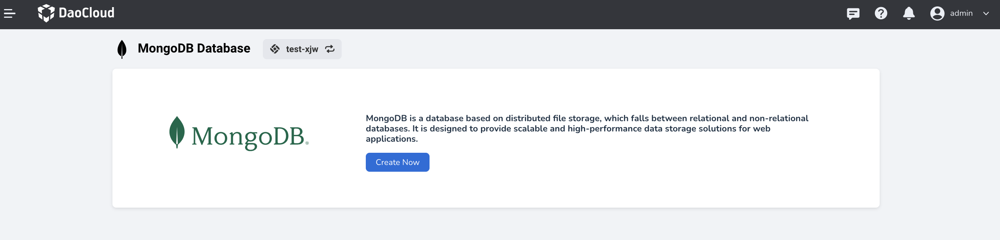

---
hide:
  - toc
---

# What is MongoDB

MongoDB is a document-oriented NoSQL database management system known for its flexible data model and scalability. Here are some important features and concepts of MongoDB:

**Document-Oriented Data Model**: MongoDB stores data in the form of documents, which are similar to JSON structures. A document is a collection of key-value pairs that can be nested and contain various types of data. This flexible data model makes MongoDB suitable for storing complex and unstructured data.

**Distributed Architecture and High Availability**: MongoDB can scale horizontally across multiple servers to handle large-scale data and high concurrency requests. It supports master-slave replication and sharding mechanisms, enabling data redundancy, load balancing, and providing high availability and scalability.

**Querying and Indexing**: MongoDB provides rich querying capabilities, supporting various query conditions and operators. It also supports flexible indexing mechanisms, allowing the creation of multiple indexes to optimize query performance as needed.

**Powerful Data Processing Capabilities**: MongoDB includes built-in data processing features such as the aggregation pipeline, geospatial indexing and querying, full-text search, and more. These features enable MongoDB to handle complex data operations and analysis tasks at the database level.

**Developer-Friendly**: MongoDB offers a wide range of APIs and drivers, supporting multiple programming languages. It also has a simple and intuitive command-line interface and graphical user interface, making it easy for developers to get started and use.

MongoDB is widely used in areas such as web applications, big data analytics, the Internet of Things (IoT), real-time data processing, and more. Its flexibility and scalability empower developers to efficiently handle and store ever-growing data.

