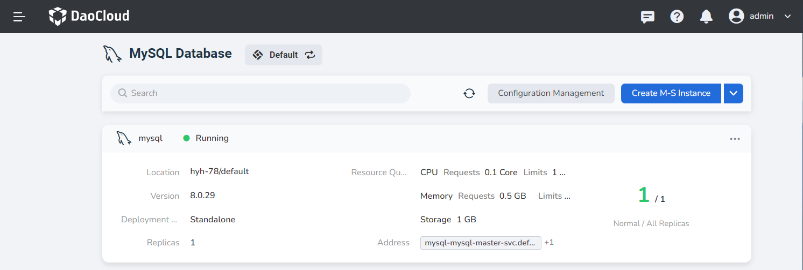
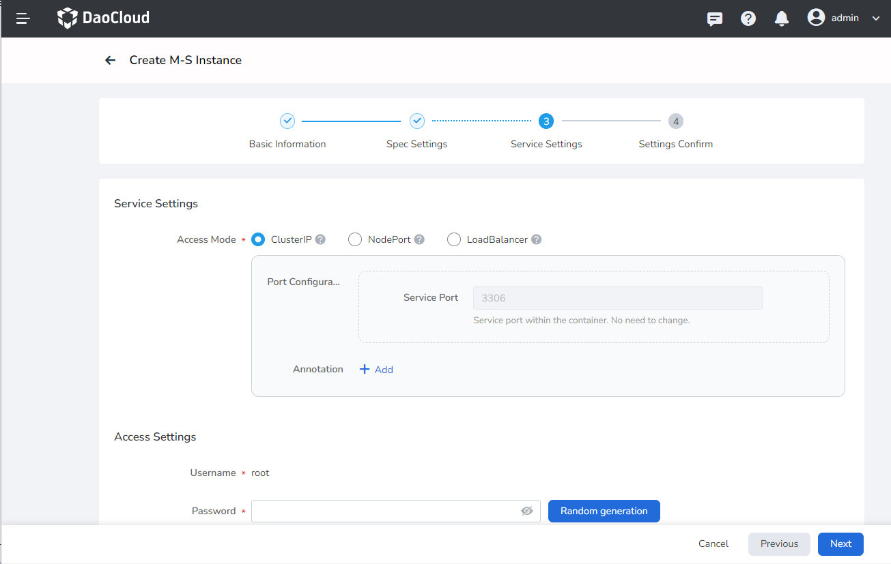
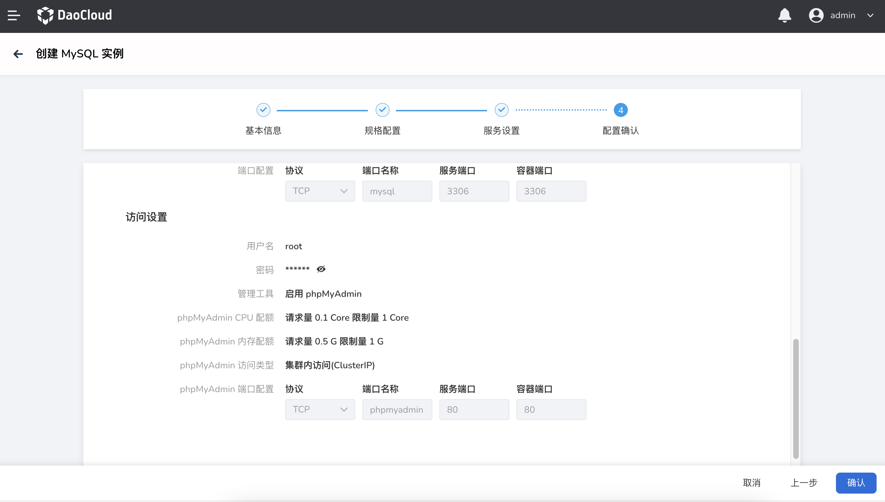
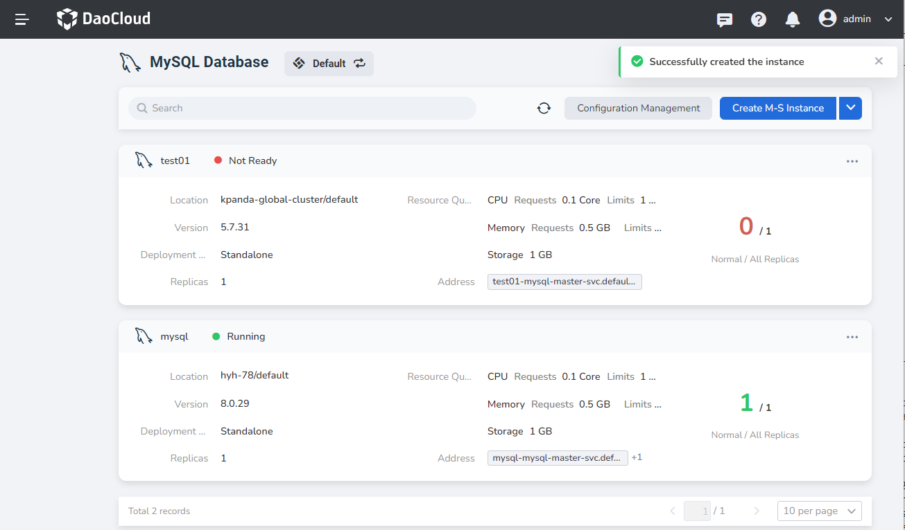

---
hide:
  - toc
---

# Create a MySQL Instance

After accessing the MySQL database, follow the steps below to create a MySQL instance.

1. In the instance list, click `Create M-S Instance` in the upper right corner.

    

2. On the Create M-S Instance page, after configuring `Basic Information`, click `Next`.

    

3. After selecting the deployment type, CPU, memory and storage, etc. `Spec Settings`, click `Next`.

    

4. Set `Service Settings` such as username and password, and use ClusterIP as the access method by default.

    

5. After confirming that the basic information, specification configuration, and service settings are correct, click `OK`.

    

6. Return to the instance list, and the screen will prompt `Successfully created the instance`.

    
