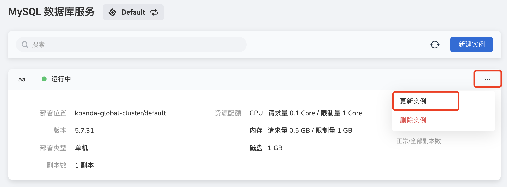
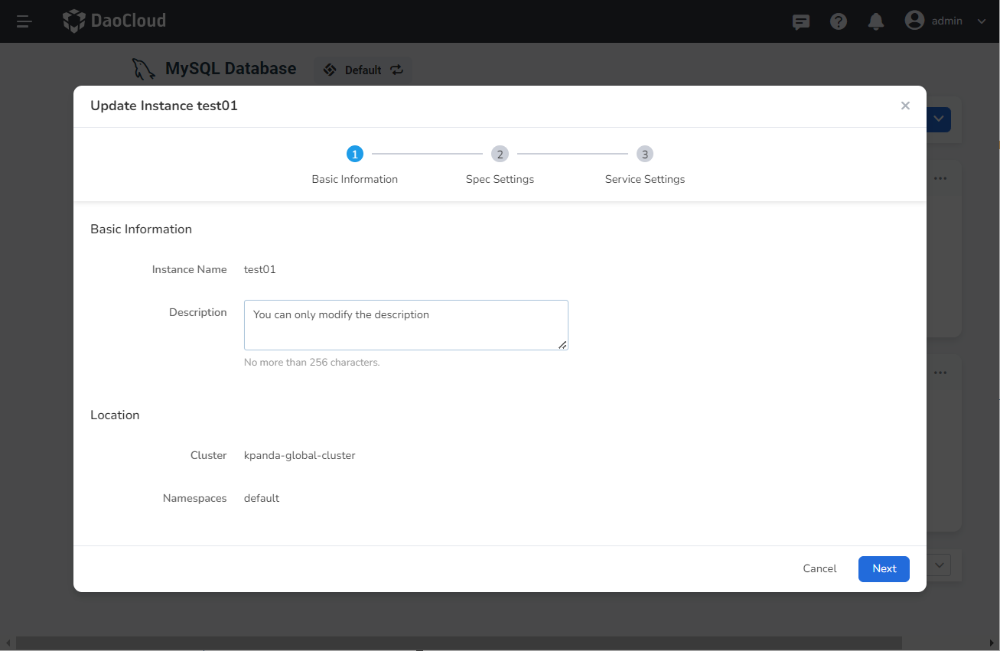
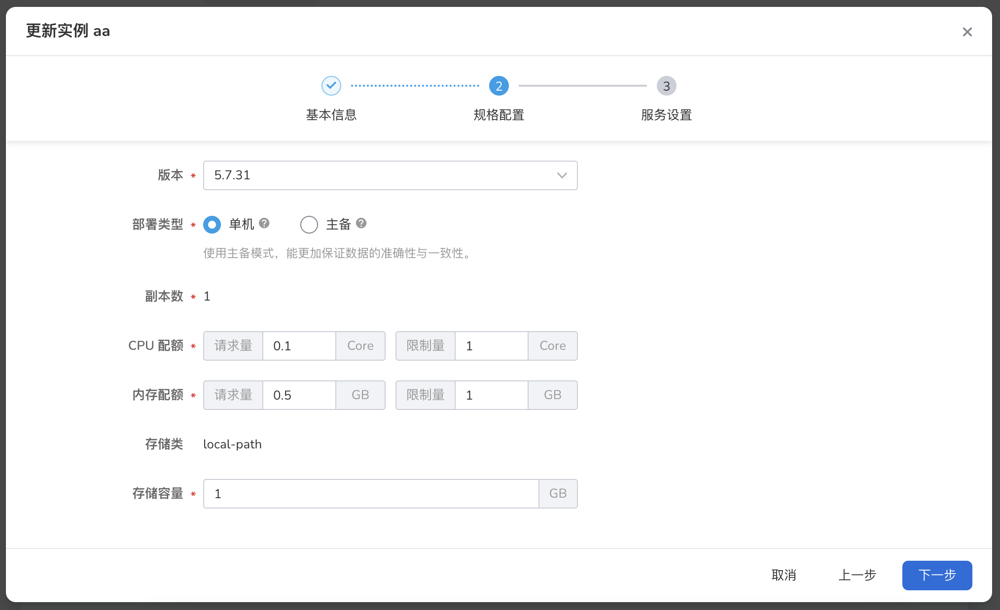
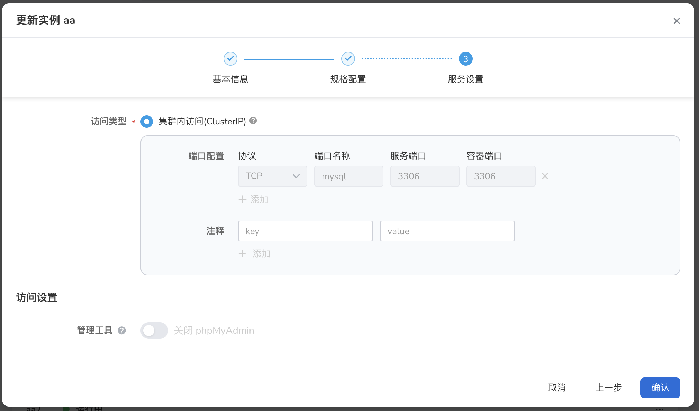

---
hide:
  - toc
---

# Update MySQL

If you want to update or modify the resource settings of MySQL, you can follow the instructions on this page.

1. In the instance list, click the `⋮` button on the right, and select `Update Instance` from the pop-up menu.

    

2. Basic information: Only the description can be modified. Then click `Next`.

    

3. After modifying the specific settings, click `Next`.

    

4. After modifying the service settings, click `OK`.

    
