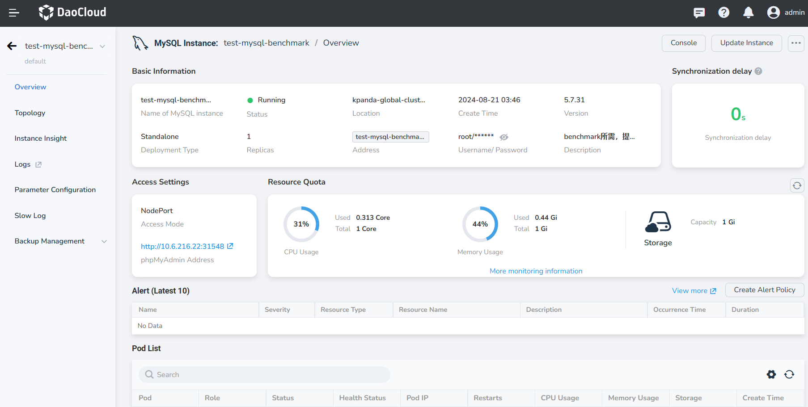
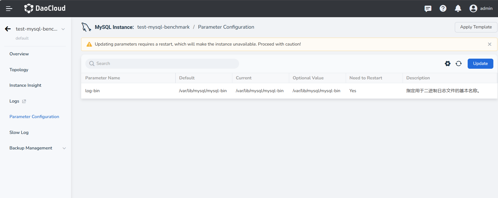
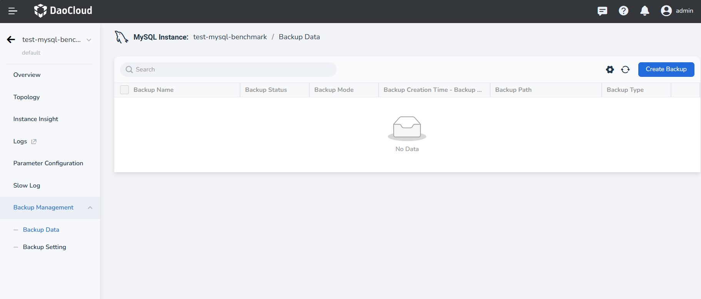
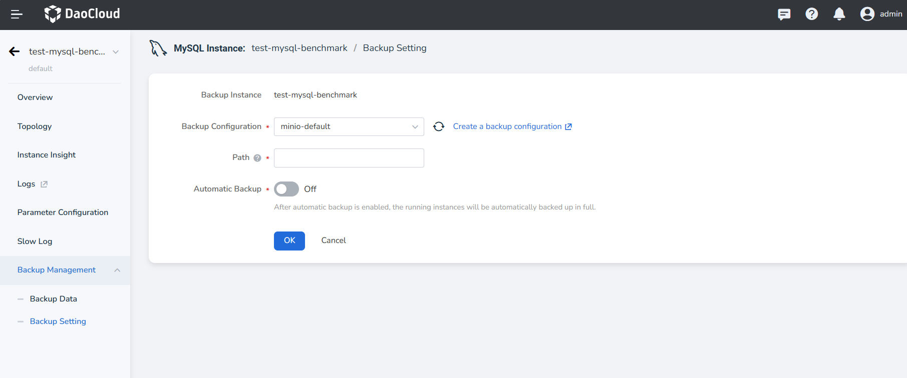

# View MySQL Instance

In the MySQL instance list, select the instance you want to view and click on the instance name to enter the detail page.

## Overview

The Overview page supports viewing Basic Information, Access Settings, Resource Quota, Synchronization delay, 
Alert, Pod List and Recent Events. Among them, 

- Synchronization delay: It refers to the time difference between the standby node receiving the packets sent by 
  the master node due to network latency or other factors during the replication or synchronization process.

- Alert: The overview page only supports viewing the latest 10 alerts. Click __View More__ to enter alert list.

## Parameter Configuration

Click the __Update__ button in the upper right corner of the page to update the `Current` value.

!!! warning

    Updating parameters requires a restart, which will make the instance unavailable. Proceed with caution!

## Backup Management

- Select __Backup Data__ from the dropdown menu, and click on __Create Backup__ in the upper right corner to 
  create backup data.

    

- Select __Backup Setting__ to change Backup Configurations, add Path, or enable Automatic Backup.

    