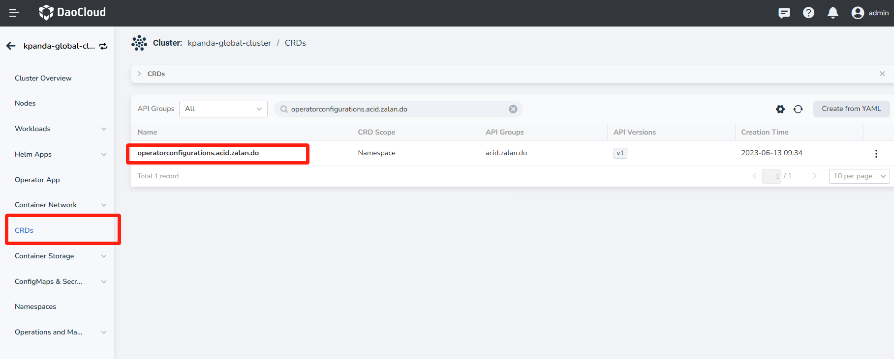
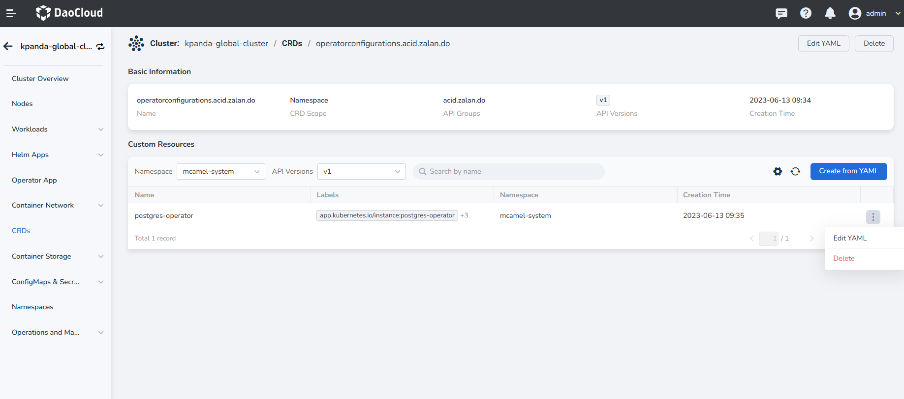
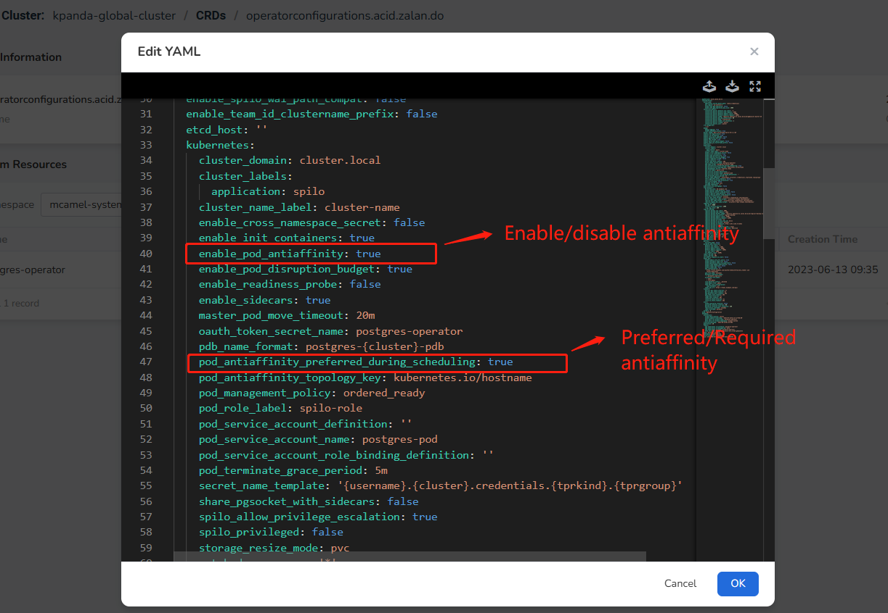

# Manually Configure Antiaffinity

The antiaffinity policy of the PostgreSQL middleware is shared across all instances within the same cluster.
Therefore, we have enabled the __Preferred__ antiaffinity by default. If you need to disable the antiaffinity policy
or enable the __Required__ antiaffinity, you need to modify the settings of the operator.

!!! note

    Modifying the antiaffinity setting of PostgreSQL will affect all instances within the cluster. Proceed with caution.

## Steps

1. Go to __Container Management__ -> __Clusters__ and select the cluster where the instance resides.

2. Click __CRDs__ and search for the resource: `operatorconfigurations.acid.zalan.do`

    

3. Under that resource, select the correct __Namespace__ and __CR Instance__ .

    

4. Click __Edit YAML__ and modify the following fields based on your needs:

    

    | Field                                          | Description                                           |
    | ---------------------------------------------- | ----------------------------------------------------- |
    | enable_pod_antiaffinity | true: Enable workload antiaffinity<br>false: Disable workload antiaffinity |
    | pod_antiaffinity_preferred_during_scheduling | true: Preferred soft antiaffinity<br>false: Required strict antiaffinity |

    Here is the complete YAML for your reference:

    ```yaml 
    apiVersion: acid.zalan.do/v1
    configuration:
      aws_or_gcp:
        additional_secret_mount_path: /meta/credentials
        aws_region: eu-central-1
        enable_ebs_gp3_migration: false
        enable_ebs_gp3_migration_max_size: 1000
      connection_pooler:
        connection_pooler_default_cpu_limit: '1'
        connection_pooler_default_cpu_request: 500m
        connection_pooler_default_memory_limit: 100Mi
        connection_pooler_default_memory_request: 100Mi
        connection_pooler_image: registry.opensource.zalan.do/acid/pgbouncer:master-26
        connection_pooler_max_db_connections: 60
        connection_pooler_mode: transaction
        connection_pooler_number_of_instances: 2
        connection_pooler_schema: pooler
        connection_pooler_user: pooler
      crd_categories:
        - all
      debug:
        debug_logging: true
        enable_database_access: true
      docker_image: ghcr.io/zalando/spilo-15:2.1-p9
      enable_crd_registration: true
      enable_crd_validation: true
      enable_lazy_spilo_upgrade: false
      enable_pgversion_env_var: true
      enable_shm_volume: true
      enable_spilo_wal_path_compat: false
      enable_team_id_clustername_prefix: false
      etcd_host: ''
      kubernetes:
        cluster_domain: cluster.local
        cluster_labels:
          application: spilo
        cluster_name_label: cluster-name
        enable_cross_namespace_secret: false
        enable_init_containers: true
        enable_pod_antiaffinity: true
        enable_pod_disruption_budget: true
        enable_readiness_probe: false
        enable_sidecars: true
        master_pod_move_timeout: 20m
        oauth_token_secret_name: postgres-operator
        pdb_name_format: postgres-{cluster}-pdb
        pod_antiaffinity_preferred_during_scheduling: true
        pod_antiaffinity_topology_key: kubernetes.io/hostname
        pod_management_policy: ordered_ready
        pod_role_label: spilo-role
        pod_service_account_definition: ''
        pod_service_account_name: postgres-pod
        pod_service_account_role_binding_definition: ''
        pod_terminate_grace_period: 5m
        secret_name_template: '{username}.{cluster}.credentials.{tprkind}.{tprgroup}'
        share_pgsocket_with_sidecars: false
        spilo_allow_privilege_escalation: true
        spilo_privileged: false
        storage_resize_mode: pvc
        watched_namespace: '*'
      kubernetes_use_configmaps: false
      load_balancer:
        db_hosted_zone: db.example.com
        enable_master_load_balancer: false
        enable_master_pooler_load_balancer: false
        enable_replica_load_balancer: false
        enable_replica_pooler_load_balancer: false
        external_traffic_policy: Cluster
        master_dns_name_format: '{cluster}.{namespace}.{hostedzone}'
        master_legacy_dns_name_format: '{cluster}.{team}.{hostedzone}'
        replica_dns_name_format: '{cluster}-repl.{namespace}.{hostedzone}'
        replica_legacy_dns_name_format: '{cluster}-repl.{team}.{hostedzone}'
      logging_rest_api:
        api_port: 8080
        cluster_history_entries: 1000
        ring_log_lines: 100
      logical_backup:
        logical_backup_cpu_limit: 200m
        logical_backup_cpu_request: 100m
        logical_backup_docker_image: registry.opensource.zalan.do/acid/logical-backup:v1.9.0
        logical_backup_job_prefix: logical-backup-
        logical_backup_memory_limit: 256Mi
        logical_backup_memory_request: 128Mi
        logical_backup_provider: s3
        logical_backup_s3_access_key_id: minio
        logical_backup_s3_bucket: postgre
        logical_backup_s3_endpoint: http://10.6.216.5:31612
        logical_backup_s3_region: ''
        logical_backup_s3_retention_time: 3 days
        logical_backup_s3_secret_access_key: Daocloud
        logical_backup_s3_sse: ''
        logical_backup_schedule: 30 00 * * *
      major_version_upgrade:
        major_version_upgrade_mode: 'off'
        minimal_major_version: '12'
        target_major_version: '16'
      max_instances: -1
      min_instances: -1
      patroni:
        failsafe_mode: false
      postgres_pod_resources:
        default_cpu_limit: '1'
        default_cpu_request: 100m
        default_memory_limit: 500Mi
        default_memory_request: 100Mi
        min_cpu_limit: 250m
        min_memory_limit: 250Mi
      repair_period: 5m
      resync_period: 30m
      set_memory_request_to_limit: false
      teams_api:
        enable_admin_role_for_users: true
        enable_postgres_team_crd: false
        enable_postgres_team_crd_superusers: false
        enable_team_member_deprecation: false
        enable_team_superuser: false
        enable_teams_api: false
        pam_configuration: >-
          https://info.example.com/oauth2/tokeninfo?access_token= uid
          realm=/employees
        pam_role_name: zalandos
        postgres_superuser_teams:
          - postgres_superusers
        protected_role_names:
          - admin
          - cron_admin
        role_deletion_suffix: _deleted
        team_admin_role: admin
        team_api_role_configuration:
          log_statement: all
        teams_api_url: https://teams.example.com/api/
      timeouts:
        patroni_api_check_interval: 1s
        patroni_api_check_timeout: 5s
        pod_deletion_wait_timeout: 10m
        pod_label_wait_timeout: 10m
        ready_wait_interval: 3s
        ready_wait_timeout: 30s
        resource_check_interval: 3s
        resource_check_timeout: 10m
      users:
        enable_password_rotation: false
        password_rotation_interval: 90
        password_rotation_user_retention: 180
        replication_username: standby
        super_username: postgres
      workers: 8
    kind: OperatorConfiguration
    metadata:
      annotations:
        mcamel/description: cas111
        mcamel/update-timestamp: '2023-07-24T13:27:27+08:00'
        meta.helm.sh/release-name: postgres-operator
        meta.helm.sh/release-namespace: mcamel-system
      creationTimestamp: '2023-06-13T01:35:00Z'
      generation: 10
      labels:
        app.kubernetes.io/instance: postgres-operator
        app.kubernetes.io/managed-by: Helm
        app.kubernetes.io/name: postgres-operator
        helm.sh/chart: postgres-operator-0.0.2-553-g4622fd73
      name: postgres-operator
      namespace: mcamel-system
      resourceVersion: '1202085540'
      uid: 3c9a7758-2f76-432e-9f84-0161cf9a959b
    ```

5. Restart the operator. The existing instances will be recreated and the new scheduling configuration will be applied.
