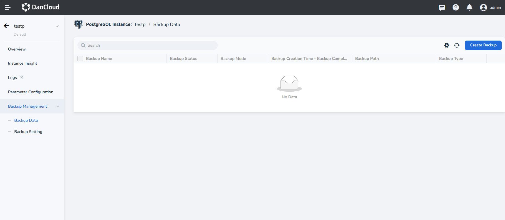
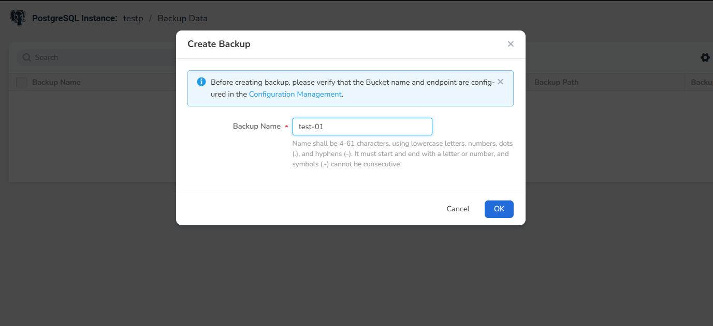
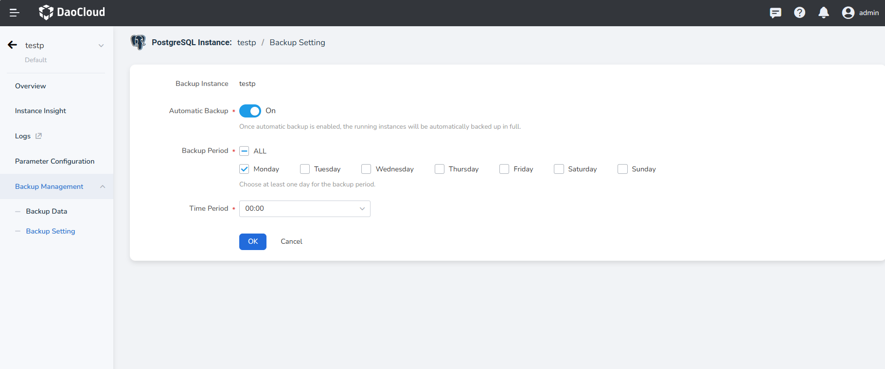

---
hide:
  - toc
---

# Configure Backup Data

PostgreSQL database supports automatic backups of database instances. Since enabling backups can affect the read and 
write performance of the database, it is recommended to schedule automatic backups during off-peak business hours. 
This ensures that in case of data loss, the database can be quickly restored and data security is maintained.

## Steps

1. Access the **PostgreSQL Database**.

2. In the instance list, select the instance for which you want to enable automatic backups, and click its name to 
   enter the instance details.

3. Click **Backup Management** -> **Backup Data** in the left navigation bar.

    

    

## Configure Automatic Backup

Backup Configuration: You can set up automatic backups and the frequency of the automatic backups.

- Automatic Backup: There is a switch to choose to "enable" or "disable" the automatic backup feature. 
  A prompt indicates that once enabled, the system will automatically back up all running instances.
- Backup Period: You can select the backup frequency, with the default option being "All". Users are 
  allowed to choose specific days of the week for backups (e.g., Monday to Sunday).
- Time Period: Users can set the specific start time for backups, with the default value being 00:00.

