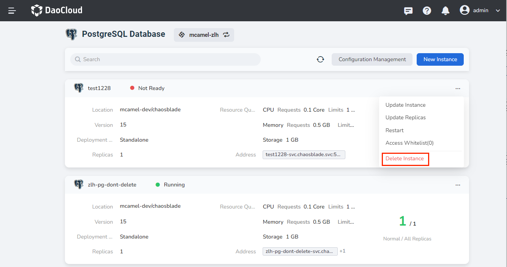
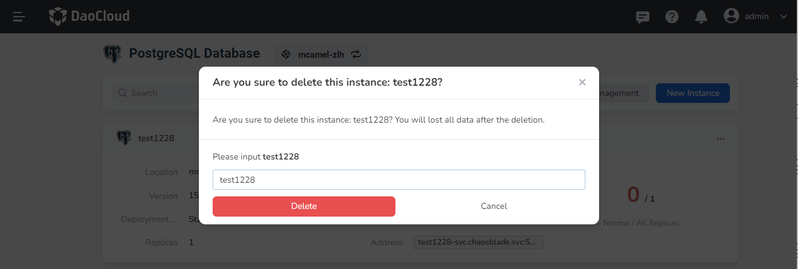

---
hide:
  - toc
---

# Delete the PostgreSQL instance

If you want to delete a PostgreSQL instance, you can do the following:

1. In the PostgreSQL instance list, click the `⋮` button on the right, and select `Delete Instance` from the pop-up menu.

    

2. Enter the name of the instance in the pop-up window, and click the `Delete` button after confirming that it is correct.

    

    !!! warning

        After an instance is deleted, all information related to the instance will also be deleted, so please proceed with caution.
